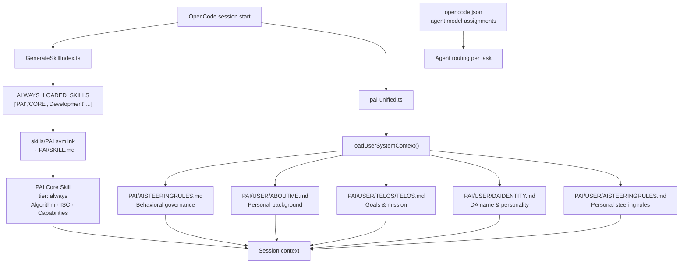

# PAI Adaptations

**What we changed from vanilla PAI v3.0 and why**

---

## Overview

PAI-OpenCode is **PAI v3.0 (Algorithm v1.8.0) ported to OpenCode**. Most of the system is unchanged—same skills, same agents, same memory structure. But some parts required adaptation due to fundamental platform differences.

This document explains **what we changed** and **why**.

---

## PAI Version History

| PAI-OpenCode | Based on PAI | Algorithm | Key Additions |
|--------------|--------------|-----------|---------------|
| v1.0.0 | PAI 2.4 | v0.2.24 | Core port, 8 handlers |
| v1.1.0 | PAI 2.5 | v0.2.25 | 13 handlers, voice/sentiment |
| v1.3.0 | PAI 2.5 | v0.2.25 | 16 agents, agent-based routing, 3 presets |
| **v2.0.0** | **PAI 3.0** | **v1.8.0** | **8 effort levels, Verify Completion Gate, Wisdom Frames, 20 handlers, 39 skills** |
| **v3.0.0** | **PAI 3.0** | **v1.8.0** | **Vanilla OpenCode, zero bootstrap, Zen free default, PAI Core tier:always** |

---

## Core Changes

### 1. Hooks → Plugins

> **Architecture Decision:** [ADR-001 - Hooks → Plugins Architecture](architecture/adr/ADR-001-hooks-to-plugins-architecture.md)

**What changed:**
- Claude Code: Multiple hook files in `.claude/hooks/`
- OpenCode: Single unified plugin in `.opencode/plugins/pai-unified.ts`

**Why:**
- OpenCode doesn't support the hooks pattern (separate subprocess execution)
- Plugins are in-process TypeScript functions (faster, simpler)
- Unified plugin allows shared state between event handlers

**Impact:**
- Security validation logic preserved, just different wrapper
- Context injection preserved, same CORE skill loading
- Hook exit codes → throw Error for blocking

**Files affected:**
```
hooks/load-core-context.ts      → plugins/handlers/context-loader.ts
hooks/security-validator.ts     → plugins/handlers/security-validator.ts
hooks/initialize-session.ts     → plugins/pai-unified.ts (event handler)
```

---

### 2. Directory Structure

> **Architecture Decision:** [ADR-002 - Directory Structure (`.claude/` → `.opencode/`)](architecture/adr/ADR-002-directory-structure-claude-to-opencode.md)

**What changed:**
```
.claude/         → .opencode/
```

**Why:**
- OpenCode expects config in `.opencode/` directory
- Different platform convention

**Impact:**
- All path references updated (`$PAI_DIR` points to `.opencode/`)
- Skills, agents, MEMORY structure unchanged
- Tools updated to use `.opencode/` paths

---

### 3. Agent File Naming

**What changed:**
- Claude Code: `intern.md`, `researcher.md` (lowercase)
- OpenCode: `Intern.md`, `Researcher.md` (PascalCase)

**Why:**
- OpenCode requires PascalCase agent filenames
- Agent invocation syntax: `@Intern` expects `Intern.md`

**Impact:**
- All agent files renamed during conversion
- Agent content unchanged
- Invocation: `@Intern`, `@Researcher`, `@Architect`

---

### 4. Plugin Logging

> **Architecture Decision:** [ADR-004 - Plugin Logging (File-Based)](architecture/adr/ADR-004-plugin-logging-file-based.md)

**What changed:**
- Claude Code hooks: Can use `console.log()` (separate process)
- OpenCode plugins: Must use file logging (in-process)

**Why:**
- OpenCode plugins run in the same process as the TUI
- `console.log()` corrupts the terminal interface
- File logging preserves TUI integrity

**Implementation:**
```typescript
// lib/file-logger.ts
export function fileLog(message: string, level = "info") {
  appendFileSync("/tmp/pai-opencode-debug.log",
    `[${level}] ${message}\n`);
}
```

---

### 5. Security System Documentation

**What changed:**
- Added `PAISECURITYSYSTEM/PLUGINS.md`
- Documents plugin-specific security implementation

**Why:**
- Security validation is fundamentally different in plugins
- Exit codes → throw Error
- Need clear docs for OpenCode-specific security

---

## What Stayed The Same

> **Architecture Decisions:**
> - [ADR-003 - Skills System - 100% Unchanged](architecture/adr/ADR-003-skills-system-unchanged.md)
> - [ADR-006 - Security Validation Preservation](architecture/adr/ADR-006-security-validation-preservation.md)
> - [ADR-007 - Memory System Structure Preserved](architecture/adr/ADR-007-memory-system-structure-preserved.md)

### Skills System

**100% unchanged** — PAI skill discovery now uses the native OpenCode scanner via symlink (`skills/PAI → ../PAI`). OpenCode discovers `PAI/SKILL.md` automatically without any bootstrap.

- All 29 skills work identically
- SKILL.md format unchanged
- Workflow files unchanged
- Skill trigger logic unchanged

### Memory Structure

**100% unchanged:**
- `MEMORY/` directory structure identical
- Session tracking unchanged
- Work session format unchanged
- Learning capture format unchanged

### Agent Personalities

**Content unchanged, only filenames:**
- Agent YAML frontmatter unchanged
- Agent instructions unchanged
- Agent invocation syntax same (`@AgentName`)

---

## Configuration Differences

### settings.json → opencode.json

> **Architecture Decision:** [ADR-005 - Configuration - Dual File Approach](architecture/adr/ADR-005-configuration-dual-file-approach.md)

| PAI 2.4 (Claude Code) | PAI-OpenCode |
|-----------------------|--------------|
| `settings.json` | `settings.json` (kept for PAI config) |
| No plugin config | `opencode.json` for plugin registration |

**Why two files:**
- `settings.json` - PAI configuration (env vars, identity, permissions)
- `opencode.json` - OpenCode configuration (plugins)

**Example opencode.json:**
```json
{
  "plugins": [
    ".opencode/plugins/pai-unified.ts"
  ],
  "agent": {
    "Algorithm": {
      "model": "anthropic/claude-opus-4-6"
    },
    "Engineer": {
      "model": "opencode/kimi-k2.5"
    }
  }
}
```

---

## v3.0 Native OpenCode Architecture

> [!note] **Architecture Decision:** ADR-020 — Native OpenCode Context Loading (Bootstrap Removal)

The v3.0 release represents a fundamental shift in how PAI Core loads into context. The custom bootstrap mechanism built for earlier versions became redundant once OpenCode's native skill system matured — so we removed it entirely.

### What Changed

**Context Loading: Bootstrap → Skill System (tier:always)**

| Before (v2.x) | After (v3.0) |
|---------------|--------------|
| `MINIMAL_BOOTSTRAP.md` loaded explicitly by plugin | PAI Core Skill loads via native OpenCode `tier: always` |
| `pai-unified.ts` handled bootstrap + user context | `pai-unified.ts` handles user context only |
| `AGENTS.md` contained ~450 lines of PAI behavior | `AGENTS.md` contains 14 lines (repo build commands only) |
| Manual Skill Discovery Index in bootstrap | OpenCode natively provides `<available_skills>` XML listing |

**Why:**
- OpenCode's native skill system (`tier: always` in `GenerateSkillIndex.ts`) reliably loads skills into every session context
- The `ALWAYS_LOADED_SKILLS` list now includes `'PAI'`, ensuring the full 479-line PAI Core Skill is always in context
- OpenCode natively provides `<available_skills>` XML with name + description + location for every skill — the bootstrap's Skill Discovery Index was a manual duplicate of this native capability
- Removing bootstrap reduces the attack surface, eliminates a maintenance burden, and makes the architecture easier to reason about

### Plugin Simplification

**`pai-unified.ts` — What it does now:**

```text
Before: Bootstrap loading + User identity context
After:  User identity context only
```

The plugin now loads only the pieces OpenCode's native system cannot provide:
- `PAI/AISTEERINGRULES.md` — behavioral governance (system-level)
- `PAI/USER/ABOUTME.md` — personal background
- `PAI/USER/TELOS/TELOS.md` — goals and mission
- `PAI/USER/DAIDENTITY.md` — DA name and personality
- `PAI/USER/AISTEERINGRULES.md` — personal behavioral steering rules

PAI Core (Algorithm, ISC, Capabilities) loads automatically via the skill system.

### v3.0 Architecture — Context Flow

```text
OpenCode session start
  │
  ├─► GenerateSkillIndex.ts (ALWAYS_LOADED_SKILLS)
  │       └─► skills/PAI symlink → PAI/SKILL.md   [tier:always]
  │               Algorithm, ISC, Capabilities — always in context
  │
  └─► pai-unified.ts plugin (loadUserSystemContext)
          └─► PAI/AISTEERINGRULES.md              [behavioral governance]
          └─► PAI/USER/ABOUTME.md                 [personal background]
          └─► PAI/USER/TELOS/TELOS.md             [goals & mission]
          └─► PAI/USER/DAIDENTITY.md              [DA name & personality]
          └─► PAI/USER/AISTEERINGRULES.md         [personal steering rules]
```

<details>
<summary>Detailed Mermaid Diagram</summary>



</details>

### AGENTS.md Simplification

**From 450 LOC → 14 LOC**

The old `AGENTS.md` contained the full PAI behavior specification — effectively duplicating what `PAI/SKILL.md` already held. This created a maintenance hazard: two sources of truth that could drift apart.

The new `AGENTS.md` contains only what belongs there — repository-specific build commands:

```markdown
# AGENTS.md
## Build, Test & Lint Commands
| Command | Purpose |
|---------|---------|
| `bun test` | Run all tests |
...
```

All PAI behavior lives in `PAI/SKILL.md` — the single source of truth.

### PAI/SKILL.md Now tier:always

**`GenerateSkillIndex.ts` — ALWAYS_LOADED_SKILLS:**

```typescript
// Before
const ALWAYS_LOADED_SKILLS = [];

// After
const ALWAYS_LOADED_SKILLS = [
  'PAI',         // ← PAI Core Skill (Algorithm, ISC, Capabilities)
  'CORE',
  'Development',
  'Research',
  'Blogging',
  'Art',
];
```

This ensures the full 479-line PAI Core Skill (Algorithm, ISC, Capabilities) is always available in session context without any plugin intervention.

### skills/PAI Symlink

A new symlink `skills/PAI → ../PAI` enables the native OpenCode skill scanner to discover `PAI/SKILL.md`:

```text
.opencode/
├── skills/
│   ├── PAI -> ../PAI    ← symlink
│   ├── Blog/
│   ├── Research/
│   └── ...
└── PAI/
    └── SKILL.md         ← the actual file
```

The skill scanner follows symlinks (supported since `upstream #620`), so PAI is discovered and loaded exactly like any other skill — no special handling required.

### Default Model: Zen Free

**`opencode.json` default model:**

```json
{
  "model": "opencode/big-pickle"
}
```

Previously the default required configuring an API key. With `opencode/big-pickle` as default, new users get a working PAI installation out of the box — zero API key required.

---

## v3.0 Adaptations

### Platform-Specific Adaptations

**Algorithm v1.2.0–v1.8.0** introduced numerous features — some portable to OpenCode, some Claude Code only:

#### ✅ Ported to OpenCode

##### Algorithm v1.2.0 (Base)

| Feature | Implementation | Notes |
|---------|----------------|-------|
| **8 Effort Levels** | `format-reminder.ts` handler | Instant → Loop, replaces 3-tier depth |
| **25-Capability Audit** | In SKILL.md | Capability table adapted for OpenCode agents |
| **Constraint Extraction** | In SKILL.md | [EX-N] before ISC creation |
| **Self-Interrogation** | In SKILL.md | 5 questions before BUILD |
| **Build Drift Prevention** | In SKILL.md | Re-read [CRITICAL] ISC before each artifact |
| **Verification Rehearsal** | In SKILL.md | Simulate violations in THINK |
| **Mechanical Verification** | In SKILL.md | No rubber-stamp PASS |
| **7 Quality Gates** | In SKILL.md | QG1-QG7 phase gates |
| **PRD System** | `MEMORY/WORK/PRD/` directory | Persistent Requirements Documents |
| **ISC Naming Convention** | In SKILL.md | ISC-{Domain}-{N} with tags |
| **Anti-Criteria** | In SKILL.md | ISC-A-{Domain}-{N} |
| **Algorithm Reflection JSONL** | In SKILL.md | Structured learning capture |
| **Start Symbol ♻︎** | In SKILL.md | Replaces 🤖 |
| **OBSERVE Hard Gate** | In SKILL.md | Thinking-only phase |
| **AUTO-COMPRESS 150%** | In SKILL.md | Drop effort tier on budget overrun |
| **Loop Mode** | In SKILL.md (concept) | Multi-pass refinement |

##### Algorithm v1.3.0–v1.8.0 (Upstream Sync)

| Feature | Version | Implementation | Notes |
|---------|---------|----------------|-------|
| **Verify Completion Gate** | v1.6.0 | In SKILL.md (VERIFY phase) | **CRITICAL:** Prevents "PASS" claims without actual TaskUpdate calls. NON-NEGOTIABLE. |
| **Phase Separation Enforcement** | v1.6.0 | In SKILL.md | "STOP" markers on THINK, PLAN, BUILD, EXECUTE, VERIFY |
| **Zero-Delay Output** | v1.6.0 | In SKILL.md | Instant output before any processing |
| **Self-Interrogation Effort Scaling** | v1.3.0 | In SKILL.md | Instant/Fast skip, Standard answers 1+4, Extended+ all 5 |
| **Constraint Extraction Effort Gate** | v1.3.0 | In SKILL.md | Gate for effort levels below Standard |
| **Steps 6-8 Gated to Extended+** | v1.3.0 | In SKILL.md | Constraint Fidelity steps scale by effort |
| **QG6/QG7 Gated to Extended+** | v1.3.0 | In SKILL.md | Quality gates scale by effort |
| **ISC Scale Tiers Updated** | v1.3.0 | In SKILL.md | Simple: 4-16, Medium: 17-32, Large: 33-99, Massive: 100-500+ |
| **BUILD Capability Execution** | v1.8.0 | In SKILL.md | Explicit capability execution substep within BUILD |
| **Wisdom Injection (OUTPUT 1.75)** | v1.8.0 | In SKILL.md | Injects domain wisdom between Constraint Extraction and ISC |
| **Wisdom Frame Update in LEARN** | v1.8.0 | In SKILL.md | Captures new wisdom into domain frames |
| **Algorithm Reflection First in LEARN** | v1.8.0 | In SKILL.md | Reflection before PRD LOG |
| **Wisdom Frames System** | v1.8.0 | `MEMORY/WISDOM/` directory | 5 seed domains + WisdomFrameUpdater CLI tool |
| **Security: env var prefix strip** | upstream #620 | `security-validator.ts` | Strips export/set/declare/readonly prefixes |
| **Rating: 5/10 noise filter** | upstream | `rating-capture.ts` | Ambiguous ratings skip learning files |
| **Symlink skill support** | upstream | `GenerateSkillIndex.ts` | `findSkillFiles()` follows symlinks |

#### ❌ Not Portable (Claude Code Only)

| Feature | Why Not Portable |
|---------|------------------|
| **Agent Teams/Swarm** | Requires `CLAUDE_CODE_EXPERIMENTAL_AGENT_TEAMS=1` environment flag — not in OpenCode |
| **Plan Mode** | Built-in tools `EnterPlanMode`/`ExitPlanMode` — OpenCode doesn't have these |
| **StatusLine** | Claude Code UI feature — terminal status bar integration |

### New Handlers (WP-A — PR #42, 2026-03-06)

Five new handlers ported from PAI v4.0.3 + new OpenCode-native handlers:

| Handler | Purpose | Event | Status |
|---------|---------|-------|--------|
| `prd-sync.ts` | Sync PRD frontmatter → `prd-registry.json` | `tool.execute.after` (Write/Edit on PRD.md) | ✅ PR #42 |
| `session-cleanup.ts` | Mark work COMPLETED, clear state files | `session.ended/idle` | ✅ PR #42 |
| `last-response-cache.ts` | Cache last assistant response for context | `message.updated` (assistant) | ✅ PR #42 |
| `relationship-memory.ts` | Extract W/B/O notes → `MEMORY/RELATIONSHIP/` | `session.ended/idle` | ✅ PR #42 |
| `question-tracking.ts` | Record AskUserQuestion Q&A pairs | `tool.execute.after` (AskUserQuestion) | ✅ PR #42 |

New Bus Events activated (all previously unused):

| Event | Purpose | Status |
|-------|---------|--------|
| `session.compacted` | **Critical:** Learning rescue before context loss | ✅ PR #42 |
| `session.error` | Error diagnostics and resilience monitoring | ✅ PR #42 |
| `permission.asked` | Full audit log of ALL permission requests | ✅ PR #42 |
| `command.executed` | `/command` usage tracking | ✅ PR #42 |
| `installation.update.available` | Native OpenCode update notification | ✅ PR #42 |
| `session.updated` | Session title tracking | ✅ PR #42 |

New Plugin Hook added (OpenCode-native, no PAI v4.0.3 equivalent):

| Hook | Purpose | Status |
|------|---------|--------|
| `shell.env` | PAI context injection per bash call (stateless shell fix) | ✅ PR #42 |

### New Handlers (v2.0)

Five new plugin handlers added for v2.0:

| Handler | Purpose | Event | Status |
|---------|---------|-------|--------|
| `algorithm-tracker.ts` | Monitors Algorithm phase transitions, ISC progress | `tool.execute.after` | ✅ Created |
| `agent-execution-guard.ts` | Validates agent invocations before execution | `tool.execute.before` | ✅ Created |
| `skill-guard.ts` | Ensures skill prerequisites are met | `tool.execute.before` | ✅ Created |
| `check-version.ts` | Verifies Algorithm version compatibility | `session.created` | ✅ Created |
| `integrity-check.ts` | Session-end validation and cleanup | `session.ended` | ✅ Created |

### PRD System Directory Structure

PAI v3.0 introduced PRD (Persistent Requirements Documents). OpenCode adaptation:

```
MEMORY/WORK/PRD/
├── TEMPLATES/
│   ├── PRD-TEMPLATE.md
│   └── ISC-EXTRACTION-TEMPLATE.md
├── ACTIVE/
│   └── [feature-name]/
│       ├── PRD.md
│       ├── ISC.md
│       └── SESSIONS.md
├── COMPLETED/
└── ARCHIVED/
```

**Differences from Claude Code:**
- Claude Code stores in `~/.claude/MEMORY/WORK/`
- OpenCode stores in `.opencode/MEMORY/WORK/PRD/` (relative path)

### Capability Audit Table Changes

The 25-capability audit table in SKILL.md required adaptation:

**Claude Code agents:**
- Uses agent names specific to Claude Code ecosystem
- Includes Plan mode as capability

**OpenCode agents (adapted):**
- Mapped Claude Code agents to OpenCode equivalents
- Removed Plan mode (not portable)
- Added OpenCode-specific agents (explore, general)

**Example mapping:**
```
Claude Code:        OpenCode:
Plan mode      →    Architect agent
Explore        →    explore (lowercase, built-in)
general        →    general (built-in)
```

### format-reminder Handler Enhancement

Updated for 8-tier effort level system:

**Old (v1.3):**
```typescript
// 3 depth levels: FULL, ITERATION, MINIMAL
```

**New (v2.0):**
```typescript
// 8 effort levels: Instant, Fast, Standard, Extended, Advanced, Deep, Comprehensive, Loop
```

---

## What We Added in v1.3 (Multi-Provider Agent System)

### Agent System Expansion

**What's New:**
- **16 Agents** (expanded from ~11) - Full specialized agent roster
- **Agent-Based Routing** - Match task complexity to the appropriate agent (use `explore`/`Intern` for lightweight work; use `Architect`/`Algorithm` for heavy work)
- **3 Presets** - Simplified from 8 providers to 3 presets + custom
- **Researcher Renames:**
  - `ClaudeResearcher` → `DeepResearcher` (renamed for clarity)
  - `PerplexityProResearcher` → Removed (merged into `PerplexityResearcher`)
- **Model Routing:** Moved from `.md` frontmatter to `opencode.json` exclusively (one model per agent)

**Why:**
- Centralized model configuration in `opencode.json`
- Provider-agnostic agent files (skills don't specify models)
- Easier provider switching without editing agent files

**Configuration Example:**
```json
{
  "agent": {
    "Engineer": {
      "model": "opencode/kimi-k2.5"
    }
  }
}
```

## What We Added in v1.1 (PAI 2.5 Upgrade)

### PAI 2.5 Algorithm (v0.2.25)
Full 7-phase Algorithm implementation:
- **OBSERVE** - Reverse-engineering user intent
- **THINK** - Capability Selection + Thinking Tools Assessment
- **PLAN** - Finalize approach
- **BUILD** - Create artifacts
- **EXECUTE** - Run the work
- **VERIFY** - ISC criteria validation
- **LEARN** - Capture improvements

### New v1.1 Handlers

| Handler | Purpose | Backend |
|---------|---------|---------|
| `voice-notification.ts` | TTS for events | ElevenLabs / Google TTS / macOS say |
| `implicit-sentiment.ts` | Satisfaction detection | Haiku inference |
| `tab-state.ts` | Terminal tab updates | Kitty terminal |
| `update-counts.ts` | System counting | settings.json |
| `response-capture.ts` | ISC tracking | MEMORY/LEARNING/ |

### Two-Pass Capability Selection
- **Pass 1 (Hook):** AI inference suggests capabilities from raw prompt
- **Pass 2 (THINK):** Validates against reverse-engineered request + ISC

### Thinking Tools Assessment
Mandatory in THINK phase - justify exclusion of:
- Council, RedTeam, FirstPrinciples, Science, BeCreative, Prompting

---

## What's Deferred to Future Versions

| Feature | Status | Target |
|---------|--------|--------|
| Observability Dashboard | ✅ Shipped | v1.2.0 |
| Multi-Channel Notifications | ✅ Shipped (Voice) | v1.1.0 |
| Auto-Migration | Deferred | v3.0 |
| MCP Server Adapters | Deferred | v3.0 |
| PRD Auto-Creation Handler | Deferred | v2.1 |
| Dynamic Algorithm Version (LATEST file) | Deferred | v2.1 |
| DB Archive Tool (WP-F) | Planned | v3.0 PR #D |
| `file.edited` → PRD Sync (WP-G) | Planned | v3.0 PR #B |
| relationship-memory config-based names | Planned | v3.0 PR #C |
| last-response-cache session-scoped | Planned | v3.0 PR #B |

See **ROADMAP.md** for detailed timeline.

---

## Version Compatibility

| Component | PAI v3.0 | PAI-OpenCode v2.0 | PAI-OpenCode v3.0 |
|-----------|----------|-------------------|-------------------|
| Skills | ✅ 39 skills | ✅ 39 skills (identical) | ✅ 39 skills (identical) |
| Agents | ✅ Content identical | ⚠️ Filename casing changed (PascalCase) | ⚠️ Filename casing changed (PascalCase) |
| MEMORY | ✅ Identical | ✅ Identical (+ WISDOM/ directory) | ✅ Identical (+ WISDOM/ directory) |
| Security Patterns | ✅ Identical | ✅ Identical | ✅ Identical |
| Hooks/Plugins | ❌ Different architecture | ✅ Plugin system (20 handlers) | ✅ Plugin system, simplified (user context only) |
| Algorithm v1.8.0 | ✅ Full | ✅ Full | ✅ Full |
| Wisdom Frames | ✅ Available | ✅ Available (5 seed domains) | ✅ Available (5 seed domains) |
| Voice Server | ✅ Available | ✅ Available (3 backends) | ✅ Available (3 backends) |
| Sentiment Detection | ✅ Available | ✅ Available | ✅ Available |
| Verify Completion Gate | ✅ Available | ✅ Available | ✅ Available |
| Observability Dashboard | ✅ Available | ✅ Available | ✅ Available |
| Bootstrap | N/A | ✅ MINIMAL_BOOTSTRAP.md | ❌ Removed — native skill system |
| PAI Core Loading | SKILL.md | Plugin-injected | Native tier:always |
| Default Model | N/A | Requires API key | `opencode/big-pickle` (free) |

---

## Migration Path

### From PAI 2.4 (Claude Code)

```bash
# Use converter tool
bun Tools/pai-to-opencode-converter.ts \
  --source ~/.claude \
  --target .opencode

# What transfers:
✅ All skills
✅ All agents (renamed to PascalCase)
✅ All MEMORY
✅ All security patterns
✅ USER customizations

# What doesn't transfer:
❌ Hooks (need manual plugin migration)
❌ Observability (deferred)
❌ Voice Server (deferred)
```

See **MIGRATION.md** for full guide.

---

## Summary of Changes

| Category | Change | Reason | Impact |
|----------|--------|--------|--------|
| **Architecture** | Hooks → Plugins | OpenCode platform requirement | Implementation only |
| **Directory** | `.claude/` → `.opencode/` | Platform convention | Path updates |
| **Agents** | Lowercase → PascalCase | OpenCode requirement | Filename only |
| **Logging** | stdout → file logging | TUI integrity | Debug workflow change |
| **Deferred** | Voice/Observability | Focus on core first | Available in v1.x |
| **Model Routing** | `.md` frontmatter → `opencode.json` exclusively (one model per agent) | Centralized configuration | Easier provider switching |
| **Context Loading** | Bootstrap → Native skill system (`tier:always`) | OpenCode native `<available_skills>` XML made bootstrap redundant | Zero bootstrap overhead, single source of truth |

---

## Next Steps

- **[PAI-to-OpenCode Mapping Guide](../.opencode/PAISYSTEM/PAI-TO-OPENCODE-MAPPING.md)** - Detailed component mapping rules and import checklist
- **PLUGIN-SYSTEM.md** - How OpenCode plugins work
- **DEFERRED-FEATURES.md** - Roadmap for v1.x features
- **MIGRATION.md** - Migrating from Claude Code PAI

---

---

*Last updated: 2026-04-13 (v3.0 native OpenCode architecture — bootstrap removed, PAI Core tier:always, AGENTS.md 450→14 LOC, Zen free default)*

**PAI-OpenCode v3.0** — Full PAI v3.0, Algorithm v1.8.0, 39 Skills, Native OpenCode Skill Loading, Zero Bootstrap, Zen Free Default
