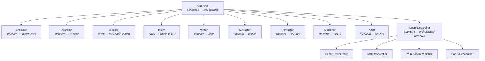

# PAI-OpenCode Agent Capability Matrix

> [!NOTE]
> **Source of truth for agent capabilities (WP-N8).** Model names are resolved from `opencode.json` — this document describes agent roles and cost profiles only.

---

## Overview

PAI-OpenCode defines agent types in `opencode.json` under the `agent` key. Each agent type has:
- Exactly **one configured model** in `opencode.json` (no runtime tier overrides)
- Inherits **session permissions** from `opencode.json` `permission` block

```text
Orchestrator (Algorithm)
    │
    ├── Task → Engineer (implementation)
    ├── Task → Architect (design/ADR)
    ├── Task → explore (fast search)
    ├── Task → Researcher agents (web/research)
    └── Task → Intern (simple batch work)
```

<details>
<summary>Agent hierarchy (Mermaid)</summary>



</details>

---

## Agent Type Reference

### Core Agents

| Agent | Cost Profile | Primary Role | Spawned By |
|---|---|---|---|
| `Algorithm` | Heavy (orchestrator) | Full PAI Algorithm runs, orchestration | User directly |
| `Architect` | Standard | System design, ADR writing | Algorithm |
| `Engineer` | Standard | Implementation, code writing, file edits | Algorithm |
| `general` | Standard | General purpose fallback | Algorithm |
| `explore` | Lightweight | Fast codebase exploration, file search | Algorithm |
| `Intern` | Lightweight | Simple batch tasks, data transformation | Algorithm |
| `Writer` | Standard | Documentation, content, changelogs | Algorithm |
| `QATester` | Standard | Quality assurance, test writing, review | Algorithm |

### Specialist Agents

| Agent | Cost Profile | Primary Role | Notes |
|---|---|---|---|
| `Pentester` | Standard | Security testing, vulnerability analysis | Offensive security — use with purpose |
| `Designer` | Standard | UI/UX design, component specs | — |
| `Artist` | Standard | Visual content, image generation prompts | — |

### Research Agents

| Agent | Cost Profile | Primary Role | Data Source |
|---|---|---|---|
| `DeepResearcher` | Standard | Research orchestration | Delegates to sub-researchers |
| `GeminiResearcher` | Configured in `opencode.json` | Multi-perspective research | Google Gemini (or equivalent) |
| `GrokResearcher` | Configured in `opencode.json` | Contrarian / fact-based analysis | xAI Grok (or equivalent) |
| `PerplexityResearcher` | Configured in `opencode.json` | Real-time web search | Perplexity (or equivalent) |
| `CodexResearcher` | Standard | Technical archaeology | Multiple models |

> [!NOTE]
> Research agents that use external providers (Gemini, Grok, Perplexity) require the corresponding API keys and provider configuration in `opencode.json`. The specific model IDs are set by the user — see `Configuration.md` for the agent model routing schema.

---

## Agent-Based Routing

PAI-OpenCode uses **vanilla OpenCode**. Each agent has exactly one model configured in `opencode.json`. There is no runtime `model_tier` parameter. Cost optimization is achieved by selecting the appropriate agent for the task.

| Cost Profile | Agents | When to Use |
|---|---|---|
| Lightweight | `explore`, `Intern` | Simple lookups, search, batch ops, data transformation |
| Standard | `Engineer`, `Architect`, `Writer`, `QATester`, researchers | Default — implementation, research, documentation |
| Heavy | `Algorithm` | Full orchestration runs, critical reasoning |

### Agent Selection Usage

```typescript
// Use the default Engineer agent (configured model in opencode.json)
Task({ subagent_type: "Engineer", prompt: "..." })

// For cheap/simple work, use a lightweight agent
Task({ subagent_type: "explore", prompt: "Find all files matching *.test.ts" })
Task({ subagent_type: "Intern", prompt: "Replace all occurrences of X with Y across these files" })

// For heavy reasoning, use a heavyweight agent
Task({ subagent_type: "Architect", prompt: "Design the multi-region failover strategy" })
```

### Per-Agent Model Configuration

| Agent | Cost Profile | Model Source |
|---|---|---|
| `Algorithm` | Heavy | `opencode.json` agent section |
| `Architect` | Standard | `opencode.json` agent section |
| `Engineer` | Standard | `opencode.json` agent section |
| `general` | Standard | `opencode.json` agent section |
| `explore` | Lightweight | `opencode.json` agent section |
| `Intern` | Lightweight | `opencode.json` agent section |
| `Writer` | Standard | `opencode.json` agent section |
| `DeepResearcher` | Standard | `opencode.json` agent section |
| `GeminiResearcher` | Configured | `opencode.json` agent section |
| `GrokResearcher` | Configured | `opencode.json` agent section |
| `PerplexityResearcher` | Configured | `opencode.json` agent section |
| `CodexResearcher` | Standard | `opencode.json` agent section |
| `QATester` | Standard | `opencode.json` agent section |
| `Pentester` | Standard | `opencode.json` agent section |
| `Designer` | Standard | `opencode.json` agent section |
| `Artist` | Standard | `opencode.json` agent section |

> [!IMPORTANT]
> All agent models are set in `opencode.json`. Run `cat opencode.json | jq '.agent'` to see current model assignments. The `model_tier` runtime parameter is **no longer supported** — it was removed in v3.0.

---

## Tool Access

All agents inherit the session's tool permissions from `opencode.json`. The current permission block:

```json
"permission": {
  "*": "allow",
  "websearch": "allow",
  "codesearch": "allow",
  "webfetch": "allow",
  "doom_loop": "ask",
  "external_directory": "ask"
}
```

### Native Tool Access by Agent Role

| Tool Category | Algorithm | Engineer | Architect | explore | Intern | Researcher |
|---|---|---|---|---|---|---|
| File read/write | ✅ | ✅ | ✅ | Read only | ✅ | Read only |
| Bash / shell | ✅ | ✅ | ✅ | ❌ | ✅ | ❌ |
| Web search | ✅ | ✅ | ✅ | ❌ | ❌ | ✅ |
| Web fetch | ✅ | ✅ | ✅ | ❌ | ❌ | ✅ |
| Task (spawn subagent) | ✅ | ✅ | ✅ | ❌ | ❌ | ❌ |
| Custom tools (PAI) | ✅ | ✅ | ✅ | ✅ | ✅ | ✅ |
| `doom_loop` | ask | ask | ask | ask | ask | ask |
| `external_directory` | ask | ask | ask | ask | ask | ask |

> [!NOTE]
> The `explore` agent is designed for **read-only codebase exploration**. It uses `grep`, `glob`, and `read` only — no bash, no writes. Use `Engineer` for any operation that modifies files.

### PAI Custom Tools (WP-N1 + WP-N7)

| Tool | Available To | Description |
|---|---|---|
| `session_registry` | All agents | Lists recent sessions with summaries |
| `session_results` | All agents | Detailed results for a specific session ID |
| `code_review` | All agents | Runs roborev AI code review on changed files |

---

## MCP Tool Access

MCP servers are configured globally and available to all agents in a session. Each server exposes its own tools.

### Configuring MCP Servers

MCP servers are defined in your `opencode.json` under the `mcp` key. Each server you add exposes its own tools automatically to all agents in a session.

```jsonc
// opencode.json
{
  "mcp": {
    "my-server": {
      "type": "local",
      "command": "npx",
      "args": ["-y", "@my-org/my-mcp-server"]
    },
    "remote-server": {
      "type": "sse",
      "url": "https://my-mcp-endpoint.example.com/sse"
    }
  }
}
```

> [!TIP]
> Run `/mcp` in an OpenCode session to see all currently connected MCP servers and their available tools.

> [!NOTE]
> Which MCP servers you configure is entirely up to your workflow. Common categories include project management tools, documentation lookups, CI/CD systems, and external APIs. See [`Configuration.md`](./Configuration.md) for the full `mcp` schema.

### Detecting Active MCP Servers

```bash
# List MCP server keys defined in your local opencode.json
jq '.mcp | keys' opencode.json
```

---

## Agent Selection Guide

| Task | Recommended Agent | Cost Profile | Rationale |
|---|---|---|---|
| Complex implementation, multi-file | `Engineer` | Standard | Default implementation role |
| Simple rename, search-replace | `explore` or `Intern` | Lightweight | Lightweight agents for mechanical ops |
| Architecture decisions, ADR writing | `Architect` | Standard | Design role |
| Major redesign, critical ADR | `Architect` | Standard (heavy model) | Best quality for high-stakes decisions |
| Find files, search codebase | `explore` | Lightweight | 2-second rule — fastest option |
| Documentation, README, changelogs | `Writer` | Standard | Dedicated writing role |
| Live web search, real-time facts | `PerplexityResearcher` | Configured | Real-time web index |
| Deep multi-angle research | `DeepResearcher` | Standard | Orchestrates multiple sub-researchers |
| Contrarian / fact-check | `GrokResearcher` | Configured | xAI contrarian analysis |
| Security testing | `Pentester` | Standard | Purpose-built security role |
| Batch/trivial data tasks | `Intern` | Lightweight | Lowest cost for mechanical work |

---

## Decision Rules

> [!IMPORTANT]
> **2-Second Rule:** If `grep`, `glob`, or `read` can answer in <2 seconds, do NOT spawn an agent. Agent spawn overhead is 5–15s plus potential permission prompt.

| Situation | Action |
|---|---|
| Search within 1–3 known files | Use `grep`/`glob`/`read` directly |
| Unknown codebase structure, 5+ files | Spawn `explore` |
| Multi-step implementation work | Spawn `Engineer` |
| You need a web search result | Spawn `PerplexityResearcher` |
| You need architecture advice | Spawn `Architect` |
| Multiple independent criteria | Parallelize with `Promise.all` over multiple `Task` calls |

---

## References

- `opencode.json` — authoritative agent + model configuration
- `docs/architecture/ToolReference.md` — full tool catalog with usage examples
- `docs/architecture/Configuration.md` — `opencode.json` schema reference
- `AGENTS.md` — Algorithm operating instructions (CAPABILITIES SELECTION section)

---

## Installer Preset Coverage (WP-N9)

The installer generates `opencode.json` for 4 provider presets. Each preset assigns a single model per agent based on provider capabilities and cost:

| Preset | Orchestrator (Algorithm) | Lightweight Agents (explore, Intern) | Standard Agents (Engineer, Architect, etc.) |
|--------|-------------------------|--------------------------------------|---------------------------------------------|
| **anthropic** | Claude Opus 4.6 | Claude Haiku 3.5 | Claude Sonnet 4.5 |
| **zen** | Claude Opus 4.6 (via Zen) | GLM 4.7 | Kimi K2.5 |
| **openrouter** | Kimi K2.5 (via OpenRouter) | GLM 4.7 | Kimi K2.5 |
| **openai** | GPT-4o | GPT-4o-mini | GPT-4o |

> [!NOTE]
> Exact per-agent model assignments are in the generated `opencode.json`. The table above shows representative groupings. Run `cat opencode.json | jq '.agent'` to see the full configuration for your active preset.
