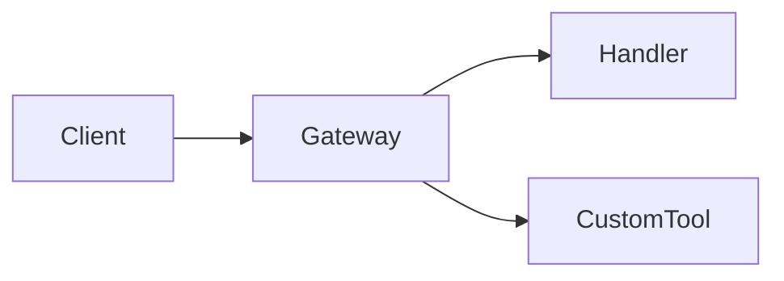

# PAI-OpenCode Formatting Guidelines

> [!NOTE]
> **Canonical formatting reference for all PAI-OpenCode docs and AI-generated output (WP-N8)**

---

## Overview

All PAI-OpenCode documentation follows Obsidian-compatible Markdown. This ensures:
- Correct rendering in Obsidian vaults linked to the repository
- Consistent structure across architecture docs, ADRs, and skill files
- AI output that renders cleanly in both Obsidian and GitHub

---

## 1. Document Frontmatter

Every documentation file **must** include YAML frontmatter:

```yaml
---
title: Short human-readable title
description: One sentence describing the document's purpose
type: reference | adr | skill | guide | spec
wp: WP-N{X}           # Work package that created this file (omit if not applicable)
adr: ADR-{NNN}        # Linked ADR (omit if not applicable)
updated: YYYY-MM-DD
---
```

**Required fields:** `title`, `description`, `type`, `updated`
**Optional fields:** `wp`, `adr`, `status`, `authors`

### Frontmatter for ADRs

```yaml
---
title: "ADR-{NNN}: Short Decision Title"
description: One sentence summary of the decision
type: adr
status: Accepted | Proposed | Deprecated | Superseded
date: YYYY-MM-DD
updated: YYYY-MM-DD
deciders: [Jeremy]
wp: WP-N{X}
---
```

### Frontmatter for SKILL.md files

```yaml
---
name: SkillName
description: One sentence — what this skill does
version: "1.0"
updated: YYYY-MM-DD
---
```

---

## 2. Obsidian Callouts

Use Obsidian callouts (not raw blockquotes) for highlighted content.

### Standard Callout Types

```markdown
> [!NOTE]
> Informational content that adds context without urgency.

> [!IMPORTANT]
> Critical information the reader must not miss.

> [!WARNING]
> Potential pitfall or destructive action risk.

> [!TIP]
> Best practice or efficiency improvement.

> [!DANGER]
> Data loss, security risk, or irreversible action.
```

### Collapsible Callouts

Add `-` for collapsed (closed by default) or `+` for expanded (open by default):

```markdown
> [!NOTE]- Collapsed by default — click to expand
> This content is hidden until the user clicks the header.

> [!TIP]+ Expanded by default — click to collapse
> This content is visible but the user can collapse it.
```

**Rule:** Long supplementary content (>10 lines) that is not essential to the main flow should be wrapped in a collapsed callout.

---

## 3. Diagrams: ASCII + Collapsible Mermaid

Every architecture diagram must provide **both** an ASCII overview and a collapsible Mermaid diagram.

### Pattern

````markdown
```text
Short ASCII overview:

    ┌─────────────┐     ┌─────────────┐
    │   Client    │────▶│   Gateway   │
    └─────────────┘     └─────────────┘
                              │
                    ┌─────────┴─────────┐
                    │                   │
              ┌─────▼─────┐     ┌───────▼───────┐
              │  Handler  │     │  Custom Tool  │
              └───────────┘     └───────────────┘
```

<details>
<summary>Mermaid — detailed view</summary>



</details>
````

### When to Use Each

| Diagram Type | When |
|---|---|
| ASCII only | Simple linear flows, 3–5 nodes |
| ASCII + Mermaid | Architecture diagrams, multi-system flows |
| Mermaid only | Never — always pair with ASCII |

### ASCII Drawing Characters

| Shape | Characters |
|---|---|
| Box | `┌─┐` / `│ │` / `└─┘` |
| Arrow right | `──▶` or `───►` |
| Arrow down | `│` + `▼` |
| T-junction | `├`, `┤`, `┬`, `┴`, `┼` |
| Tree branch | `├──`, `└──` |

---

## 4. Code Blocks

All code blocks must include a language hint:

````markdown
```bash
# Shell commands
git checkout -b feature/wp-n8
```

```typescript
// TypeScript source
const handler: Plugin.Handler = (event) => { ... };
```

```text
# Plain text / file trees / ASCII diagrams
.opencode/
├── plugins/
└── skills/
```

```yaml
# YAML config
agent: opencode
timeout: 120
```

```toml
# TOML config
[tool.roborev]
agent = "opencode"
```
````

> [!WARNING]
> Fenced code blocks without a language hint trigger **MD040** in Biome/markdownlint and will fail CI.

---

## 5. Tables

Use Markdown tables for comparisons, matrices, and reference data.

```markdown
| Column A | Column B | Column C |
|---|---|---|
| Value 1 | Value 2 | Value 3 |
```

**Rules:**
- Header row always present
- Alignment pipes (`|---|---|`) always present
- Short cell content preferred — avoid wrapping prose in table cells
- For wide tables, use collapsible callouts or `<details>` blocks

---

## 6. Headings

```markdown
# H1 — Document title only (one per file)
## H2 — Major sections
### H3 — Subsections
#### H4 — Use sparingly, for deeply nested reference content only
```

**Rules:**
- H1 appears only once per document (matches frontmatter `title`)
- Heading levels never skip (H2 → H4 without H3 is invalid)
- Headings use sentence case: `## Agent capability matrix` not `## Agent Capability Matrix`

---

## 7. Links

### Internal links (Obsidian-style)

```markdown
[[SystemArchitecture]]          # Wikilink to another doc in the vault
[[SystemArchitecture#Hooks]]    # Wikilink with anchor
```

### Standard Markdown links

```markdown
[SystemArchitecture](./SystemArchitecture.md)         # Relative path
[ADR-018](./adr/ADR-018-roborev-code-review-integration.md)
```

> [!TIP]
> Use **relative paths** for cross-references within `docs/`. Obsidian resolves both styles, but relative paths work on GitHub and in CI.

---

## 8. SKILL.md Structure (PAI v3.0 Schema)

All skill files follow this canonical structure:

````markdown
---
name: SkillName
description: One sentence
version: "1.0"
updated: YYYY-MM-DD
---

# SkillName

> [!NOTE]
> One sentence summary of purpose and when this skill activates.

## USE WHEN

- Trigger phrase or situation 1
- Trigger phrase or situation 2

## MANDATORY

Steps the AI must always perform when this skill activates.

## OPTIONAL

Enhancements the AI may perform based on context.

## OUTPUT FORMAT

Expected output structure.

## EXAMPLES

```text
Example invocation or output.
```
````

---

## 9. ADR Structure

All Architecture Decision Records follow this canonical structure:

```markdown
---
title: "ADR-{NNN}: Title"
type: adr
status: Accepted
date: YYYY-MM-DD
updated: YYYY-MM-DD
deciders: [Jeremy]
wp: WP-N{X}
---

# ADR-{NNN}: Title

## Status

Accepted

## Context

What situation or problem prompted this decision.

## Decision

What was decided.

## Consequences

### Positive
- ...

### Negative / Trade-offs
- ...

## Implementation

How the decision was implemented (file paths, key changes).

## References

- Related ADRs or external docs
```

---

## 10. AI Output Formatting

When the AI produces output that will be stored in Obsidian (notes, session summaries, PRDs):

### Required Elements

| Element | Pattern |
|---|---|
| Frontmatter | YAML block at top of every persisted document |
| Headers | H1 for title, H2+ for sections |
| Callouts | `> [!NOTE]` / `> [!WARNING]` / `> [!IMPORTANT]` |
| Code blocks | Always fenced with language hint |
| Diagrams | ASCII overview + collapsible Mermaid for complex flows |

### Prohibited Patterns

| Pattern | Problem | Use Instead |
|---|---|---|
| `> Simple blockquote` for callouts | Not rendered as callout in Obsidian | `> [!NOTE]` |
| ` ``` ` without language | MD040 CI failure | ` ```text ` or ` ```bash ` |
| `<br>` or raw HTML | Not portable | Blank line between paragraphs |
| Skipping heading levels | Invalid structure | Use H2 → H3 → H4 in order |
| Inline HTML tables | Not portable | Standard Markdown tables |

---

## Quick Reference

```text
Frontmatter:       title, description, type, updated (required)
Callouts:          > [!NOTE/IMPORTANT/WARNING/TIP/DANGER]
Collapsed:         > [!NOTE]- (collapsed) / > [!NOTE]+ (expanded)
Diagrams:          ASCII overview + <details> Mermaid block
Code blocks:       Always fenced + language hint (MD040)
Headings:          H1 once, no skipped levels, sentence case
Links:             Relative paths for cross-references
SKILL.md:          USE WHEN / MANDATORY / OPTIONAL / OUTPUT FORMAT
ADR:               Status / Context / Decision / Consequences / Implementation
```
