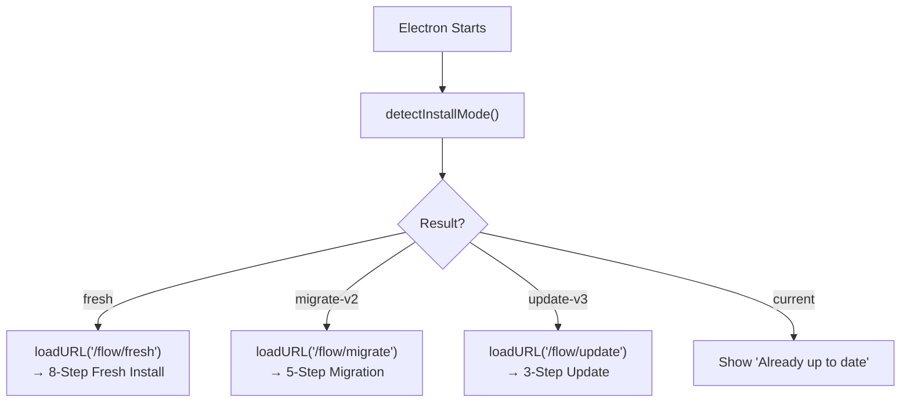

# PAI-OpenCode Installer Refactor Plan (Updated)

> [!info]
> **Status:** Ready for Implementation — Post PR `#47`
> **Goal:** One Electron GUI entry point for both new and existing users
> **Author:** Jeremy (Updated after WP-D completion)
> **Target:** New PR `#48` (after PR `#47` merged)

---

## 1. Current State (Post PR #47)

### ✅ What Was Fixed in PR #47

PR #47 successfully merged PAI-Install v4.0.3 with all CodeRabbit fixes:

- ✅ Git URLs corrected to `Steffen025/pai-opencode`
- ✅ Atomic file writes in `engine/state.ts`
- ✅ `opencode.json` validation added
- ✅ Fish shell alias detection working
- ✅ Safe headless detection with `${DISPLAY-}`
- ✅ 4 fixes in `generate-welcome.ts`
- ✅ Target-specific client sockets + inputType masking
- ✅ Voice IDs have secret allowlist comments
- ✅ Retry limit (50 attempts) in `checkAndSend`
- ✅ Brew detection cached (no duplicate exec)
- ✅ `db-archive.ts` success/failure logic fixed
- ✅ `migration-v2-to-v3.ts` syntax errors resolved
- ✅ Command help text clarified (shows stats only)
- ✅ README callout syntax applied

### ❌ What Still Needs Refactoring

**Current installer structure (messy):**
```text
install.sh          ← 163 lines (too complex)
  └── PAI-Install/
        ├── cli/          ← 3 files (TUI, interactive)
        ├── electron/     ← GUI wrapper (separate)
        ├── engine/       ← 8 files (shared logic)
        └── web/          ← Web server for Electron

.opencode/PAIOpenCodeWizard.ts   ← STILL EXISTS (4. Weg!)
Tools/migration-v2-to-v3.ts      ← STILL EXISTS (separate script)
```

**Problems identified:**
1. **4 entry points still exist** — user confusion not resolved
2. **PAIOpenCodeWizard.ts not integrated** — build logic lives outside PAI-Install
3. **Migration is separate** — not unified with installer
4. **TUI code (cli/)** — duplicates what Electron should do
5. **install.sh too complex** — 163 lines of bash

---

## 2. Clarifications from PR #47

### 2.1 What the Installer Actually Does

**Clarified:** The installer has TWO distinct responsibilities:

| Phase | What It Does | Where Logic Lives |
|-------|--------------|-------------------|
| **Bootstrap** | Check/install bun, launch Electron | `install.sh` |
| **Build OpenCode** | Clone fork, checkout model-tiers, build binary | `PAIOpenCodeWizard.ts` ❌ (external!) |
| **Install PAI** | Copy files, generate settings, setup voice | `PAI-Install/engine/` ✅ |
| **Migrate** | v2→v3 structure migration, backup | `Tools/migration-v2-to-v3.ts` ❌ (external!) |

**Problem:** The Build and Migrate logic are OUTSIDE PAI-Install, causing the fragmentation.

### 2.2 User Scenarios Clarified

| User Type | Current Experience | Target Experience |
|-----------|-------------------|-------------------|
| **New User** | Reads README, confused which script to run | `bash install.sh` → Electron auto-detects "fresh" |
| **v2→v3 Migrator** | Runs `migration-v2-to-v3.ts`, then installer | `bash install.sh` → Electron auto-detects "migrate" |
| **v3 Updater** | Manual git pull, no installer | `bash install.sh` → Electron auto-detects "update" |
| **CI/Headless** | No supported path | `bash install.sh --cli --preset anthropic` |

### 2.3 What "Building OpenCode Binary" Actually Means

**Clarified:** This is NOT installing PAI — it's building a custom OpenCode CLI tool:

```text
Steffen025/opencode (fork)
    └── feature/model-tiers (branch with 60x cost optimization)
        └── bun build → /usr/local/bin/opencode (binary)
```

**Why it's needed:**
- Model Tier routing (quick=MiniMax, standard=Sonnet, advanced=Opus)
- 60x cost optimization (Opus vs MiniMax cost difference)
- PAI-specific enhancements

**Why it's confusing:** Users think they're installing PAI, but first they must build a custom OpenCode binary.

### 2.4 Migration vs. Update Clarified

| Operation | When | What Changes |
|-----------|------|--------------|
| **Migrate (v2→v3)** | Flat skills → Hierarchical | Skills structure, MINIMAL_BOOTSTRAP |
| **Update (v3→v3.x)** | Within v3.x versions | PAI files, skills, maybe OpenCode binary |
| **Fresh Install** | No existing ~/.opencode | Everything: OpenCode binary + PAI files |

**Detection Logic:**
```typescript
function detectInstallMode(): "fresh" | "migrate-v2" | "update-v3" | "current" {
  const opencodePath = path.join(os.homedir(), ".opencode");
  if (!existsSync(opencodePath)) return "fresh";
  
  const settings = readSettings();
  if (settings?.pai?.version?.startsWith("3")) {
    // Has v3, check if update needed
    return isOutdated(settings.pai.version) ? "update-v3" : "current";
  }
  
  // Has .opencode but no v3 settings = v2
  return "migrate-v2";
}
```

---

## 3. Updated Target Architecture

### Simplified Structure

```text
PAI-Install/
├── install.sh              ← Bootstrap ONLY (15 lines)
├── README.md               ← Entry point docs
│
├── electron/               ← PRIMARY ENTRY POINT
│   ├── main.js             ← Electron main process
│   ├── package.json        ← electron deps
│   └── preload.js          ← Security context bridge
│
├── engine/                 ← SHARED LOGIC
│   ├── detect.ts           ← System + install mode detection
│   ├── build-opencode.ts   ← ⭐ NEW: Build OpenCode binary
│   ├── migrate.ts          ← ⭐ NEW: v2→v3 migration
│   ├── update.ts           ← ⭐ NEW: v3→v3.x update
│   ├── actions.ts          ← Install actions
│   ├── config-gen.ts       ← Settings generation
│   ├── state.ts            ← State machine (already atomic ✓)
│   ├── validate.ts         ← Validation (already has opencode.json ✓)
│   ├── steps-fresh.ts      ← ⭐ NEW: 8-step fresh install
│   ├── steps-migrate.ts    ← ⭐ NEW: 5-step migration
│   ├── steps-update.ts     ← ⭐ NEW: 3-step update
│   └── types.ts            ← Types (already has DEFAULT_VOICES ✓)
│
├── web/                    ← Web UI (served by bun)
│   ├── server.ts           ← Bun HTTP server
│   ├── routes.ts           ← API routes (already has socket targeting ✓)
│   └── public/
│       ├── index.html
│       ├── app.js          ← UI (already has retry limit ✓)
│       ├── styles.css
│       └── assets/
│
└── cli/                    ← HEADLESS ONLY
    └── quick-install.ts    ← ⭐ RENAMED from index.ts, non-interactive
```

### Deleted Files

| File | Status | Notes |
|------|--------|-------|
| `cli/display.ts` | ❌ DELETE | TUI replaced by Electron |
| `cli/index.ts` | ❌ DELETE | Interactive flow replaced |
| `cli/prompts.ts` | ❌ DELETE | Terminal prompts replaced |
| `engine/steps.ts` | ❌ DELETE | Split into steps-fresh/migrate/update |
| `Tools/migration-v2-to-v3.ts` | ❌ DELETE | Ported to `engine/migrate.ts` |
| `.opencode/PAIOpenCodeWizard.ts` | ❌ DEPRECATE | Ported to `engine/build-opencode.ts` |

---

## 4. Entry Point Flow (Simplified)

### 4.1 install.sh (15 lines)

```bash
#!/usr/bin/env bash
set -euo pipefail

# 1. Check bun
if ! command -v bun &>/dev/null; then
  curl -fsSL https://bun.sh/install | bash
fi

# 2. Launch (GUI default, CLI with --cli flag)
if [ "${1:-}" = "--cli" ]; then
  bun PAI-Install/cli/quick-install.ts "${@:2}"
else
  cd PAI-Install
  bun install --silent
  electron .
fi
```

### 4.2 Electron Main Process Flow

```text
Electron Starts
    │
    └── detectInstallMode()
          │
          ├── "fresh" → loadURL('/flow/fresh')
          │               └── 8-Step Fresh Install
          │
          ├── "migrate-v2" → loadURL('/flow/migrate')
          │                    └── 5-Step Migration
          │
          ├── "update-v3" → loadURL('/flow/update')
          │                   └── 3-Step Update
          │
          └── "current" → show "Already up to date"
```

<details>
<summary>Mermaid detail</summary>



</details>

---

## 5. Step Definitions (Updated)

### 5.1 Fresh Install (8 Steps)

| Step | UI Screen | Backend Action | Progress |
|------|-----------|----------------|----------|
| 1 | Welcome | Show value prop | 0% |
| 2 | Prerequisites | Check git, bun | 10% |
| 3 | **Build OpenCode** | `engine/build-opencode.ts` | 10-70% |
|   | - Clone fork | `git clone Steffen025/opencode` | 20% |
|   | - Checkout branch | `git checkout feature/model-tiers` | 30% |
|   | - Install deps | `bun install` | 40% |
|   | - Build binary | `bun run build.ts --single` | 70% |
| 4 | **AI Provider** ⭐ | Configure API keys | 75% |
|   | - **Recommended:** OpenCode Zen (FREE models) | Save `ZEN_API_KEY` | — |
|   | - Alternative: Anthropic, OpenRouter | Save respective keys | — |
| 5 | Identity | Save name, AI name, timezone | 85% |
| 6 | Voice (Optional) | ElevenLabs key, test voice | 90% |
| 7 | Install PAI | Copy files, create wrapper | 90-100% |
| 8 | Done | Show summary, launch command | 100% |

**Step 4 — Provider Selection UI:**
```text
┌─────────────────────────────────────────────────────────┐
│                                                         │
│   Step 4 of 8: Choose Your AI Provider                  │
│                                                         │
│   💚 RECOMMENDED: OpenCode Zen (Start FREE)            │
│   ┌──────────────────────────────────────┐             │
│   │                                      │             │
│   │  🆓 FREE Tier Available:             │             │
│   │  • MiniMax M2.5 Free — $0           │             │
│   │  • GPT 5 Nano — $0                  │             │
│   │  • Big Pickle — $0 (limited)        │             │
│   │                                      │             │
│   │  Low-cost options:                  │             │
│   │  • GPT 5.1 Codex Mini — $0.25/M     │             │
│   │  • Claude Haiku 3.5 — $0.80/M       │             │
│   │                                      │             │
│   │  Get your free API key:              │             │
│   │  👉 https://opencode.ai/zen          │             │
│   │                                      │             │
│   │  [I have my Zen API key →]           │             │
│   │                                      │             │
│   └──────────────────────────────────────┘             │
│                                                         │
│   ─ ─ ─ ─ ─ ─ ─ ─ ─ ─ ─ ─ ─ ─ ─ ─ ─ ─ ─ ─ ─ ─ ─       │
│                                                         │
│   🔄 Use Different Provider:                          │
│   • Anthropic (Claude Opus/Sonnet) — Premium quality   │
│   • OpenRouter (Multi-provider) — Flexibility          │
│   • OpenAI (GPT-5 series) — Familiar                   │
│                                                         │
│   [Back]              [Continue with Zen]              │
│                                                         │
└─────────────────────────────────────────────────────────┘
```

**Why OpenCode Zen is Default:**
- ✅ FREE tier available (no credit card required)
- ✅ Pay-as-you-go (no subscription)
- ✅ Includes Claude, GPT, and open-source models
- ✅ 60x cost optimization through model tiers
- ✅ Built specifically for PAI-OpenCode workflow

### 5.2 Migration v2→v3 (5 Steps)

| Step | UI Screen | Backend Action | Progress |
|------|-----------|----------------|----------|
| 1 | Detected | Show "Found v2.x" | 0% |
| 2 | Backup | `createBackup()` → `~/.opencode-backup-DATE` | 10% |
| 3 | Migrate | `engine/migrate.ts` | 10-70% |
|   | - Flatten skills | Move files up one level | 30% |
|   | - Update bootstrap | Fix MINIMAL_BOOTSTRAP.md | 50% |
|   | - Validate | Run validation checks | 70% |
| 4 | Binary Update | Optional: `build-opencode.ts` | 70-90% |
| 5 | Done | Summary, no settings lost | 100% |

### 5.3 Update v3→v3.x (3 Steps)

| Step | UI Screen | Backend Action | Progress |
|------|-----------|----------------|----------|
| 1 | Detected | Show current → new version | 0% |
| 2 | Update | Pull changes, update files | 10-80% |
| 3 | Done | Summary | 100% |

---

## 6. Backend Logic (New Files)

### 6.1 engine/build-opencode.ts (NEW)

Ported from `PAIOpenCodeWizard.ts`:

```typescript
export async function buildOpenCodeBinary(
  options: {
    onProgress: (step: string, percent: number) => void;
    skipIfExists?: boolean;
  }
): Promise<BuildResult> {
  const buildDir = "/tmp/opencode-build-" + Date.now();
  const installPath = "/usr/local/bin/opencode";
  
  // Skip if exists
  if (options.skipIfExists && existsSync(installPath)) {
    return { success: true, skipped: true, version: await getVersion() };
  }
  
  try {
    // Step 1: Clone
    options.onProgress("Cloning Steffen025/opencode fork...", 10);
    await exec(`git clone https://github.com/Steffen025/opencode.git ${buildDir}`);
    
    // Step 2: Checkout model-tiers
    options.onProgress("Checking out feature/model-tiers...", 30);
    await exec(`git checkout feature/model-tiers`, { cwd: buildDir });
    
    // Step 3: Install
    options.onProgress("Installing dependencies (this takes 2-3 min)...", 50);
    await exec(`bun install`, { cwd: buildDir });
    
    // Step 4: Build
    options.onProgress("Building standalone binary...", 70);
    await exec(
      `bun run ./packages/opencode/script/build.ts --single`,
      { cwd: buildDir }
    );
    
    // Step 5: Install
    options.onProgress("Installing to /usr/local/bin...", 90);
    await exec(`cp ${buildDir}/opencode ${installPath}`);
    await exec(`chmod +x ${installPath}`);
    
    options.onProgress("Done!", 100);
    return { success: true, version: await getVersion() };
    
  } finally {
    // Cleanup
    await exec(`rm -rf ${buildDir}`);
  }
}
```

### 6.2 engine/migrate.ts (NEW)

Ported from `Tools/migration-v2-to-v3.ts`:

```typescript
export async function migrateV2ToV3(
  options: { dryRun?: boolean; onProgress?: (step: string, percent: number) => void }
): Promise<MigrationResult> {
  const paiDir = join(homedir(), ".opencode");
  const backupDir = join(homedir(), `.opencode-backup-${Date.now()}`);
  
  const result: MigrationResult = {
    backedUp: [],
    migrated: [],
    skipped: [],
    errors: [],
  };
  
  try {
    // 1. Backup
    options.onProgress?.("Creating backup...", 10);
    await createBackup(paiDir, backupDir);
    result.backedUp.push(backupDir);
    
    // 2. Detect flat skills
    options.onProgress?.("Detecting flat skill structure...", 20);
    const flatSkills = detectFlatSkills(paiDir);
    
    // 3. Migrate each skill
    let progress = 20;
    for (const skill of flatSkills) {
      options.onProgress?.(`Migrating ${skill}...`, progress);
      await migrateFlatSkill(skill);
      result.migrated.push(skill);
      progress += Math.floor(50 / flatSkills.length);
    }
    
    // 4. Update MINIMAL_BOOTSTRAP.md
    options.onProgress?.("Updating bootstrap file...", 80);
    await updateMinimalBootstrap();
    
    // 5. Validate
    options.onProgress?.("Validating migration...", 90);
    const validation = await validateMigration();
    if (!validation.valid) {
      result.errors.push(...validation.errors);
    }
    
    options.onProgress?.("Migration complete!", 100);
    return result;
    
  } catch (error) {
    result.errors.push(error instanceof Error ? error.message : String(error));
    throw error;
  }
}
```

### 6.3 engine/update.ts (NEW)

```typescript
export async function updateV3(
  currentVersion: string,
  targetVersion: string,
  options: { onProgress?: (step: string, percent: number) => void }
): Promise<UpdateResult> {
  // 1. Detect what changed
  const changes = detectChanges(currentVersion, targetVersion);
  
  // 2. Apply updates
  for (const change of changes) {
    await applyChange(change);
  }
  
  // 3. Update version marker
  await updateVersionMarker(targetVersion);
  
  return { success: true, changesApplied: changes.length };
}
```

---

## 7. Headless CLI (quick-install.ts)

### Usage

```bash
# Fresh install (interactive fallback if no args)
bun PAI-Install/cli/quick-install.ts \
  --preset anthropic \
  --name "Steffen" \
  --ai-name "Jeremy" \
  --timezone "Europe/Berlin" \
  --anthropic-key "sk-..." \
  --elevenlabs-key "..." \
  --build-opencode \
  --voice

# Migrate
bun PAI-Install/cli/quick-install.ts --migrate --backup-dir ~/backups

# Update
bun PAI-Install/cli/quick-install.ts --update

# Dry run (preview)
bun PAI-Install/cli/quick-install.ts --migrate --dry-run
```

### Non-Interactive Requirements

- All required args must be provided (no prompts)
- Progress output to stdout (JSON lines or text)
- Exit code 0 = success, 1 = error
- No TUI, no Electron

---

## 8. UI/UX Design Principles

### 8.1 One Question Per Screen

Don't overwhelm users. Each step asks ONE thing:

```text
┌─────────────────────────────────────────────────────────┐
│                                                         │
│   Step 5 of 8                                           │
│                                                         │
│   What's your name?                                     │
│                                                         │
│   ┌──────────────────────────────────────┐             │
│   │ Steffen                              │             │
│   └──────────────────────────────────────┘             │
│                                                         │
│   This will be used to personalize your AI              │
│   assistant's responses.                                │
│                                                         │
│   [Back]              [Continue]                        │
│                                                         │
└─────────────────────────────────────────────────────────┘
```

### 8.2 Always Show Progress

Users must know:
- What step they're on
- How many steps total
- What is happening (not just "Loading...")

```text
Step 3 of 8: Building OpenCode Binary
████████████████████░░░░  67%

Current: Compiling TypeScript...
Estimated: 2 minutes remaining
```

### 8.3 Explain the "Why"

When asking for API keys or building binary, explain WHY:

```text
┌─────────────────────────────────────────────────────────┐
│                                                         │
│   Why do you need an Anthropic API key?                 │
│                                                         │
│   PAI-OpenCode uses Claude (via Anthropic API) to       │
│   provide intelligent assistance. Without this,         │
│   the AI features won't work.                           │
│                                                         │
│   Get your key: https://console.anthropic.com           │
│                                                         │
│   ┌──────────────────────────────────────┐             │
│   │ sk-ant-...                           │             │
│   └──────────────────────────────────────┘             │
│                                                         │
└─────────────────────────────────────────────────────────┘
```

### 8.4 Skip Option for Advanced Steps

Building OpenCode takes 3-5 minutes. Allow skipping:

```text
┌─────────────────────────────────────────────────────────┐
│                                                         │
│   ⚙  Building OpenCode                                  │
│                                                         │
│   ████████████████████░░  60%                           │
│                                                         │
│   Compiling... (3-5 minutes total)                      │
│                                                         │
│   ─ ─ ─ ─ ─ ─ ─ ─ ─ ─ ─ ─ ─ ─ ─ ─ ─ ─ ─ ─ ─ ─ ─       │
│                                                         │
│   [Skip]  ← Use standard OpenCode (no model tiers)      │
│                                                         │
│   (You can build it later by re-running installer)      │
│                                                         │
└─────────────────────────────────────────────────────────┘
```

---

## 9. Error Handling Strategy

### 9.1 Recoverable Errors

| Error | Recovery Action |
|-------|-----------------|
| Git clone fails | Retry with https vs ssh, or manual instructions |
| Bun install fails | Clear cache, retry, or show manual build steps |
| Build fails | Show logs, offer "skip this step" |
| API key invalid | Retry input, link to docs |
| Backup exists | Offer overwrite, append timestamp, or cancel |

### 9.2 Non-Recoverable Errors

| Error | Action |
|-------|--------|
| No internet | Show offline instructions |
| Disk full | Show cleanup instructions |
| Permission denied | Show sudo instructions |
| Unknown state | Safe fallback to manual mode |

---

## 10. Testing Strategy

### 10.1 Test Scenarios

| Scenario | Test |
|----------|------|
| Fresh macOS install | VM with no bun, no git |
| Fresh Linux install | Ubuntu VM |
| Existing v2 install | Simulate flat skills |
| Existing v3 install | Simulate current version |
| Network failure | Disconnect during build |
| Cancel mid-install | Ctrl+C, resume |
| Headless mode | CI pipeline |

### 10.2 Automated Tests

```typescript
// engine/__tests__/detect.test.ts
describe("detectInstallMode", () => {
  it("returns 'fresh' when no .opencode exists", () => {
    // ...
  });
  
  it("returns 'migrate-v2' when flat skills detected", () => {
    // ...
  });
  
  it("returns 'update-v3' when v3.x outdated", () => {
    // ...
  });
});
```

---

## 11. Implementation Tasks (Updated)

| Task | Effort | Dependencies |
|------|--------|--------------|
| Create `engine/build-opencode.ts` | 1.5h | None |
| Create `engine/migrate.ts` (port from tools/) | 1h | None |
| Create `engine/update.ts` | 30min | None |
| Create `engine/steps-fresh.ts` | 1h | build-opencode.ts |
| Create `engine/steps-migrate.ts` | 45min | migrate.ts |
| Create `engine/steps-update.ts` | 30min | update.ts |
| Simplify `install.sh` (163→15 lines) | 15min | None |
| Create `cli/quick-install.ts` (headless) | 1.5h | All steps-* |
| Update Electron UI for flow routing | 2h | All steps-* |
| ⭐ **Create wrapper script** `/usr/local/bin/{AI_NAME}-wrapper` | 1h | build-opencode.ts |
| ⭐ **Add .zshrc alias integration** | 30min | Wrapper script |
| Delete deprecated files | 15min | All above |
| Write tests | 2h | All above |
| Update documentation | 1h | All above |

**Total Effort:** ~12.5 hours (added wrapper creation)

---

## 12. Migration from Current State

### Step-by-Step

1. **Create new engine files** (parallel to existing)
   - `engine/build-opencode.ts`
   - `engine/migrate.ts`
   - `engine/update.ts`
   - `engine/steps-fresh.ts`
   - `engine/steps-migrate.ts`
   - `engine/steps-update.ts`

2. **Simplify `install.sh`**
   - Reduce to 15 lines
   - Test on macOS + Linux

3. **Create `cli/quick-install.ts`**
   - Non-interactive only
   - Arg parsing
   - Progress output

4. **Update Electron UI**
   - Route based on detectInstallMode()
   - Show appropriate flow

5. **Delete deprecated**
   - `cli/display.ts`
   - `cli/index.ts`
   - `cli/prompts.ts`
   - `engine/steps.ts`
   - `Tools/migration-v2-to-v3.ts`
   - `.opencode/PAIOpenCodeWizard.ts` (add deprecation notice)

6. **Create wrapper script** ⭐ CRITICAL
   - Install to `/usr/local/bin/{AI_NAME}-wrapper`
   - Template based on `~/.opencode/tools/opencode-wrapper`
   - Install custom binary to `~/.opencode/tools/opencode`
   - Add alias to `.zshrc`: `alias {AI_NAME}="{AI_NAME}-wrapper"`
   - Include `--rebuild`, `--brew`, `--status` flags

7. **Test all scenarios**
   - Fresh install
   - Migrate v2→v3
   - Update v3→v3.x
   - Headless mode
   - **Wrapper test:** Type `{AI_NAME}` after restart → must use custom build
   - **Brew escape:** `{AI_NAME} --brew` → must use Homebrew version

---

## 13. Post-Refactor Verification

### Checklist

- [ ] `install.sh` is <20 lines
- [ ] Only ONE entry point (Electron GUI)
- [ ] Headless mode works (`--cli` flag)
- [ ] Auto-detect works for fresh/migrate/update
- [ ] Build OpenCode step shows progress
- [ ] Migration creates backup before changing
- [ ] Update preserves settings
- [ ] **Wrapper created at** `/usr/local/bin/{AI_NAME}-wrapper`
- [ ] **Custom binary at** `~/.opencode/tools/opencode`
- [ ] **Alias in .zshrc** works after restart
- [ ] `{AI_NAME}` command uses custom build (not Homebrew)
- [ ] `{AI_NAME} --brew` escape hatch works
- [ ] `{AI_NAME} --rebuild` rebuilds from source
- [ ] `{AI_NAME} --status` shows build info
- [ ] All scenarios tested
- [ ] Documentation updated

### Wrapper Test Procedure

```bash
# 1. Test fresh install
bash PAI-Install/install.sh
# Complete installation...

# 2. Verify wrapper exists
which {AI_NAME}
# Should output: /usr/local/bin/{AI_NAME}-wrapper

# 3. Verify alias in .zshrc
grep "alias {AI_NAME}" ~/.zshrc
# Should show: alias {AI_NAME}="/usr/local/bin/{AI_NAME}-wrapper"

# 4. Test wrapper uses custom build
{AI_NAME} --status
# Should show: Binary: /Users/.../.opencode/tools/opencode
# Should show: Branch: feature/model-tiers

# 5. Simulate restart (new shell)
exec zsh
{AI_NAME} --status
# Should STILL show custom build (not Homebrew)

# 6. Test escape hatch
{AI_NAME} --brew --version
# Should show Homebrew version

# 7. Test rebuild
{AI_NAME} --rebuild
# Should rebuild from source
```

---

## 14. Clarifications Summary

### What We Learned from PR #47

1. **The installer does TWO things:** Build OpenCode binary + Install PAI files
2. **Users are confused** by 4 entry points — need ONE
3. **Build takes 3-5 min** — must show progress + allow skip
4. **Migration is separate** — must integrate into installer
5. **Headless mode needed** — for CI/homeserver users
6. **Auto-detect is key** — don't make users choose

### Clarifications from Jeremy (2026-03-09)

#### Q1: Should we bundle OpenCode binary or always build from source?

**Answer:** Always build from source — because:
- Standard OpenCode (brew install) lacks model-tiers feature
- Custom build needed for dynamic routing (quick/standard/advanced)
- Can't upload binaries to GitHub (size limits)
- Build is now Bun-based (reliable, no Go needed)

**Solution:** Build during install with clear progress UI + skip option

---

#### Q2: API Key Strategy — No Anthropic Key Required!

**Key Insight:** Since we install OpenCode (not Claude Code PAI), users DON'T need Anthropic API key!

**Revised Provider Flow:**

**Step 1: Direct users to OpenCode-Zen (FREE option)**
- URL: https://opencode.ai/docs/zen/
- Models available:
  - **MiniMax M2.5 Free** — FREE (limited time)
  - **Big Pickle** — FREE (limited time, stealth model)
  - **GPT 5 Nano** — FREE
  - **GPT 5.1 Codex Mini** — $0.25/$2.00 per 1M tokens
- Get key at: https://opencode.ai/zen

**Step 2: Alternative API Keys (optional)**
- **Anthropic** — for Claude users (Opus 4.6, Sonnet 4.6, etc.)
- **OpenRouter** — for multi-provider access
- **OpenAI** — for GPT models

**UI Design:**
```text
┌─────────────────────────────────────────────────────────┐
│                                                         │
│   Step 4 of 8: Choose Your AI Provider                  │
│                                                         │
│   💡 RECOMMENDED: OpenCode Zen (FREE)                  │
│   ┌──────────────────────────────────────┐             │
│   │ • MiniMax M2.5 Free — $0            │             │
│   │ • GPT 5 Nano — $0                   │             │
│   │ • GPT 5.1 Codex Mini — $0.25/M      │             │
│   │                                      │             │
│   │ Get free key: opencode.ai/zen        │             │
│   └──────────────────────────────────────┘             │
│                                                         │
│   ─ ─ ─ ─ ─ ─ ─ ─ ─ ─ ─ ─ ─ ─ ─ ─ ─ ─ ─ ─ ─ ─ ─       │
│                                                         │
│   Other Options:                                        │
│   ┌──────────────────────────────────────┐             │
│   │ Anthropic (Claude) — $3-15/M tokens │             │
│   │ OpenRouter (Multi-provider)         │             │
│   │ OpenAI (GPT-4/5)                    │             │
│   └──────────────────────────────────────┘             │
│                                                         │
│   [Back]              [Continue with Zen]             │
│                                                         │
└─────────────────────────────────────────────────────────┘
```

---

#### Q3: What if build fails?

**Answer:** Build rarely fails (Bun-based, reliable), but if it does:

**Recovery Options:**
1. **Show detailed error logs** in UI
2. **Offer "Try Again"** — most network issues are transient
3. **Manual build instructions** — fallback for advanced users
4. **Skip option** — use standard OpenCode (no model tiers)

**Note:** Cannot offer pre-built binary download due to GitHub size limits

---

#### Q4: Update Frequency?

**Answer:** Check on EVERY launch

**Implementation:** Custom wrapper command (like "jeremy")

**Current Setup (reference implementation - `~/.opencode/tools/opencode-wrapper`):**

```bash
#!/usr/bin/env bash
#
# WHY: The Homebrew build of OpenCode doesn't support our custom agent system
# (model_tiers, agent frontmatter metadata, PAI CODE branding). We compile our
# own binary from the feature/model-tiers branch.
#
# The compiled binary runs from ANY directory - no --cwd tricks, no symlinks,
# no process.cwd() overrides needed.

OPENCODE_SRC="/Users/steffen/workspace/github.com/anomalyco/opencode"
PAI_BIN="${HOME}/.opencode/tools/opencode"
BREW_BIN="/usr/local/bin/opencode"

# Rebuild from source
rebuild() {
    echo "[PAI CODE] Rebuilding from source..."
    
    # Build
    (cd "${OPENCODE_SRC}" && bun run --filter=opencode build)
    
    # Symlink binary (Bun-compiled binaries MUST stay in dist/)
    local dist_bin="${OPENCODE_SRC}/packages/opencode/dist/opencode-darwin-arm64/bin/opencode"
    rm -f "${PAI_BIN}"
    ln -s "${dist_bin}" "${PAI_BIN}"
    
    echo "[PAI CODE] Build complete!"
}

# Show status
show_status() {
    local branch=$(cd "${OPENCODE_SRC}" && git branch --show-current)
    local commit=$(cd "${OPENCODE_SRC}" && git log --oneline -1)
    local binary_exists=$([[ -f "${PAI_BIN}" ]] && echo "yes" || echo "NO")
    
    echo "PAI CODE - Custom Build Status"
    echo "━━━━━━━━━━━━━━━━━━━━━━━━━━━━━"
    echo "Binary:           ${PAI_BIN}"
    echo "Binary exists:    ${binary_exists}"
    echo "Source:           ${OPENCODE_SRC}"
    echo "Branch:           ${branch}"
    echo "Latest commit:    ${commit}"
    echo ""
    echo "Custom features:"
    echo "  - Agent model_tier support (quick/standard/advanced)"
    echo "  - Agent frontmatter metadata (voice, fallback, etc.)"
    echo "  - PAI CODE branding"
}

# Main
main() {
    case "${1:-}" in
        --status)
            show_status
            exit 0
            ;;
        --brew)
            shift
            echo "[PAI CODE] Using Homebrew version (escape hatch)..."
            exec "${BREW_BIN}" "$@"
            ;;
        --rebuild)
            rebuild
            exit $?
            ;;
    esac

    # Verify binary exists
    if [[ ! -f "${PAI_BIN}" ]]; then
        echo "[PAI CODE] Binary not found. Run: opencode-wrapper --rebuild"
        echo "[PAI CODE] Falling back to Homebrew..."
        exec "${BREW_BIN}" "$@"
    fi

    # Run our custom binary
    exec "${PAI_BIN}" "$@"
}

main "$@"
```

**Called from `.zshrc`:**
```bash
jeremy() {
  cd ~/workspace/github.com/Steffen025/jeremy-opencode && ~/.opencode/tools/opencode-wrapper "$@"
}
```

**Key Features:**
- ✅ Checks if custom build exists
- ✅ Falls back to Homebrew if missing
- ✅ `--rebuild` flag to rebuild from source
- ✅ `--brew` escape hatch to use Homebrew
- ✅ `--status` shows build info
- ✅ Works from any directory
- ✅ Bun-compiled binary stays in dist/ (symlinked, not copied)

---

**For Installer: Create similar solution**

```bash
# After install, user's .zshrc gets:
alias {AI_NAME}="/usr/local/bin/{AI_NAME}-wrapper"

# Wrapper script at /usr/local/bin/{AI_NAME}-wrapper:
# - Checks custom binary at ~/.opencode/tools/opencode
# - Compares version/hash
# - Rebuilds if outdated
# - Launches correct binary
```

**Critical Problem to Solve:**
> "When users type 'opencode' after restart, it loads standard OpenCode (brew) instead of our custom build"

**Solution (from reference implementation):**
1. **Install custom binary to** `~/.opencode/tools/opencode` (NOT /usr/local/bin)
2. **Create wrapper script** at `/usr/local/bin/{AI_NAME}` 
3. **Wrapper ensures correct binary** is always used
4. **Escape hatch**: `--brew` flag for standard OpenCode
5. **Custom logos and branding** preserved in custom build

---

#### Q5: Should migration be automatic?

**Answer:** NO — Migration must be EXPLICIT with user confirmation

**Migration Flow:**
```text
┌─────────────────────────────────────────────────────────┐
│                                                         │
│   ⚠️  Migration Required                                │
│                                                         │
│   We found PAI-OpenCode v2.x at:                      │
│   ~/.opencode                                           │
│                                                         │
│   What will happen:                                    │
│   • Backup created: ~/.opencode-backup-20260309        │
│   • Skills reorganized (flat → hierarchical)           │
│   • Settings preserved                                 │
│   • ~5 minutes duration                                │
│                                                         │
│   ⬇️  BEFORE PROCEEDING:                               │
│   Your data will be backed up automatically.           │
│   You can restore from backup if anything goes wrong │
│                                                         │
│   [Cancel]         [Create Backup & Migrate]            │
│                                                         │
│   ℹ️  Learn more: docs/MIGRATION.md                   │
│                                                         │
└─────────────────────────────────────────────────────────┘
```

**Requirements:**
1. **Explicit user consent** — no automatic migration
2. **Backup created FIRST** — before any changes
3. **Clear explanation** — what will happen, how long it takes
4. **Cancel option** — user can abort anytime
5. **Restore instructions** — documented for emergencies

---

### API Key Security Strategy (Q2 Detailed)

**Options Considered:**

| Option | Pros | Cons | Recommendation |
|--------|------|------|----------------|
| **Electron secure storage** | OS keychain integration | Complex, platform-specific | USE for production |
| **~/.opencode/.env file** | Simple, accessible | Plain text (chmod 600) | USE for dev/CI |
| **Environment variable** | Standard, flexible | Not persistent across sessions | Alternative |
| **settings.json** | Centralized | Plain text, version controlled | NOT recommended |

**Recommended Implementation:**

1. **Electron GUI:** Use `safeStorage` API (encrypts with OS keychain)
2. **Headless/CLI:** Use `~/.opencode/.env` with 0600 permissions
3. **Migration:** Preserve existing keys, re-encrypt if needed

**Code Example:**
```typescript
// engine/config-gen.ts
export async function saveApiKey(provider: string, key: string): Promise<void> {
  const envPath = join(homedir(), ".opencode", ".env");
  
  // Electron: Use secure storage
  if (isElectron()) {
    const encrypted = await safeStorage.encryptString(key);
    await writeFile(`${envPath}.${provider}.enc`, encrypted, { mode: 0o600 });
  } else {
    // CLI: Plain env file with restricted permissions
    await appendFile(envPath, `${provider}_API_KEY=${key}\n`);
    await chmod(envPath, 0o600);
  }
}
```

---

### OpenCode-Zen Model Configuration

**For settings.json:**

```json
{
  "models": {
    "defaultProvider": "opencode-zen",
    "providers": {
      "opencode-zen": {
        "baseURL": "https://opencode.ai/zen/v1",
        "models": {
          "quick": "minimax-m2.5-free",     // FREE
          "standard": "gpt-5.1-codex-mini",  // $0.25/M
          "advanced": "claude-sonnet-4-6"    // $3.00/M
        }
      }
    }
  }
}
```

**Free Tier Limits:**
- MiniMax M2.5 Free: Rate limited, feedback collection period
- Big Pickle: Stealth model, limited availability
- GPT 5 Nano: Always free

**Paid Tier:** Pay-as-you-go, no subscription

---

## 15. Next Steps

1. **✅ Questions clarified** (see §14)
2. **Create feature branch:** `feature/wp-e-installer-refactor`
3. **Implement in order:** §11 tasks
4. **Test all scenarios**
5. **Create PR #48**
6. **Merge to dev**

---

*Updated: 2026-03-09 (after PR #47 merge + Jeremy clarifications)*
*Status: Ready for implementation*
*Target: PR #48*
