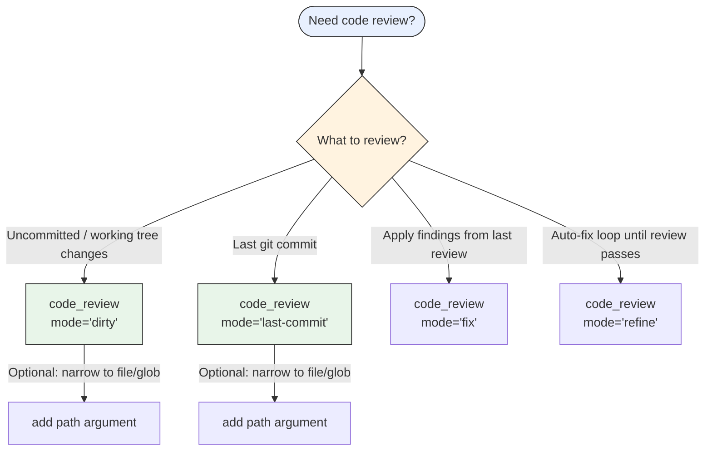

# Tool Reference

> [!NOTE]
> **Authoritative source for all tools available in PAI-OpenCode (ADR-017 / WP-N6)**

---

## Native OpenCode Tools

These are built into OpenCode and always available regardless of configuration.

| Tool | Description | Common Use |
|------|-------------|------------|
| `read` | Read file contents | Read source files, configs, PRDs |
| `write` | Write file contents | Create or overwrite files |
| `edit` | Apply diff to file | Targeted file modifications |
| `bash` | Execute shell commands | Git, bun, build commands |
| `glob` | Pattern file search | Find files by name pattern |
| `grep` | Content search | Search code for patterns |
| `webfetch` | Fetch a URL | Read documentation, APIs |
| `websearch` | Web search | Research, lookup current info |
| `codesearch` | Search codebase | Semantic code search (if enabled) |
| `task` | Spawn a subagent | Delegate work to specialist agents |

### Tool Permissions

Configured in `opencode.json` under `permission:`:

```json
{
  "permission": {
    "*": "allow",
    "websearch": "allow",
    "codesearch": "allow",
    "webfetch": "allow",
    "doom_loop": "ask",
    "external_directory": "ask"
  }
}
```

`"*": "allow"` grants all tools without prompting. `"ask"` requires user confirmation.

---

## Custom PAI Tools (WP-N1 + WP-N7)

Registered by `pai-unified.ts` plugin. Available in every session.

### `session_registry`

**Purpose:** Lists recent sessions with summaries — primary entry point for post-compaction CONTEXT RECOVERY.

**When to use:**
- After context compaction when prior work is lost from working memory
- When user says "continue from where we left off"
- During OBSERVE CONTEXT RECOVERY step

**Returns:** List of sessions with IDs, timestamps, task descriptions, and summaries.

**Example flow:**
```
1. Call session_registry → get list of recent sessions
2. Identify session matching current task context
3. Call session_results with that session ID → get detailed results
4. Rebuild working memory from results
```

### `session_results`

**Purpose:** Gets detailed output, ISC criteria, and work done for a specific session ID.

**When to use:** After `session_registry` identifies a relevant prior session.

**Input:** Session ID from `session_registry` output.

**Returns:** Full session results including completed ISC criteria, decisions made, artifacts created.

---

### `code_review` (WP-N7)

**Purpose:** Runs roborev AI code review on changed files. Surfaces quality issues, architectural violations, and style inconsistencies based on `.roborev.toml` guidelines.

**When to use:**
- VERIFY phase: as evidence of code quality before marking ISC criterion complete
- After BUILD: to catch issues before committing
- Before creating a PR: for final quality check

**Input args:**
- `mode` (optional, default `"dirty"`): `"dirty"` | `"last-commit"` | `"fix"` | `"refine"`
- `path` (optional): file path or glob to focus the review — only valid for mode `"dirty"` and `"last-commit"`; rejected with an error for mode `"fix"` or `"refine"`

**Returns:** roborev output with review findings or confirmation that review passed.

**Requires roborev installed:** If roborev is not in PATH, returns installation instructions.

**Example:**
```text
Use code_review tool with mode="dirty" to review uncommitted changes.
```

---

## Subagent Types (task tool)

When using the `task` tool to spawn agents, use these `subagent_type` values:

| subagent_type | Cost Profile | Best For |
|---------------|-------------|----------|
| `Algorithm` | Heavy (orchestrator) | Full PAI Algorithm runs, complex reasoning |
| `Architect` | Standard | System design, ADR writing, architecture decisions |
| `Engineer` | Standard | Implementation, file edits, code writing |
| `explore` | Lightweight | Fast codebase exploration |
| `Intern` | Lightweight | Simple tasks, data transformation |
| `Writer` | Standard | Documentation, content |
| `DeepResearcher` | Standard | Multi-model research orchestration |
| `GeminiResearcher` | Standard | Google Gemini research |
| `GrokResearcher` | Standard | xAI Grok contrarian analysis |
| `PerplexityResearcher` | Standard | Real-time web search |
| `CodexResearcher` | Standard | Technical archaeology |
| `QATester` | Standard | Quality assurance, test writing |
| `Pentester` | Standard | Security testing |
| `Designer` | Standard | UI/UX design |
| `Artist` | Standard | Visual content generation |
| `general` | Standard | General purpose fallback |

> [!IMPORTANT]
> **Agent-based routing:** Each agent has exactly one model configured in `opencode.json` — there is no runtime `model_tier` override. To use a cheaper model, choose a lightweight agent (`explore`, `Intern`). For heavy reasoning, choose a heavier agent (`Architect`, `Algorithm`). Actual model names are resolved from `opencode.json` — never hardcode model names in prompts or docs.

---

## MCP Servers

MCP (Model Context Protocol) servers extend the tool set with domain-specific capabilities.

> [!TIP]
> **Check `opencode.json` for currently connected MCP servers.** The list below reflects a typical PAI-OpenCode setup — your installation may differ.

### Detecting Connected MCP Servers

If unsure which MCP servers are active, inspect `opencode.json` for an `mcp` or `mcpServers` section:

```bash
# List configured MCP servers from opencode.json
grep -A 5 '"mcp"\|"mcpServers"' opencode.json
```

MCP tools appear with the `mcp_` prefix in tool calls (e.g., `mcp_task`, `mcp_jira_create_issue`).

---

## Tool Selection Decision Tree

```text
Need to find files?
    ├── By name/pattern → glob
    └── By content → grep or codesearch

Need to read a file?
    └── read (always prefer over bash cat)

Need to modify a file?
    ├── Replace specific text → edit
    └── Full rewrite → write

Need to run commands?
    └── bash (with workdir parameter — NEVER cd &&)

Need prior session context?
    ├── Step 1: session_registry (list sessions)
    └── Step 2: session_results (get details)

Need to verify code quality?
    └── code_review (mode="dirty" for uncommitted, mode="last-commit" for last commit)
```

<details>
<summary>code_review mode selection (Mermaid)</summary>



</details>

```text
Need to delegate complex work?
    └── task (with subagent_type, full context, effort level)

Need current web information?
    ├── Specific URL → webfetch
    └── General search → websearch or PerplexityResearcher agent
```

---

## Anti-Patterns

| ❌ Don't | ✅ Do Instead |
|---------|--------------|
| `bash: cd /path && command` | Use `workdir` parameter on bash |
| `bash: cat file.txt` | Use `read` tool |
| Spawn agent for grep/glob | Use grep/glob directly (2-second rule) |
| Guess tool names | Check this reference or inspect opencode.json |
| Use `npm install` | Always `bun install` |
