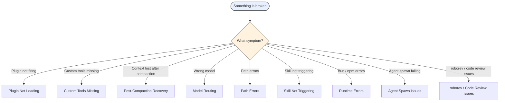

# Troubleshooting — Self-Diagnostic Checklist

> [!NOTE]
> Walk each checklist top-to-bottom. Stop at the first match.

---

## Quick Triage

```text
Start — What's broken?
├── Plugin not firing / hooks silent   → Plugin Not Loading
├── Custom tools not available         → Custom Tools Missing
├── Session context lost               → Post-Compaction Recovery
├── Wrong model being used             → Model Routing
├── Path errors (~/.claude/ vs ~/.opencode/) → Path Errors
├── Skill not triggering               → Skill Not Triggering
├── Bun / npm errors                   → Runtime Errors
├── Agent spawn failing                → Agent Spawn Issues
└── roborev / code_review issues       → roborev / Code Review Issues
```

| Symptom | Jump To |
|---------|---------|
| Plugin not firing / hooks silent | [Plugin Not Loading](#plugin-not-loading) |
| Custom tools not available | [Custom Tools Missing](#custom-tools-missing) |
| Session context lost after compaction | [Post-Compaction Recovery](#post-compaction-recovery) |
| Wrong model being used | [Model Routing](#model-routing) |
| Path errors (`~/.claude/` vs `~/.opencode/`) | [Path Errors](#path-errors) |
| Skill not triggering | [Skill Not Triggering](#skill-not-triggering) |
| Bun / npm errors | [Runtime Errors](#runtime-errors) |
| Agent spawn failing | [Agent Spawn Issues](#agent-spawn-issues) |
| roborev not found / code review fails | [roborev / Code Review Issues](#roborev--code-review-issues-wp-n7) |

<details>
<summary>Quick Triage Flowchart (Mermaid)</summary>



</details>

---

## Plugin Not Loading

```text
□ Does .opencode/plugins/pai-unified.ts exist?
    → NO: Run PAI installer or restore from git

□ Does pai-unified.ts have syntax errors?
    → Check: bun check .opencode/plugins/pai-unified.ts
    → Fix syntax errors before restart

□ Did you restart OpenCode after changing plugin files?
    → Plugin changes require OpenCode restart to take effect

□ Is the plugin exporting a default plugin object?
    → Must export: export default { ... } with hooks
    → Check pai-unified.ts final lines

□ Are handlers imported correctly in pai-unified.ts?
    → Check import paths at top of pai-unified.ts
    → All handlers are in .opencode/plugins/handlers/
```

---

## Custom Tools Missing

`session_registry` and `session_results` not available:

```text
□ Is the plugin loaded? (See Plugin Not Loading above)

□ Check pai-unified.ts for tool: { } registration block
    → Search: grep -n "session_registry" .opencode/plugins/pai-unified.ts
    → Should show line ~370: session_registry: sessionRegistryTool

□ Check session-registry.ts exports
    → grep -n "export" .opencode/plugins/handlers/session-registry.ts
    → Should export: sessionRegistryTool, sessionResultsTool

□ Restart OpenCode — custom tools require fresh session to register
```

---

## Post-Compaction Recovery

Context was compacted and working memory is lost:

```text
□ Use session_registry tool immediately
    → Call: session_registry (no arguments needed)
    → Returns: list of recent sessions with IDs and task descriptions

□ Identify the relevant session from the list
    → Match task description to current work context

□ Call session_results with that session ID
    → Returns: ISC criteria, decisions, artifacts from that session

□ If session_registry returns empty:
    → Sessions may have been cleaned up
    → Check ~/.opencode/MEMORY/WORK/ for PRD files
    → Read PRD file directly to recover ISC and context

□ Rebuild working memory from recovered data
    → Re-create ISC via TaskCreate matching recovered criteria
    → Resume from last known phase in PRD LOG section
```

See AGENTS.md "Session Recovery" section for the full CONTEXT RECOVERY protocol.

---

## Model Routing

Wrong model being used for an agent:

```text
□ Check opencode.json agent section
    → cat opencode.json | grep -A 10 '"AgentName"'
    → Verify model field matches expected

□ Verify model_tier is being passed correctly in task tool call
    → model_tier: "quick" | "standard" | "advanced"
    → Only works if model_tiers block exists in opencode.json for that agent

□ Is the model provider configured?
    → Anthropic models: require ANTHROPIC_API_KEY in environment
    → Google models: require GOOGLE_API_KEY
    → xAI models: require XAI_API_KEY
    → Perplexity: require PERPLEXITY_API_KEY

□ Check opencode.json top-level "model" field
    → This is the default for interactive sessions, not for agents
    → Agent routing always comes from "agent" section
```

Full model table: `docs/architecture/Configuration.md`

---

## Path Errors

Files being written to wrong location:

```text
□ CRITICAL: This is OpenCode, NOT Claude Code
    → CORRECT: ~/.opencode/
    → WRONG:   ~/.claude/ or ~/.Claude/

□ Check every file operation path before executing
    → Memory: ~/.opencode/MEMORY/
    → Skills: ~/.opencode/skills/ (user-level) or .opencode/skills/ (project)
    → PRDs: ~/.opencode/MEMORY/WORK/{session-slug}/

□ If files were written to ~/.claude/:
    → First backup: cp -r ~/.claude/MEMORY/ ~/.claude/MEMORY.bak/
    → Ensure target exists: mkdir -p ~/.opencode/MEMORY/
    → Then move: rsync -av ~/.claude/MEMORY/ ~/.opencode/MEMORY/
    → Verify: ls ~/.opencode/MEMORY/ (confirm files arrived)
    → Only then remove source: rm -rf ~/.claude/MEMORY/
    → Update any references in PRD files

□ Working directory in bash tool
    → Always use workdir parameter
    → NEVER use cd && pattern
```

---

## Skill Not Triggering

A skill's USE WHEN condition matches but skill isn't being loaded:

```text
□ Is the skill in skill-index.json?
    → grep -n "SkillName" .opencode/skills/skill-index.json
    → If missing: add entry with name, path, triggers, fullDescription

□ Does the skill path in skill-index.json match the actual file?
    → Check path field in index matches real file location
    → Paths are relative to .opencode/skills/

□ Is CAPABILITY AUDIT reading skill-index.json?
    → OBSERVE phase must show: "🔍 SKILL INDEX SCAN (#4 — MANDATORY)"
    → If missing from output, re-read AGENTS.md CAPABILITY AUDIT section

□ Do the skill triggers match the task context?
    → Check triggers array in skill-index.json for the skill
    → Triggers are keyword matches against the task description
```

---

## Runtime Errors

Bun or build errors:

```text
□ Always use bun, never npm/yarn/pnpm
    → bun install (not npm install)
    → bun run dev (not npm run dev)
    → bun test (not jest or vitest)

□ TypeScript errors in plugin files
    → bun check .opencode/plugins/pai-unified.ts
    → Fix type errors before testing

□ Module not found errors
    → Bun resolves relative imports without extension automatically, trying .tsx/.ts/.js in order
    → import { foo } from './bar' is valid; no extension required in most cases
    → Add explicit .ts only if resolution fails: import { foo } from './bar.ts'

□ Environment variables not loading
    → Bun auto-loads .env — do NOT use dotenv package
    → Verify .env exists at project root
    → Verify variable names match exactly (case-sensitive)
```

---

## Agent Spawn Issues

Task tool not spawning agents or agents failing:

```text
□ Is subagent_type valid?
    → Valid types: Algorithm, Architect, Engineer, explore, Intern, Writer,
      DeepResearcher, GeminiResearcher, GrokResearcher, PerplexityResearcher,
      CodexResearcher, QATester, Pentester, Designer, Artist, general
    → Check ToolReference.md for full list with model defaults

□ Is the task prompt complete?
    → Include: CONTEXT, TASK, EFFORT LEVEL, OUTPUT FORMAT
    → Agents need full context — they don't inherit session memory

□ Did you check if Grep/Glob/Read can do this instead?
    → 2-second rule: if search/read can answer in <2s, don't spawn agent
    → Agent spawning has 5-15s overhead + permission prompt risk

□ Is doom_loop triggering?
    → opencode.json has "doom_loop": "ask"
    → If agent is recursively spawning agents, user sees a prompt
    → This is expected safety behavior
```

---

## roborev / Code Review Issues (WP-N7)

```text
□ Is roborev installed?
    → which roborev
    → If not found: brew install roborev-dev/tap/roborev
    → Or: go install github.com/roborev-dev/roborev@latest

□ code_review tool returns "roborev not found"?
    → Install roborev (see above)
    → Ensure it's in PATH: echo $PATH
    → Try: roborev --version

□ Review hangs / times out?
    → Large changeset: focus on specific files
      roborev review --dirty -- src/specific/file.ts
    → Default timeout is 2 minutes

□ Post-commit hook not running after git commit?
    → Verify hook exists: cat .git/hooks/post-commit
    → Reinstall: roborev init

□ Biome CI fails on PR?
    → Run locally: bun run lint
    → Auto-fix: bun run lint:fix
    → Check biome.json at repo root for config

□ roborev review passes locally but CI Biome fails?
    → These are separate checks: roborev = AI review, Biome = format/lint
    → Fix Biome issues with bun run lint:fix
    → Re-push to trigger CI again
```

---

## Still Stuck?

If none of the above resolves the issue, escalate through reference materials:

1. Read the relevant ADR: `docs/architecture/adr/README.md` — find the ADR for the failing component and re-read its rationale and implementation notes
2. Review collected diagnostic artifacts: run `git log --oneline -10` and `git diff HEAD~1` to surface recent changes that may have introduced the regression
3. Read the full handler file for the failing component — check imports, hook registration, and exported symbols against what `pai-unified.ts` expects
4. Cross-reference all four architecture docs: `SystemArchitecture.md` (handler map), `ToolReference.md` (tool list), `Configuration.md` (model routing), `Troubleshooting.md` (this file) — confirm the component is documented and wired as expected
