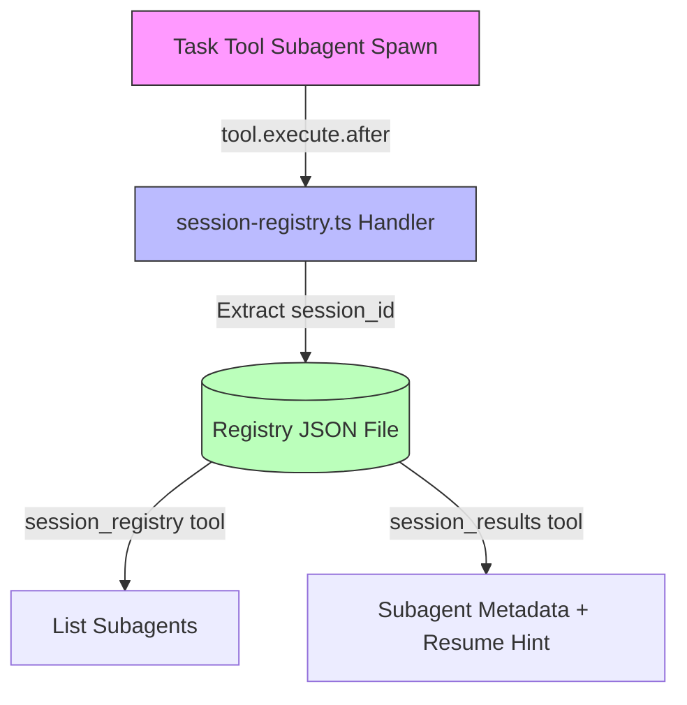

# ADR-012: Session Registry as Custom Plugin Tool

## Quick Overview

```text
┌─────────────────┐     ┌──────────────────────┐     ┌─────────────────┐
│  Task Tool      │────▶│ session-registry.ts  │────▶│ Registry File   │
│  (subagent)     │     │ (capture handler)    │     │ (JSON metadata) │
└─────────────────┘     └──────────────────────┘     └─────────────────┘
                                │
                                ▼
                       ┌──────────────────────┐
                       │   Custom Tools       │
                       │ • session_registry   │
                       │ • session_results    │
                       └──────────────────────┘
```

<details>
<summary>Detailed Diagram</summary>



</details>

---

**Status:** Accepted
**Date:** 2026-03-10
**Deciders:** Steffen, Jeremy
**Tags:** opencode-native, session-api, custom-tools, compaction-recovery
**WP:** WP-N1

---

## Context

After context compaction, the PAI Algorithm loses track of which subagents were spawned and their session IDs. It incorrectly claims "subagent results are lost" even though OpenCode stores all subagent sessions persistently in SQLite with indexed `parent_id` fields.

**Root cause:** PAI has zero custom tools. It never queries `Session.children(parentID)` which returns all subagent sessions regardless of compaction state.

**DeepWiki confirmation:** "Compaction NEVER deletes sessions or breaks parent-child relationships. Child sessions remain fully accessible via `Session.children(parentID)` because the `parent_id` database field is never modified during compaction."

---

## Decision

Register two custom tools via the `tool` property in `pai-unified.ts` plugin hooks:

1. **`session_registry`** — Lists all subagent sessions spawned from the current session with their metadata (agent type, description, status)
2. **`session_results`** — Retrieves registry metadata for a specific subagent session plus instructions on how to resume or access the full conversation

Additionally, create a handler that intercepts Task tool completions (`tool.execute.after` where `tool === "task"`) to build a local registry file for fast lookups. The handler captures session_id from Task output metadata and stores it with descriptive info for later recovery.

---

## Technical Implementation

### Verified OpenCode APIs (Source-confirmed)

**Plugin Tool Registration** (`packages/plugin/src/index.ts:151`):
```typescript
// The Hooks interface includes optional tool property
interface Hooks {
  tool?: {
    [key: string]: ToolDefinition;
  };
  // ... other hooks
}
```

**Tool Definition Factory** (`packages/plugin/src/tool.ts:29`):
```typescript
export function tool<Args extends z.ZodRawShape>(input: {
  description: string;
  args: Args;
  execute(args: z.infer<z.ZodObject<Args>>, context: ToolContext): Promise<string>;
}): ToolDefinition;
```

**ToolContext** (`packages/plugin/src/tool.ts:3`):
```typescript
export type ToolContext = {
  sessionID: string;
  messageID: string;
  agent: string;
  directory: string;
  worktree: string;
  abort: AbortSignal;
  metadata(input: { title?: string; metadata?: { [key: string]: any } }): void;
  ask(input: AskInput): Promise<void>;
};
```

**SDK Session Methods** (`packages/sdk/js/src/v2/gen/sdk.gen.ts`):
```typescript
// client.session2.children({ sessionID }) → returns child sessions
// client.session2.messages({ sessionID }) → returns all messages
```

**Plugin receives SDK client** (`packages/plugin/src/index.ts:26`):
```typescript
export type PluginInput = {
  client: ReturnType<typeof createOpencodeClient>;
  // client.session2.children() is available
};
```

---

### File: `.opencode/plugins/handlers/session-registry.ts` (NEW)

```typescript
/**
 * Session Registry Handler
 *
 * Tracks subagent sessions spawned via Task tool and provides
 * two custom tools for the Algorithm to recover session data
 * after context compaction.
 *
 * TOOLS PROVIDED:
 * - session_registry: Lists all subagent sessions with metadata for current session
 * - session_results: Gets registry metadata for a subagent + resume instructions
 *
 * HOOKS USED:
 * - tool.execute.after (tool === "task"): Captures session_id from Task tool output,
 *   extracts metadata, writes to local registry file
 *
 * @module session-registry
 */

import * as fs from "fs";
import * as path from "path";
import { tool } from "@opencode-ai/plugin";
import type { ToolContext } from "@opencode-ai/plugin";
import { fileLog, fileLogError } from "../lib/file-logger";
import { getStateDir } from "../lib/paths";

// --- Types ---

interface SubagentEntry {
  sessionId: string;
  agentType: string;
  description: string;
  modelTier?: string;
  spawnedAt: string;
  status: "running" | "completed" | "failed";
}

interface SubagentRegistry {
  parentSessionId: string;
  entries: SubagentEntry[];
  updatedAt: string;
}

// --- Registry File Operations ---

function getRegistryPath(sessionId: string): string {
  return path.join(getStateDir(), `subagent-registry-${sessionId}.json`);
}

function readRegistry(sessionId: string): SubagentRegistry {
  const filePath = getRegistryPath(sessionId);
  if (fs.existsSync(filePath)) {
    try {
      return JSON.parse(fs.readFileSync(filePath, "utf-8"));
    } catch {
      // Corrupted file — start fresh
    }
  }
  return { parentSessionId: sessionId, entries: [], updatedAt: new Date().toISOString() };
}

function writeRegistry(sessionId: string, registry: SubagentRegistry): void {
  const filePath = getRegistryPath(sessionId);
  const dir = path.dirname(filePath);
  if (!fs.existsSync(dir)) fs.mkdirSync(dir, { recursive: true });
  registry.updatedAt = new Date().toISOString();
  fs.writeFileSync(filePath, JSON.stringify(registry, null, 2), "utf-8");
}

// --- Task Tool Output Parser ---

/**
 * Extract session_id from Task tool output metadata.
 *
 * The Task tool returns output in this format (upstream v1.2.24+):
 * ```
 * <task_metadata>
 * session_id: ses_abc123...
 * </task_metadata>
 * ```
 *
 * Also checks the structured metadata field (output.metadata.sessionId).
 */
export function extractSessionId(output: { output?: string; metadata?: any }): string | null {
  // Method 1: Structured metadata (preferred)
  if (output.metadata?.sessionId) {
    return output.metadata.sessionId;
  }

  // Method 2: Parse from <task_metadata> text block
  if (output.output) {
    const match = output.output.match(/session_id:\s*(ses_[a-zA-Z0-9]+)/);
    if (match) return match[1];

    // Legacy format: task_id: ses_...
    const legacyMatch = output.output.match(/task_id:\s*(ses_[a-zA-Z0-9]+)/);
    if (legacyMatch) return legacyMatch[1];
  }

  return null;
}

/**
 * Extract agent type and description from Task tool args.
 */
export function extractTaskInfo(args: any): { agentType: string; description: string; modelTier?: string } {
  return {
    agentType: args?.subagent_type || args?.agent || "unknown",
    description: args?.description || args?.prompt?.substring(0, 100) || "unknown task",
    modelTier: args?.model_tier,
  };
}

// --- Hook: Capture Task tool completions ---

/**
 * Called from tool.execute.after when tool === "task".
 * Registers the spawned subagent session in the local registry.
 */
export async function captureSubagentSession(
  sessionId: string,
  args: any,
  output: { output?: string; metadata?: any; title?: string },
): Promise<void> {
  try {
    const childSessionId = extractSessionId(output);
    if (!childSessionId) {
      fileLog("[SessionRegistry] Could not extract session_id from Task output", "warn");
      return;
    }

    const taskInfo = extractTaskInfo(args);
    const registry = readRegistry(sessionId);

    // Avoid duplicates
    if (registry.entries.some((e) => e.sessionId === childSessionId)) {
      fileLog(`[SessionRegistry] Session ${childSessionId} already registered`, "debug");
      return;
    }

    registry.entries.push({
      sessionId: childSessionId,
      agentType: taskInfo.agentType,
      description: taskInfo.description,
      modelTier: taskInfo.modelTier,
      spawnedAt: new Date().toISOString(),
      status: "completed",
    });

    writeRegistry(sessionId, registry);
    fileLog(
      `[SessionRegistry] Registered ${taskInfo.agentType} subagent: ${childSessionId} (${registry.entries.length} total)`,
      "info",
    );
  } catch (error) {
    fileLogError("[SessionRegistry] Failed to capture subagent session", error);
  }
}

// --- Custom Tools ---

/**
 * Tool: session_registry
 *
 * Lists all subagent sessions spawned in the current session.
 * Use after compaction to recover context about spawned subagents.
 */
export const sessionRegistryTool = tool({
  description:
    "List all subagent sessions spawned in this session. Returns session IDs, agent types, and descriptions. " +
    "Use this after context compaction to recover information about previously spawned subagents. " +
    "The results are always available — subagent data survives compaction.",
  args: {},
  async execute(_args: {}, context: ToolContext): Promise<string> {
    const registry = readRegistry(context.sessionID);

    if (registry.entries.length === 0) {
      return "No subagent sessions found for this session. No subagents have been spawned via the Task tool yet.";
    }

    const lines = [
      `## Subagent Registry (${registry.entries.length} sessions)`,
      "",
      "| # | Agent Type | Session ID | Description | Spawned At |",
      "|---|-----------|-----------|-------------|------------|",
    ];

    for (let i = 0; i < registry.entries.length; i++) {
      const e = registry.entries[i];
      lines.push(
        `| ${i + 1} | ${e.agentType} | ${e.sessionId} | ${e.description.substring(0, 60)} | ${e.spawnedAt} |`,
      );
    }

    lines.push("");
    lines.push("Use `session_results` with any session_id above to retrieve the full subagent output.");

    return lines.join("\n");
  },
});

/**
 * Tool: session_results
 *
 * Retrieves registry metadata for a specific subagent session (agent type, description,
 * spawn time, status) plus instructions for resuming the session. The full conversation
 * history is stored in OpenCode's SQLite database and survives context compaction.
 * To get the actual conversation messages, use the Task tool with the session_id.
 */
export const sessionResultsTool = tool({
  description:
    "Get registry metadata for a specific subagent session by session_id. " +
    "Returns: agent type, description, model tier, status, and resume instructions. " +
    "Use this to identify what a subagent worked on and how to access its full results. " +
    "The full conversation history is in OpenCode's database — use Task tool with session_id to retrieve it.",
  args: {
    session_id: tool.schema
      .string()
      .describe("The session ID of the subagent (e.g., ses_abc123). Get IDs from session_registry."),
  },
  async execute(args: { session_id: string }, context: ToolContext): Promise<string> {
    // Read the registry file to get stored metadata for this session
    const registry = readRegistry(context.sessionID);
    const entry = registry.entries.find((e) => e.sessionId === args.session_id);

    if (!entry) {
      return `Session ${args.session_id} not found in the registry for this session. Use session_registry to see available sessions.`;
    }

    // Return registry metadata + resume instructions
    // Note: Full conversation is in OpenCode's DB. To retrieve actual messages,
    // use Task({ session_id, prompt: "Summarize your work" }) or access via SDK.
    return [
      `## Subagent Session: ${args.session_id}`,
      "",
      `**Agent:** ${entry.agentType}`,
      `**Description:** ${entry.description}`,
      `**Model Tier:** ${entry.modelTier || "default"}`,
      `**Spawned:** ${entry.spawnedAt}`,
      `**Status:** ${entry.status}`,
      "",
      `**To resume this session or get full conversation history:**`,
      `Task({ session_id: "${args.session_id}", prompt: "Continue where you left off and summarize what you did" })`,
    ].join("\n");
  },
});

/**
 * Build formatted registry context for compaction injection.
 * Called by WP-N2 compaction intelligence handler.
 */
export function buildRegistryContext(sessionId: string): string | null {
  const registry = readRegistry(sessionId);
  if (registry.entries.length === 0) return null;

  const lines = [
    "## Active Subagent Registry",
    "",
    "The following subagent sessions were spawned during this session.",
    "Their data is stored in OpenCode's database and survives compaction.",
    "Use `session_registry` tool to list them, `session_results` to retrieve output.",
    "",
  ];

  for (const e of registry.entries) {
    lines.push(`- **${e.agentType}** (${e.sessionId}): ${e.description.substring(0, 80)}`);
  }

  return lines.join("\n");
}
```

### Changes to `.opencode/plugins/pai-unified.ts`

**1. Add import (line ~92):**
```typescript
import {
  captureSubagentSession,
  sessionRegistryTool,
  sessionResultsTool,
} from "./handlers/session-registry";
```

**2. Add `tool` key to hooks object (after line 354, inside `const hooks: Hooks = {`):**
```typescript
// WP-N1: Custom tools for session recovery after compaction
tool: {
  session_registry: sessionRegistryTool,
  session_results: sessionResultsTool,
},
```

**3. Add to `tool.execute.after` handler (inside the existing handler, around line 530):**
```typescript
// WP-N1: Capture subagent sessions from Task tool
if (input.tool === "task") {
  await captureSubagentSession(
    input.sessionID,
    input.args,
    output,
  );
}
```

---

## Alternatives Considered

### 1. Direct SDK API call instead of registry file
**Rejected** because: The SDK `client.session2.children()` requires the plugin input context (`ctx`), which is not available inside the custom tool `execute` function. The `ToolContext` only has `sessionID`, not the SDK client. A registry file bridges this gap.

### 2. Storing full subagent output in registry
**Rejected** because: Subagent outputs can be very large. Storing session IDs and metadata is sufficient — the Algorithm can resume the session via Task tool to get full output.

---

## Consequences

### ✅ Positive
- Algorithm can recover subagent context after compaction
- "Results are lost" problem solved permanently
- Custom tools appear in OpenCode tool list — Algorithm can discover them
- Registry file is human-readable JSON for debugging

### ❌ Negative
- Registry file grows with subagent count
  - *Mitigation:* Cleanup in session-cleanup.ts on session end
- Two data sources (registry file + DB) could diverge
  - *Mitigation:* DB is source of truth; registry is a cache for fast access

---

## Verification

- [ ] Spawn 2+ subagents via Task tool, verify `subagent-registry-{sessionId}.json` created
- [ ] Call `session_registry` tool — returns table with all subagent entries
- [ ] Call `session_results` with a valid session_id — returns subagent info
- [ ] Trigger compaction, then call `session_registry` — still returns all entries
- [ ] `biome check --write .` passes
- [ ] `bun test` passes

---

## References

- DeepWiki: Session children query (`session/index.ts:645`)
- OpenCode Plugin Tool API: `packages/plugin/src/tool.ts:29` (tool factory)
- OpenCode Plugin Tool Registration: `packages/opencode/src/tool/registry.ts:55` (extraction)
- Plugin Example: `packages/plugin/src/example.ts:4` (ExamplePlugin)
- ADR-001: Hooks → Plugins Architecture (predecessor)

---

## Related ADRs

- ADR-001: Hooks → Plugins Architecture (foundation)
- ADR-015: Compaction Intelligence (uses registry from this ADR)
- ADR-013: Algorithm Session Awareness (teaches Algorithm to use these tools)
