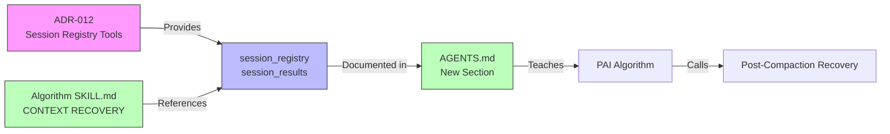

# ADR-013: Algorithm Session Awareness Post-Compaction

## Quick Overview

```text
┌─────────────────┐     ┌──────────────────────┐     ┌─────────────────┐
│  AGENTS.md      │────▶│ Session Recovery     │────▶│ Algorithm       │
│  (docs)         │     │ Section              │     │ Uses Tools      │
└─────────────────┘     └──────────────────────┘     └─────────────────┘
                                │
                                ▼
                       ┌──────────────────────┐
                       │  Custom Tools        │
                       │ • session_registry   │
                       │ • session_results    │
                       └──────────────────────┘
```

<details>
<summary>Detailed Diagram</summary>



</details>

---

**Status:** Accepted
**Date:** 2026-03-10
**Deciders:** Steffen, Jeremy
**Tags:** opencode-native, algorithm, compaction-recovery, agents-md
**WP:** WP-N3

---

## Context

Even with WP-N1 (Session Registry tool) and WP-N2 (Compaction Intelligence) implemented, the PAI Algorithm and AGENTS.md don't know these tools exist. The Algorithm won't use `session_registry` unless explicitly taught.

Currently, the Algorithm's CONTEXT RECOVERY section (in AGENTS.md) searches MEMORY files and PRDs for context. It has no instruction to check subagent sessions via the session tools.

---

## Decision

Update three documents to teach the Algorithm about OpenCode's session persistence:

1. **AGENTS.md** — Add Session Recovery section with tool documentation
2. **Algorithm SKILL.md** — Update CONTEXT RECOVERY to include session check
3. **KNOWN_LIMITATIONS.md** — Remove "results lost after compaction" as a known issue (it's solved)

---

## Technical Implementation

### 1. Update `AGENTS.md` — Add section after "Committing changes with git"

```markdown
# Subagent Session Recovery (OpenCode-Native)

OpenCode stores ALL subagent sessions persistently in its SQLite database.
Subagent data SURVIVES context compaction — it is NEVER deleted during compaction.

## Available Custom Tools

### session_registry
Lists all subagent sessions spawned in the current session.
Returns: session IDs, agent types, descriptions, spawn times.

**When to use:** After context compaction, or whenever you need to recall
which subagents were spawned and what they worked on.

### session_results
Gets the output details of a specific subagent session by session_id.
Returns: agent type, description, model tier, status.

**When to use:** When you need to recall what a specific subagent produced.
Get the session_id from `session_registry` first.

## Post-Compaction Recovery Pattern

After context compaction occurs:
1. Call `session_registry` to see all subagent sessions
2. Review which results you need
3. Call `session_results(session_id)` for specific results
4. Or use `Task({ session_id: "ses_...", prompt: "..." })` to resume a session

**NEVER say "subagent results are lost after compaction."**
They are stored in the database and always recoverable.
```

### 2. Update `.opencode/skills/PAI/SKILL.md` — In CONTEXT RECOVERY section

Add after "**Recovery Mode Detection (check FIRST — before searching):**"

```markdown
- **POST-COMPACTION:** Context was compressed mid-session →
  1. Call `session_registry` tool to recover all subagent session IDs
  2. Call `session_results(session_id)` for any results needed
  3. Run env var/shell state audit: verify auth tokens, working directory
  4. Read active PRD for ISC criteria state
  5. Subagent data SURVIVES compaction — never claim it is lost
```

### 3. Update `KNOWN_LIMITATIONS.md` — Remove or update the compaction limitation

Change any reference to "results lost after compaction" to:

```markdown
### Context Compaction (SOLVED in v3.0-native)
- **Previous:** Algorithm lost subagent context after compaction
- **Current:** Two custom tools (`session_registry`, `session_results`) provide
  persistent access to all subagent sessions via OpenCode's SQLite database
- **Compaction Intelligence** hook injects ISC, PRD, and registry into summary
- **No action needed** — recovery is automatic via compaction hook + tools
```

---

## Verification

- [ ] AGENTS.md contains "Subagent Session Recovery" section
- [ ] `session_registry` and `session_results` documented with examples
- [ ] Algorithm SKILL.md POST-COMPACTION recovery references session tools
- [ ] KNOWN_LIMITATIONS.md updated — no "results lost" language
- [ ] Run Algorithm, trigger compaction → Algorithm uses `session_registry` to recover
- [ ] No references to "results are lost after compaction" in any documentation

---

## Related ADRs

- ADR-012: Session Registry (provides the tools)
- ADR-015: Compaction Intelligence (provides automatic context injection)
