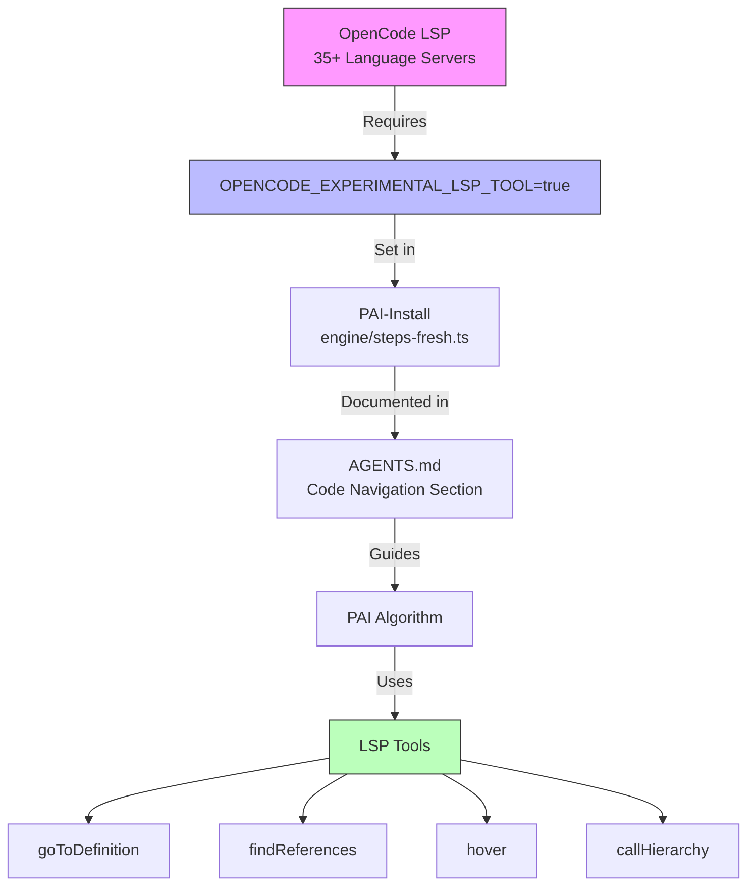

# ADR-014: LSP-Native Code Navigation

## Quick Overview

```text
┌─────────────────┐     ┌──────────────────────────┐     ┌─────────────────┐
│  OpenCode LSP   │────▶│ OPENCODE_EXPERIMENTAL_   │────▶│ PAI Algorithm   │
│  (35+ servers)  │     │ LSP_TOOL=true            │     │ Uses LSP Tools  │
└─────────────────┘     └──────────────────────────┘     └─────────────────┘
                                │
                                ▼
                       ┌──────────────────────┐
                       │  LSP Tools           │
                       │ • goToDefinition     │
                       │ • findReferences     │
                       │ • hover              │
                       │ • callHierarchy      │
                       └──────────────────────┘
```

<details>
<summary>Detailed Diagram</summary>



</details>

---

**Status:** Accepted
**Date:** 2026-03-10
**Deciders:** Steffen, Jeremy
**Tags:** opencode-native, lsp, code-navigation, developer-experience
**WP:** WP-N4

---

## Context

OpenCode includes 35+ Language Server Protocol (LSP) servers providing type-aware code intelligence. Features include `goToDefinition`, `findReferences`, `hover`, `callHierarchy`, and `diagnostics`.

PAI-OpenCode currently uses only Grep and Read for code navigation — losing the semantic understanding that LSP provides (type hierarchies, cross-file references, real-time diagnostics after edits).

The LSP tool is experimental and can be enabled via environment variable.

---

## Decision

1. Enable LSP tools via environment variable in the installation process
2. Document LSP tools in AGENTS.md with usage guidance (when LSP vs Grep)
3. Add LSP enable to `PAI-Install/engine/` configuration step

---

## Technical Implementation

### 1. Add to `.env.example` (or PAI-Install configuration)

```bash
# Enable LSP code intelligence tools (goToDefinition, findReferences, hover, etc.)
OPENCODE_EXPERIMENTAL_LSP_TOOL=true
```

### 2. Add to `AGENTS.md` — After "Subagent Session Recovery" section

```markdown
# Code Navigation (LSP Integration)

OpenCode provides Language Server Protocol tools for type-aware code navigation.
These are more precise than Grep for symbol lookups.

## When to Use LSP vs Grep

| Task | Best Tool | Why |
|------|-----------|-----|
| Find symbol definition | `goToDefinition` | Type-aware, follows imports |
| Find all usages of function | `findReferences` | Semantic, not text matching |
| Understand function signature | `hover` | Shows types and docs |
| Trace call chain | `callHierarchy` | Incoming/outgoing calls |
| Search for text pattern | Grep | Text matching, regex support |
| Search for file by name | Glob | File path pattern matching |

## Enabling LSP

LSP tools require: `OPENCODE_EXPERIMENTAL_LSP_TOOL=true`
This is set automatically by the PAI-OpenCode installer.
```

### 3. Update `PAI-Install/engine/steps-fresh.ts` — Add LSP enable

In the environment configuration step, add:
```typescript
// Enable LSP tools for code intelligence
envVars["OPENCODE_EXPERIMENTAL_LSP_TOOL"] = "true";
```

---

## Verification

- [ ] `OPENCODE_EXPERIMENTAL_LSP_TOOL=true` documented in `.env.example`
- [ ] AGENTS.md contains LSP vs Grep guidance table
- [ ] PAI-Install sets the env var during fresh installation
- [ ] `goToDefinition` works when invoked in a TypeScript project

---

## Related ADRs

- ADR-008: OpenCode Bash workdir Parameter (platform adaptation)
