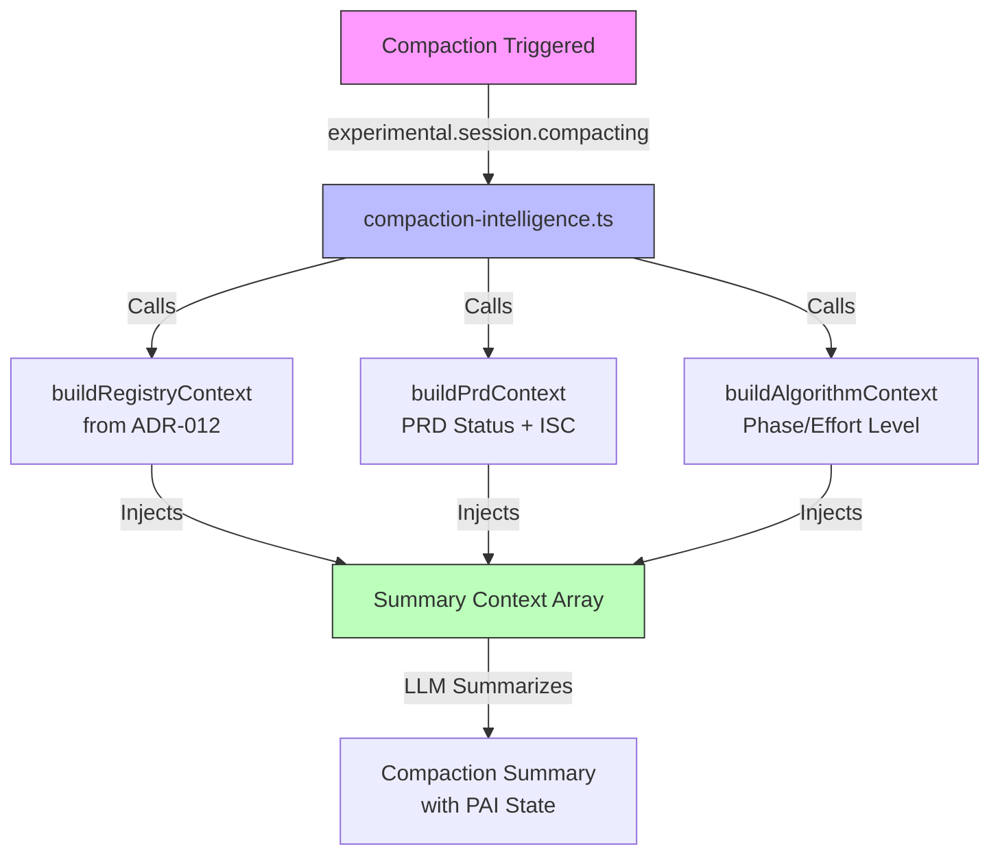

# ADR-015: Compaction Intelligence via Plugin Hook

## Quick Overview

```text
┌─────────────────┐     ┌──────────────────────┐     ┌─────────────────┐
│  Compaction     │────▶│ compaction-          │────▶│ Injected        │
│  Triggered      │     │ intelligence.ts    │     │ Context         │
└─────────────────┘     └──────────────────────┘     └─────────────────┘
                                │
          ┌─────────────────────┼─────────────────────┐
          ▼                     ▼                     ▼
   ┌──────────────┐    ┌──────────────┐    ┌──────────────┐
   │ Registry     │    │ PRD + ISC    │    │ Algorithm    │
   │ (subagents)  │    │ (status)     │    │ State        │
   └──────────────┘    └──────────────┘    └──────────────┘
```

<details>
<summary>Detailed Diagram</summary>



</details>

---

**Status:** Accepted
**Date:** 2026-03-10
**Deciders:** Steffen, Jeremy
**Tags:** opencode-native, compaction, context-preservation, session-api
**WP:** WP-N2

---

## Context

When OpenCode compacts a session (token limit reached), it generates a summary via LLM. The default summary follows a template: Goal, Instructions, Discoveries, Accomplished, Relevant Files.

PAI loses critical context during this process:
- Active ISC criteria (the Algorithm's verification checklist)
- PRD status and progress
- Subagent registry (which agents were spawned)
- Current effort level and phase

The `session.compacted` bus event fires AFTER compaction — too late to inject context. However, the `experimental.session.compacting` hook fires DURING compaction and allows plugins to **inject context into the summary prompt** or **replace the prompt entirely**.

**Verified API** (`packages/opencode/src/session/compaction.ts:168-201`):
```typescript
const compacting = await Plugin.trigger(
  "experimental.session.compacting",
  { sessionID: input.sessionID },
  { context: [], prompt: undefined },
)
const promptText = compacting.prompt ?? [defaultPrompt, ...compacting.context].join("\n\n")
```

---

## Decision

Add an `experimental.session.compacting` hook to `pai-unified.ts` that injects PAI-specific context strings into the compaction summary. This ensures the Algorithm retains its working state after compaction.

---

## Technical Implementation

### File: `.opencode/plugins/handlers/compaction-intelligence.ts` (NEW)

```typescript
/**
 * Compaction Intelligence Handler
 *
 * Injects PAI-critical context into OpenCode's compaction summary.
 * Uses the experimental.session.compacting hook to ensure the LLM
 * includes subagent registry, ISC criteria, and PRD status in its summary.
 *
 * HOOK: experimental.session.compacting
 * INPUT: { sessionID: string }
 * OUTPUT: { context: string[], prompt?: string }
 *
 * We APPEND to output.context (don't replace prompt) so OpenCode's
 * default summary template still runs — we just add PAI-specific sections.
 *
 * @module compaction-intelligence
 */

import * as fs from "fs";
import * as path from "path";
import { fileLog, fileLogError } from "../lib/file-logger";
import { getStateDir, getWorkDir } from "../lib/paths";
import { buildRegistryContext } from "./session-registry";

/**
 * Read the active PRD for a session and extract status information.
 */
function buildPrdContext(sessionId: string): string | null {
  try {
    const stateDir = getStateDir();

    // Check session-scoped work state
    let stateFile = path.join(stateDir, `current-work-${sessionId}.json`);
    if (!fs.existsSync(stateFile)) {
      stateFile = path.join(stateDir, "current-work.json");
    }
    if (!fs.existsSync(stateFile)) return null;

    const state = JSON.parse(fs.readFileSync(stateFile, "utf-8"));
    const workDir = state.work_dir || state.session_dir;
    if (!workDir) return null;

    // Read PRD file
    const prdPath = path.join(getWorkDir(), workDir, "PRD.md");
    if (!fs.existsSync(prdPath)) return null;

    const prdContent = fs.readFileSync(prdPath, "utf-8");

    // Extract frontmatter fields
    const statusMatch = prdContent.match(/^status:\s*(.+)$/m);
    const progressMatch = prdContent.match(/^verification_summary:\s*"?(\d+\/\d+)"?$/m);
    const failingMatch = prdContent.match(/^failing_criteria:\s*\[([^\]]*)\]$/m);
    const effortMatch = prdContent.match(/^effort_level:\s*(.+)$/m);
    const phaseMatch = prdContent.match(/^last_phase:\s*(.+)$/m);

    // Extract ISC criteria (lines starting with - [ ] or - [x])
    const criteria = prdContent.match(/^- \[[ x]\] ISC-[^\n]+/gm) || [];

    const lines = [
      "## Active PRD Status",
      "",
      `**Status:** ${statusMatch?.[1] || "unknown"}`,
      `**Progress:** ${progressMatch?.[1] || "unknown"}`,
      `**Effort Level:** ${effortMatch?.[1] || "unknown"}`,
      `**Last Phase:** ${phaseMatch?.[1] || "unknown"}`,
    ];

    if (failingMatch?.[1]?.trim()) {
      lines.push(`**Failing Criteria:** ${failingMatch[1]}`);
    }

    if (criteria.length > 0) {
      lines.push("");
      lines.push("### ISC Criteria (carry forward — these ARE the verification checklist):");
      lines.push("");
      for (const c of criteria) {
        lines.push(c);
      }
    }

    return lines.join("\n");
  } catch (error) {
    fileLogError("[CompactionIntelligence] Failed to read PRD", error);
    return null;
  }
}

/**
 * Build additional context about current Algorithm state.
 */
function buildAlgorithmContext(): string | null {
  try {
    const stateDir = getStateDir();
    const algorithmStatePath = path.join(stateDir, "algorithm-state.json");
    if (!fs.existsSync(algorithmStatePath)) return null;

    const state = JSON.parse(fs.readFileSync(algorithmStatePath, "utf-8"));

    const lines = [
      "## Algorithm State",
      "",
      `**Current Phase:** ${state.currentPhase || "unknown"}`,
      `**Effort Level:** ${state.effortLevel || "Standard"}`,
      `**Criteria Count:** ${state.criteriaCount || 0}`,
    ];

    if (state.currentTask) {
      lines.push(`**Current Task:** ${state.currentTask}`);
    }

    return lines.join("\n");
  } catch {
    return null;
  }
}

/**
 * Main handler for experimental.session.compacting hook.
 *
 * Called by pai-unified.ts during the compaction process.
 * Appends PAI-specific context sections to the summary prompt.
 */
export async function injectCompactionContext(
  input: { sessionID: string },
  output: { context: string[]; prompt?: string },
): Promise<void> {
  try {
    let injectedCount = 0;

    // 1. Subagent Registry (from ADR-012)
    const registryCtx = buildRegistryContext(input.sessionID);
    if (registryCtx) {
      output.context.push(registryCtx);
      injectedCount++;
    }

    // 2. Active PRD + ISC Criteria
    const prdCtx = buildPrdContext(input.sessionID);
    if (prdCtx) {
      output.context.push(prdCtx);
      injectedCount++;
    }

    // 3. Algorithm State
    const algCtx = buildAlgorithmContext();
    if (algCtx) {
      output.context.push(algCtx);
      injectedCount++;
    }

    // 4. Recovery instructions
    output.context.push([
      "## Post-Compaction Recovery Tools",
      "",
      "After compaction, these tools are available to recover context:",
      "- `session_registry` — Lists all subagent sessions with their IDs",
      "- `session_results(session_id)` — Retrieves output from a specific subagent",
      "",
      "Subagent data SURVIVES compaction. It is stored in OpenCode's database.",
      "Do NOT claim results are lost — use the tools above to recover them.",
    ].join("\n"));
    injectedCount++;

    fileLog(
      `[CompactionIntelligence] Injected ${injectedCount} context sections for session ${input.sessionID}`,
      "info",
    );
  } catch (error) {
    fileLogError("[CompactionIntelligence] Context injection failed (non-blocking)", error);
    // Non-blocking — compaction must not fail due to our plugin
  }
}
```

### Changes to `.opencode/plugins/pai-unified.ts`

**1. Add import:**
```typescript
import { injectCompactionContext } from "./handlers/compaction-intelligence";
```

**2. Add hook to hooks object (after line 354, near the tool registration):**
```typescript
// WP-N2: Inject PAI context during compaction
"experimental.session.compacting": async (input, output) => {
  fileLog("[Compaction] experimental.session.compacting hook triggered", "info");
  await injectCompactionContext(input, output);
},
```

---

## Alternatives Considered

### 1. Replace the entire compaction prompt
**Rejected** because: OpenCode's default template is well-designed. We should ADD context, not replace the template. Using `output.context.push()` appends sections.

### 2. Post-compaction context re-injection via session.compacted
**Rejected** because: By the time `session.compacted` fires, the summary is already generated. We need to influence WHAT the summary contains, not react to it after.

---

## Consequences

### ✅ Positive
- Compaction summary includes ISC criteria, PRD status, and subagent registry
- Algorithm retains working memory across compaction boundaries
- "Lobotomy effect" eliminated — Algorithm knows its own state

### ❌ Negative
- Injected context increases compaction summary length
  - *Mitigation:* Only inject active/relevant data, not entire PRD

---

## Verification

- [ ] Trigger compaction (manually or via long session)
- [ ] Check debug log for `[CompactionIntelligence] Injected N context sections`
- [ ] After compaction, summary message includes ISC criteria and subagent list
- [ ] Algorithm can answer "What subagents were spawned?" after compaction
- [ ] `biome check --write .` passes

---

## References

- OpenCode compaction hook: `packages/opencode/src/session/compaction.ts:168-201`
- Plugin Hooks interface: `packages/plugin/src/index.ts:151` (experimental.session.compacting)
- ADR-012: Session Registry (provides `buildRegistryContext()`)

---

## Related ADRs

- ADR-012: Session Registry (dependency — provides registry data)
- ADR-013: Algorithm Session Awareness (teaches Algorithm about recovery)
