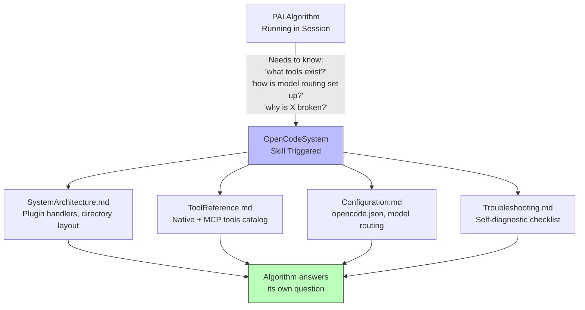

# ADR-017: System Self-Awareness Documentation

## Quick Overview

```text
┌────────────────────┐     ┌──────────────────────────┐     ┌──────────────────┐
│  Algorithm stuck   │────▶│  OpenCodeSystem skill    │────▶│  Answers found   │
│  "what tools do    │     │  (self-awareness layer)  │     │  without asking  │
│   I have?"         │     └──────────────────────────┘     │  the user        │
└────────────────────┘               │                      └──────────────────┘
                                     ▼
                          ┌──────────────────────┐
                          │  4 reference docs    │
                          │ • SystemArchitecture │
                          │ • ToolReference      │
                          │ • Configuration      │
                          │ • Troubleshooting    │
                          └──────────────────────┘
```

<details>
<summary>Detailed Diagram</summary>



</details>

---

**Status:** Accepted
**Date:** 2026-03-12
**Deciders:** Steffen, Jeremy
**Tags:** opencode-native, algorithm, self-awareness, documentation, skills
**WP:** WP-N6

---

## Context

After WP-N1 through WP-N5, the PAI Algorithm can track sessions (WP-N1), survive compaction (WP-N2), recover prior work (WP-N3), and knows about LSP + session forks (WP-N4). However, it still lacks a structured way to answer basic questions about its own operating environment:

- "What custom tools do I have access to?"
- "How is model routing configured?"
- "What MCP servers are connected?"
- "Why is plugin handler X not firing?"
- "What's the difference between `opencode.json` and `settings.json`?"

Currently the Algorithm either asks the user, hallucinates an answer, or reads raw source files — all suboptimal. A dedicated self-awareness skill and supporting reference docs solve this cleanly.

## Decision

Create a **system self-awareness layer** consisting of:

1. **`OpenCodeSystem` skill** (`.opencode/skills/OpenCodeSystem/SKILL.md`) — a self-activating skill with USE WHEN triggers that fires when the Algorithm needs environment information.

2. **Four reference documents** in `docs/architecture/`:
   - `SystemArchitecture.md` — directory layout, plugin handler map, event hooks
   - `ToolReference.md` — all native OpenCode tools + registered MCP servers + custom tools (session_registry, session_results)
   - `Configuration.md` — `opencode.json` schema, model routing, `settings.json` overlay
   - `Troubleshooting.md` — self-diagnostic checklist for common failure modes

3. **skill-index.json entry** — ensures the skill is discoverable during CAPABILITY AUDIT.

## Rationale

### Why a skill rather than inline AGENTS.md sections?

AGENTS.md is the Algorithm's runtime contract — it should stay focused on operational rules, not reference data. A skill is the correct abstraction for on-demand reference material: it loads only when needed, is version-controlled alongside the code it documents, and follows the established skill pattern already used for PAI, Research, etc.

### Why 4 separate docs rather than one big reference?

Single-responsibility principle: each doc has a distinct query pattern. A user asking "what tools exist?" needs ToolReference. A user asking "why is the plugin not firing?" needs Troubleshooting. Separating them keeps each doc focused and reduces noise when the skill loads only the relevant section.

### Why docs/architecture/ rather than .opencode/skills/OpenCodeSystem/?

The reference documents describe the project structure and are useful to human developers reading the repo. Placing them in `docs/architecture/` follows the established pattern (ADRs, installer plan, etc.) and keeps `.opencode/skills/` focused on skill logic rather than project documentation.

## Consequences

### Positive
- Algorithm can answer "what environment am I running in?" without user interruption
- Reduces hallucinated tool names or incorrect configuration assumptions
- Single authoritative source for environment facts — easy to update when config changes
- Skill auto-activates via USE WHEN triggers — zero manual invocation needed

### Negative / Trade-offs
- Reference docs require manual maintenance when configuration changes (e.g., new MCP server added, model routing updated)
- Risk of drift between `opencode.json` actuals and `Configuration.md` — mitigated by keeping docs close to source and noting the authoritative source in each doc header

## Implementation Notes

- The SKILL.md uses a **pointer pattern**: it documents where information lives and provides the key facts inline, but directs the Algorithm to read the source files for complete detail
- `Configuration.md` must reference model tiers (`quick`/`standard`/`advanced`) — never hardcode specific model names. `opencode.json` is the single source of truth for actual model routing
- `Troubleshooting.md` uses a checklist format so the Algorithm can walk it step by step
- skill-index.json triggers: `["opencode", "system", "tools", "config", "plugin", "mcp", "troubleshoot", "environment", "routing", "handlers"]`

## Related ADRs

- **ADR-005** (Dual-file configuration) — describes `opencode.json` + `settings.json` split that `Configuration.md` documents
- **ADR-012** (Session Registry custom tools) — the `session_registry` + `session_results` tools documented in `ToolReference.md`
- **ADR-013** (Algorithm Session Awareness) — the CONTEXT RECOVERY flow that relies on tools cataloged here
