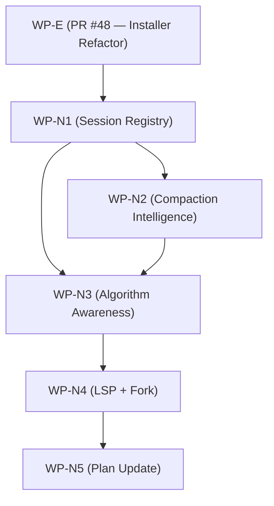

# PAI-OpenCode v3.0 — OpenCode-Native Transformation

> [!important]
> **This document supersedes the v3.0 port plan. All previous WPs are DONE.**
> The question is no longer "how do we port Claude Code?" — it is "how do we become genuinely OpenCode?"

---

## 📊 Current State (2026-03-10)

All original WPs completed and merged:

| WP | Name | PR | Status |
|----|------|----|--------|
| WP1 | Algorithm v3.7.0 + Workdir | #32, #33, #35 | ✅ MERGED |
| WP2 | Context Modernization | #34 | ✅ MERGED |
| WP3 | Category Structure | #37 | ✅ MERGED |
| WP4 | Integration & Validation | #38, #39, #40 | ✅ MERGED |
| WP-A | Plugin System & Hooks | #42 | ✅ MERGED |
| WP-B | Security Hardening | #43 | ✅ MERGED |
| WP-C | Core PAI System + Skill Fixes | #45 | ✅ MERGED |
| WP-D | Installer + Migration + DB Health | #47 | ✅ MERGED |
| WP-E | Installer Refactor (Electron-first) | #48 | 🔄 IN REVIEW |

**We have completed a port. We have NOT built a native OpenCode system.**

---

## 🧠 The Core Diagnosis

We have 11 ADRs that explain how we *translated* Claude Code. We have zero ADRs that explain how we *natively leverage* OpenCode.

The symptoms are real and recurring:
- Algorithm says "subagent results are lost after compaction" — **they are not lost, they are in the DB**
- We use Grep+Read where we could use LSP with type-aware navigation
- Every subagent spawn is a black box after compaction — `Session.children()` exists and is indexed
- Our compaction hook rescues learnings but doesn't inject the critical context that would prevent amnesia
- We have Custom Tool capability in plugins but use exactly zero custom tools

**We are a Claude Code system running on OpenCode rails.**

---

## 🔴 The Six OpenCode Native Gaps

### GAP-1: Session API — UNUSED (Critical)

**What OpenCode provides:**
```text
GET /session/:id/children     → Query all subagent sessions by parent
Session.children(parentID)    → Indexed DB query — always available
POST /session/:id/fork        → Fork at any point — safe experiments
```

**DeepWiki confirmation:** "Compaction NEVER deletes sessions or breaks parent-child relationships.
Child sessions remain fully accessible via Session.children(parentID) because the parent_id
database field is never modified during compaction."

**What PAI does:** Nothing. When the Algorithm says "subagent results are gone after compaction"
it is factually wrong. The data exists. We just never ask for it.

**Fix:** ADR-012 + WP-N1 (Session Registry Plugin + Custom Tool)

---

### GAP-2: Compaction Plugin Hook — UNUSED (Critical)

**What OpenCode provides:**
```typescript
"experimental.session.compacting": async (input, output) => {
  output.context.push("## Active Subagent Registry\n...")
  output.context.push("## Current ISC Criteria\n...")
  output.context.push("## Active PRD Status\n...")
  // OR replace the entire compaction prompt:
  output.prompt = "PAI-aware compaction prompt..."
}
```

**What PAI does:** `session.compacted` event fires AFTER compaction, rescues learnings.
The `experimental.session.compacting` hook fires DURING compaction — we can inject context
into the summary that the LLM generates. We use neither.

**The difference:** `session.compacted` = learning rescue (we have this).
`experimental.session.compacting` = memory preservation (we don't have this).

**Fix:** ADR-015 + WP-N2 (Compaction Intelligence)

---

### GAP-3: Custom Tools via Plugins — UNUSED

**What OpenCode provides:**
```typescript
export const Plugin = async (ctx) => ({
  tool: {
    session_registry: {
      description: "List all subagent sessions spawned in this session",
      execute: async (args, context) => {
        return await ctx.client.session.children(context.sessionID)
      }
    },
    session_resume: {
      description: "Get the full output of a completed subagent session",
      execute: async ({ session_id }) => {
        return await ctx.client.session.messages(session_id)
      }
    }
  }
})
```

**What PAI does:** Uses only the built-in tools. The Algorithm has no mechanism to
recover subagent results except re-reading PRD files — which only works if the subagent
wrote to disk (not all do).

**Fix:** ADR-013 + WP-N1 (Session Registry as Custom Tool)

---

### GAP-4: LSP Integration — COMPLETELY IGNORED

**What OpenCode provides:**
- 35+ LSP servers auto-configured for TypeScript, Python, Rust, Go, etc.
- Tools: `goToDefinition`, `findReferences`, `hover`, `callHierarchy`, `diagnostics`
- Enable: `OPENCODE_EXPERIMENTAL_LSP_TOOL=true`

**What PAI does:** Grep and Read. When the Algorithm analyzes a codebase it uses pattern
matching. LSP would give it semantic understanding — type-aware navigation, real-time
diagnostics after edits, call hierarchies for impact analysis.

**Effort:** 1 hour — document it, enable the env var, teach the Algorithm to use it.

**Fix:** ADR-014 + WP-N4 (LSP Documentation + Enable)

---

### GAP-5: Session Forking — UNUSED

**What OpenCode provides:**
```text
POST /session/:id/fork  → Creates exact copy of session at current state
```

**What PAI does:** When exploring multiple solutions the Algorithm creates new sessions
or works in the same session. It has no "safe experiment" primitive. This is especially
relevant as a partial replacement for Plan Mode (which is Claude Code only).

**Fix:** ADR-016 + WP-N4 (Session Fork documentation)

---

### GAP-6: Model-Tier Intelligence — STATIC (Minor)

**What oh-my-openagent does:** Task-type based routing — not just 3 tiers, but
understanding that "refactor" tasks need different models than "explain" tasks.

**What PAI does:** Static `model_tiers` (quick/standard/advanced) per agent.
Works well, but doesn't adapt to task type within an agent.

**Fix:** Algorithm.md addition — guidance on when to use which tier. Not a code change.

---

## 🟢 The Fix: Five New Work Packages

### WP-N1: Session Registry (P0 — Critical)
**Effort:** 3-4h | **Branch:** `feature/wp-n1-session-registry`

**Deliverables:**

1. **New handler:** `plugins/handlers/session-registry.ts`
   - Maintains a local registry of spawned subagent sessions
   - Hooks into `tool.execute.after` for `task` tool calls
   - Extracts `session_id` from `<task_metadata>` in tool output
   - Persists to `MEMORY/STATE/subagent-registry-{sessionId}.json`
   - Structure: `{ sessionId, agentType, description, spawnedAt, status }`

2. **New custom tool** in `pai-unified.ts`:
   ```typescript
   tool: {
     session_registry: {
       description: "List all subagent sessions spawned in this session. Use after compaction to recover lost context.",
       execute: async (args, ctx) => {
         // Read from persisted registry file
         // Return: [ { session_id, agent_type, description, spawned_at } ]
       }
     },
     session_results: {
       description: "Get the final output of a completed subagent session by session_id.",
       execute: async ({ session_id }, ctx) => {
         // Call OpenCode SDK: client.session.messages(session_id)
         // Return: last assistant message text from that session
       }
     }
   }
   ```

3. **AGENTS.md addition:** Document both tools with usage examples

4. **New ADR:** `docs/architecture/adr/ADR-012-session-registry-custom-tool.md`

**Verification:**
- Spawn 2 subagents, check `subagent-registry-*.json` has both entries
- After compaction, call `session_registry` tool — returns both entries
- Call `session_results` with a session_id — returns the subagent output
- `bun test` green, `biome check` clean

---

### WP-N2: Compaction Intelligence (P0 — Critical)
**Effort:** 4-6h | **Branch:** `feature/wp-n2-compaction-intelligence`

**The Problem in Detail:**

When compaction fires, OpenCode calls the LLM to summarize the conversation.
Without intervention, this summary focuses on "what happened" but loses:
- Which subagents were spawned (and their session IDs)
- What ISC criteria are currently active
- What the active PRD says
- What files are currently being edited

With `experimental.session.compacting` we can inject this into the summary prompt —
so the LLM *includes* this critical context in its summary.

**Deliverables:**

1. **Extend `pai-unified.ts`** — add `experimental.session.compacting` hook:
   ```typescript
   "experimental.session.compacting": async (input, output) => {
     const sessionId = input.sessionID

     // 1. Read subagent registry
     const registry = readSubagentRegistry(sessionId)
     if (registry.length > 0) {
       output.context.push(buildRegistryContext(registry))
     }

     // 2. Read active PRD status
     const prd = readActivePrd(sessionId)
     if (prd) {
       output.context.push(buildPrdContext(prd))
     }

     // 3. Read current-work.json ISC criteria
     const work = readCurrentWork(sessionId)
     if (work?.isc_criteria?.length > 0) {
       output.context.push(buildIscContext(work))
     }

     // Log what we injected
     fileLog(`[CompactionIntelligence] Injected: registry(${registry.length}), prd(${!!prd}), isc(${work?.isc_criteria?.length ?? 0})`, "info")
   }
   ```

2. **New lib:** `plugins/lib/compaction-context.ts`
   - `buildRegistryContext(registry)` — formats subagent list for injection
   - `buildPrdContext(prd)` — extracts status/criteria from PRD frontmatter
   - `buildIscContext(work)` — formats active ISC criteria list

3. **New ADR:** `docs/architecture/adr/ADR-015-compaction-intelligence.md`

**Verification:**
- Start session, spawn 2 subagents, wait for compaction (or trigger manually)
- Check `/tmp/pai-opencode-debug.log` for `[CompactionIntelligence] Injected:` entry
- After compaction, ask Algorithm: "What subagents did we spawn?" — should know
- `bun test` green, `biome check` clean

---

### WP-N3: Algorithm Awareness Update (P0 — Critical)
**Effort:** 2-3h | **Branch:** `feature/wp-n3-algorithm-awareness`

**The Problem:** Even with WP-N1 and WP-N2 implemented, the Algorithm (AGENTS.md + PAI skill)
doesn't *know* these tools exist. It won't use `session_registry` unless it's taught to.

**Deliverables:**

1. **Update `AGENTS.md`** — add section:
   ```markdown
   ## OpenCode Session API

   After context compaction, subagent results are NOT lost. They are stored in OpenCode's
   SQLite database and accessible via custom tools:

   - `session_registry` — lists all subagents spawned this session with their session_ids
   - `session_results(session_id)` — retrieves the full output of any completed subagent

   **Post-Compaction Recovery Pattern:**
   1. Call `session_registry` to see what subagents exist
   2. Call `session_results(session_id)` for any results you need
   3. Continue work — data is never lost, only the context reference is lost
   ```

2. **Update Algorithm SKILL.md (PAI Core)** — add to CONTEXT RECOVERY section:
   - After compaction: check `session_registry` before searching MEMORY files
   - Pattern: "Subagent results survive compaction — recover via session_registry tool"

3. **Update AGENTS.md Context Recovery hard speed gate section** — add post-compaction step:
   - SAME-SESSION after compaction → run `session_registry` first

4. **New ADR:** `docs/architecture/adr/ADR-013-algorithm-session-awareness.md`

**Verification:**
- Read updated AGENTS.md — session tools documented with examples
- Run Algorithm, induce compaction, verify it uses `session_registry` to recover
- No references to "results are lost after compaction" in any docs

---

### WP-N4: LSP + Fork Documentation (P1)
**Effort:** 2h | **Branch:** `feature/wp-n4-lsp-fork`

**Deliverables:**

1. **LSP Enable:**
   - Add to `opencode.json`: `"lsp": { "enabled": true }` (already default but document)
   - Add to `.env.example`: `OPENCODE_EXPERIMENTAL_LSP_TOOL=true`
   - Document in `AGENTS.md`: "LSP tools available — prefer `goToDefinition` over Grep for symbol navigation"

2. **New ADR:** `docs/architecture/adr/ADR-014-lsp-native-code-navigation.md`
   - Decision: Enable LSP tools as primary code navigation mechanism
   - Migration: When to use LSP vs Grep vs Read

3. **Session Fork documentation:**
   - Add to AGENTS.md: "Use session fork for safe experiments (replaces Plan Mode)"
   - Document: `POST /session/:id/fork` via SDK for experiment isolation

4. **New ADR:** `docs/architecture/adr/ADR-016-session-fork-experiment-isolation.md`

**Verification:**
- LSP env var documented in install guide
- `goToDefinition` example in AGENTS.md
- Session fork example in AGENTS.md

---

### WP-N5: Epic + Plan Update (P0 — Documentation)
**Effort:** 1h | **Branch:** included in WP-N1 or standalone

**Deliverables:**

1. **Update `docs/epic/EPIC-v3.0-Synthesis-Architecture.md`:**
   - Mark WP-A through WP-E as ✅ COMPLETE
   - Add WP-N section (this document's work packages)
   - Update vision statement: from "port" to "native"

2. **Update `docs/epic/OPTIMIZED-PR-PLAN.md`:**
   - Mark PR #45, #47 as MERGED
   - Mark PR #48 as IN REVIEW
   - Add PRs #N1–#N4 as upcoming

3. **Update `docs/epic/TODO-v3.0.md`:**
   - Mark WP-C and WP-D tasks as complete
   - Add WP-N task lists

4. **Update `docs/architecture/adr/README.md`:**
   - Add ADR-012 through ADR-016 to index

---

## 📊 Priority Matrix

| Priority | WP | Impact | Effort | Solves |
|----------|----|--------|--------|--------|
| 🔴 P0 | WP-N1 | Session recovery | 3-4h | "Results lost after compaction" |
| 🔴 P0 | WP-N2 | Compaction memory | 4-6h | Lobotomy effect |
| 🔴 P0 | WP-N3 | Algorithm knows tools | 2-3h | Algorithm uses new capabilities |
| 🟡 P1 | WP-N4 | LSP + Fork | 2h | Code navigation + safe experiments |
| 🟡 P1 | WP-N5 | Plan updated | 1h | Single source of truth |

**Total effort:** ~12-16h for full OpenCode-native transformation

---

## 🔄 Dependency Graph

```text
WP-E (PR #48 — Installer Refactor) — IN REVIEW, independent
    │
    ▼
WP-N1 (Session Registry)           ← No dependencies
    │
    ├──► WP-N2 (Compaction Intelligence) ← Reads registry output
    │         │
    └──► WP-N3 (Algorithm Awareness) ← Documents N1+N2 tools
              │
              └──► WP-N4 (LSP + Fork)  ← Independent, can parallel
                        │
                        └──► WP-N5 (Plan Update) ← After N1-N4 done
```

<details>
<summary>Detailed Mermaid Diagram</summary>



</details>

---

## 📋 New ADR Index (ADR-012 to ADR-016)

| ADR | Title | WP | Solves |
|-----|-------|----|--------|
| ADR-012 | Session Registry as Custom Plugin Tool | WP-N1 | Subagent recovery |
| ADR-013 | Algorithm Session Awareness Post-Compaction | WP-N3 | Algorithm teaching |
| ADR-014 | LSP-Native Code Navigation | WP-N4 | Code understanding |
| ADR-015 | Compaction Intelligence via Plugin Hook | WP-N2 | Memory preservation |
| ADR-016 | Session Fork for Experiment Isolation | WP-N4 | Safe experiments |

---

## ✅ What v3.0 Native Means

When WP-N1 through WP-N4 are complete, PAI-OpenCode v3.0 will:

| Before (Port) | After (Native) |
|---------------|----------------|
| "Subagent results lost after compaction" | Algorithm calls `session_registry`, recovers all results |
| Compaction = lobotomy | Compaction injects registry + ISC + PRD into summary |
| Grep for everything | LSP for symbol navigation, Grep for text search |
| Experiments = risky | Session fork = safe checkpoint/rollback |
| 0 custom tools | 2 custom tools (`session_registry`, `session_results`) |
| 11 ADRs about porting | 16 ADRs — 11 port + 5 native |

**That is the difference between a port and a native system.**

---

## 🚀 Next Actions

1. **Merge PR #48** (WP-E) — unblock the branch
2. **Start WP-N1** (`feature/wp-n1-session-registry`) — highest impact, enables N2+N3
3. **Parallel: WP-N5** — update plan docs so team has single source of truth

---

*Created: 2026-03-10*
*Authors: Jeremy + Steffen*
*Based on: DeepWiki analysis, oh-my-openagent research, session compaction deep dive*
*Supersedes: The "port completion" framing of all previous plan documents*
