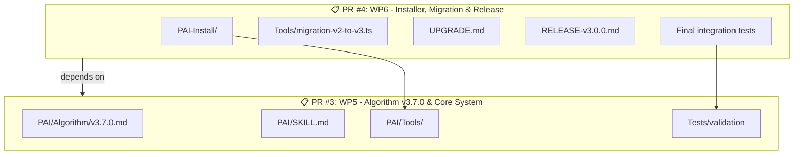

# PAI-OpenCode v3.0 - Optimierter PR-Plan

**Ziel:** Minimale sinnvolle Anzahl von PRs mit substanziellen Änderungen

---

## Aktueller Status Review

| Phase | Was wurde gemacht | PRs | Bewertung |
|-------|-------------------|-----|-----------|
| WP3 | Category Structure | 1 PR (#37) | ✅ Gut - 881 Files, substanziell |
| WP4 | Integration | 3 PRs (#38-#40) | ⚠️ Zu granular - nur ~100 Zeilen total |

**Problem:** WP4 wurde in 3 kleine PRs aufgeteilt statt einem substanziellen PR.

---

## Optimierter Plan: 4 PRs bis v3.0

### ✅ PR #1: WP3 - Category Structure (COMPLETE)
**Status:** Gemergt (#37)  
**Changes:** 881 files, 10 Kategorien erstellt  
**Bewertung:** ✅ Perfekte Größe

---

### 🔄 PR #2: WP4 - Integration & Validation (KOMBINIERT)
**Branch:** `feature/wp4-integration-complete` (existiert als #40)  
**Empfehlung:** Merge #40 als "WP4 Complete" - enthält bereits alles

**Inhalt:**
- Path reference fixes (11 paths)
- Plugin handler updates (skill-guard.ts)
- Validation tools (GenerateSkillIndex, ValidateSkillStructure)
- NPM scripts

**Stats:** ~50 Files, ~500 Zeilen  
**Bewertung:** ✅ Angemessen

---

### 📋 PR #3: WP5 - Algorithm v3.7.0 & Core System (GROSS)
**Branch:** `feature/wp5-algorithm-core` (NEU)
**Schätzung:** 20-25 Files, 2000+ Zeilen

**Inhalt:**
```text
PAI-Algorithm Migration:
├── PAI/Algorithm/v3.7.0.md (neu - 500+ Zeilen)
├── PAI/SKILL.md (modular, ~200 Zeilen statt 1400)
├── PAI/CONTEXT_ROUTING.md (updated)
├── PAI/AISTEERINGRULES.md (updated)
├── PAI/MEMORYSYSTEM.md (updated)
├── PAI/Tools/ (portiert aus v4.0.3)
│   ├── RebuildPAI.ts
│   ├── IntegrityMaintenance.ts
│   ├── SecretScan.ts
│   └── ... (7 Tools total)
└── Tests/validation
```

**Warum ein PR?**
- Algorithm und Core Tools gehören zusammen
- Alles oder nichts - halbe Algorithm-Updates sind gefährlich
- Substantielle Änderung (2000+ Zeilen)

---

### 📋 PR #4: WP6 - Installer, Migration & Release (MITTEL)
**Branch:** `feature/wp6-release` (NEU)
**Schätzung:** 15-20 Files, 800+ Zeilen

**Inhalt:**
```text
Final Delivery:
├── PAI-Install/ (portiert aus v4.0.3)
│   ├── install.sh
│   ├── electron/
│   └── engine/
├── Tools/migration-v2-to-v3.ts (neu)
├── UPGRADE.md (neu)
├── RELEASE-v3.0.0.md (neu)
├── README.md (updated)
└── Final integration tests
```

**Warum ein PR?**
- Installer + Migration gehören zusammen
- Release-Dokumentation ist logischer Abschluss
- Angemessene Größe (800 Zeilen)

<details>
<summary>📊 PR Dependencies (Mermaid Diagram)</summary>



</details>

---

## Zusammenfassung: Optimierte PR-Struktur

| PR | Name | Größe | Files | Status |
|----|------|-------|-------|--------|
| #1 | WP3: Category Structure | ✅ Gemergt | 881 | ✅ Done |
| #2 | WP4: Integration Complete | 🟡 Offen | ~50 | Ready to merge |
| #3 | WP5: Algorithm & Core | 🔴 Geplant | ~25 | Next |
| #4 | WP6: Installer & Release | 🔴 Geplant | ~20 | Last |

**Total: 4 PRs statt 8+ kleiner PRs**

---

## Empfohlene Actions

### Sofort (heute):
1. ✅ Merge PR #40 als "WP4 Complete" (statt 3 kleiner PRs)
2. Lösche `feature/wp4-*` Branches

### Als nächstes:
3. Starte PR #3: WP5 Algorithm & Core
   - Branch: `feature/wp5-algorithm-core`
   - Dauer: 6-8 Stunden
   - Größe: 2000+ Zeilen

### Zum Schluss:
4. PR #4: WP6 Installer & Release
   - Branch: `feature/wp6-release`
   - Dauer: 4-6 Stunden
   - Größe: 800+ Zeilen

---

## Warum diese Aufteilung?

| Kriterium | Alter Plan (8 PRs) | Neuer Plan (4 PRs) |
|-----------|-------------------|-------------------|
| Review-Overhead | Hoch | Niedrig |
| Context-Switching | Viel | Wenig |
| Substanz pro PR | Gering | Hoch |
| Release-Zyklen | Lang | Kurz |
| Verständlichkeit | Komplex | Klar |

**Goldilocks-Prinzip:** Nicht zu viele (Overhead), nicht zu wenige (Review unmöglich), sondern genau richtig.

---

## Konkrete Empfehlung

**Merge PR #40 jetzt** → Es enthält bereits alle WP4-Änderungen (Phasen 1-3 kombiniert).

**Dann 2 weitere PRs:**
- PR #3: Algorithm & Core (groß)
- PR #4: Installer & Release (mittel)

**Fertig.** v3.0 in 4 Pull Requests insgesamt veröffentlicht.
