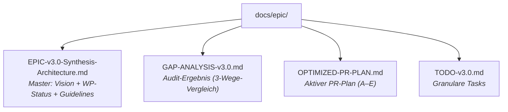

# PAI-OpenCode v3.0 — TODO

> [!NOTE]
> **Basis:** Gap-Analyse 2026-03-06 | Referenz: `GAP-ANALYSIS-v3.0.md` | Plan: `OPTIMIZED-PR-PLAN.md`

---

## Gesamtfortschritt

```
WP1 ████████████ 100% ✅
WP2 ████████████ 100% ✅
WP3 ████░░░░░░░░  40% ⚠️
WP4 ████████░░░░  70% ⚠️
─────────────────────────
WP-A  ░░░░░░░░░░░░   0% 🔄  ← Als nächstes
WP-B  ░░░░░░░░░░░░   0% 🔄
WP-C  ░░░░░░░░░░░░   0% 🔄
WP-D  ░░░░░░░░░░░░   0% 🔄
WP-E  ░░░░░░░░░░░░   0% 🔄
```

---

## 🔴 PR #A — WP3-Completion: Plugin-System & Hooks

**Branch:** `feature/wp-a-plugin-hooks`  
**Geschätzter Aufwand:** 1–2 Tage  
**Abhängigkeiten:** Keine (WP1+WP2 fertig)  
**Priorität:** KRITISCH — alle anderen PRs hängen davon ab

### Setup
- [ ] Branch `feature/wp-a-plugin-hooks` von `dev` erstellen
- [ ] PAI v4.0.3 Hooks als Referenz lesen: `/Releases/v4.0.3/.claude/hooks/`

### Neue Handler (HOCH-Priorität — alle 6 müssen rein)

- [x] **`plugins/handlers/prd-sync.ts`** ✅ portiert (PR #A)
  - Referenz: `PRDSync.hook.ts`
  - Funktion: PRD-Frontmatter → `prd-registry.json` synchronisieren
  - Event: `tool.execute.after` (Write/Edit auf PRD.md)

- [x] **`plugins/handlers/session-cleanup.ts`** ✅ portiert (PR #A)
  - Referenz: `SessionCleanup.hook.ts`
  - Funktion: Work-Directory COMPLETED markieren, State bereinigen
  - Event: `session.ended` / `session.idle`

- [x] **`plugins/handlers/last-response-cache.ts`** ✅ portiert (PR #A)
  - Referenz: `LastResponseCache.hook.ts`
  - Funktion: Letzten AI-Response cachen für ImplicitSentiment-Kontext
  - Event: `message.updated` (assistant)

- [x] **`plugins/handlers/relationship-memory.ts`** ✅ portiert (PR #A)
  - Referenz: `RelationshipMemory.hook.ts`
  - Funktion: W/B/O-Notizen → `MEMORY/RELATIONSHIP/` schreiben
  - Event: `session.ended` / `session.idle`

- [x] **`plugins/handlers/question-tracking.ts`** ✅ portiert (PR #A)
  - Referenz: `QuestionAnswered.hook.ts` (OpenCode-Semantik: Q&A-Tracking, kein Tab-Reset)
  - Funktion: AskUserQuestion Q&A-Pairs → `STATE/questions.jsonl`
  - Event: `tool.execute.after` (AskUserQuestion)

- [ ] `session-autoname` → **KEIN separater Handler nötig**
  - OpenCode setzt `info.title` nativ im `session.created` Event → wird bereits geloggt

### Neue Handler (MITTEL-Priorität — nice to have für PR #A)

- [ ] **`plugins/handlers/doc-integrity.ts`** portieren
  - Referenz: `DocIntegrity.hook.ts`
  - Funktion: Dokumentations-Integrität prüfen (Cross-References, fehlende Sections)

- [ ] **`plugins/handlers/response-tab-reset.ts`** + **`set-question-tab.ts`**
  - Referenz: `ResponseTabReset.hook.ts`, `SetQuestionTab.hook.ts`
  - Funktion: Tab-State-Management (Response/Question Tabs zurücksetzen)
  - Hinweis: `tab-state.ts` existiert bereits — prüfen ob ausreichend oder erweitern

### Neue Handler in `pai-unified.ts` einbinden (Pragmatisch — Option B)

- [ ] Alle 6 neuen Handler-Module in `pai-unified.ts` importieren
- [ ] Event-Handler-Registrierungen für neue Hooks hinzufügen (gleiche Struktur wie bestehende)
- [ ] Kommentar-Header in `pai-unified.ts` aktualisieren (Handler-Liste vollständig)
- [ ] **KEINE** komplette Umstrukturierung — Handler-Module bleiben (Option B)

### Ungenutzte Bus-Events implementieren (direkt im `event`-Handler)

> **Warum hier:** Diese Events brauchen keine eigenen Handler-Dateien — sie sind einfaches
> Event-Logging/Tracking direkt im bestehenden `event: async (input) => {}` Block.
> Alle non-blocking, alle via file-logger.

- [ ] **`session.compacted`** — KRITISCH: Learnings VOR Kontextverlust retten
  ```typescript
  if (eventType === "session.compacted") {
    await extractLearningsFromWork(); // urgent rescue before context shrinks
    fileLog(`[Compaction] Context compacted at ${new Date().toISOString()}`);
  }
  ```

- [ ] **`session.error`** — Error-Tracking für Debugging & Resilienz
  ```typescript
  if (eventType === "session.error") {
    const { error, sessionID } = eventData.properties;
    fileLog(`[SessionError] ${sessionID}: ${error}`, "error");
  }
  ```

- [ ] **`permission.asked`** — Vollständiges Audit-Log ALLER Permissions (nicht nur blockierte)
  ```typescript
  if (eventType === "permission.asked") {
    const { id, permission, patterns, tool } = eventData.properties;
    fileLog(`[PermissionAudit] id=${id} permission=${permission} patterns=[${patterns}]`);
  }
  ```

- [ ] **`command.executed`** — Tracking welche `/commands` wie oft genutzt werden
  ```typescript
  if (eventType === "command.executed") {
    const { name, arguments: args } = eventData.properties;
    fileLog(`[CommandTracker] /${name} ${args}`.trim());
  }
  ```

- [ ] **`installation.update.available`** — Native OpenCode-Update-Notification (ersetzt unseren polling check-version für OpenCode selbst)
  ```typescript
  if (eventType === "installation.update.available") {
    const { version } = eventData.properties;
    fileLog(`[UpdateAvailable] OpenCode ${version} verfügbar`);
  }
  ```

- [ ] **`session.updated`** — Session-Titel-Änderungen für Work-Log tracken
  ```typescript
  if (eventType === "session.updated") {
    const { info } = eventData.properties;
    if (info?.title) fileLog(`[SessionTitle] "${info.title}"`);
  }
  ```

- [ ] **`session.created` info-Objekt nutzen** — `info.id`, `info.title`, `info.directory` für präziseres AutoName-Logging
  ```typescript
  // Bereits: eventType.includes("session.created")
  // ERGÄNZEN: session info auslesen
  const info = eventData?.properties?.info || {};
  fileLog(`[SessionStart] id=${info.id} title="${info.title}" dir=${info.directory}`);
  ```

### Abschluss PR #A
- [ ] `biome check --write .` ausführen
- [ ] `bun test` ausführen
- [ ] PR gegen `dev` erstellen mit Beschreibung: Hooks portiert + Bus-Events implementiert

---

## 🟠 PR #B — WP3.5: Security Hardening / Prompt Injection

**Branch:** `feature/wp-b-security-hardening`  
**Geschätzter Aufwand:** 0.5–1 Tag  
**Abhängigkeiten:** PR #A (Plugin-System vollständig)  
**Priorität:** HOCH

### Prompt Injection Detection

- [ ] **`plugins/lib/injection-patterns.ts`** erstellen
  ```typescript
  export const INJECTION_PATTERNS = [
    /ignore (previous|all prior) (instructions|commands|context)/i,
    /system (prompt|instructions)/i,
    /you are (now|from now on)/i,
    /new (role|personality|identity):/i,
    /(pretend|act as if|imagine) you (are|were)/i,
    /DAN|jailbreak/i,
    /<\|(system|assistant|user)\|>/i,
  ];
  ```

- [ ] **`plugins/handlers/prompt-injection-guard.ts`** erstellen
  - Inputs vor LLM-Verarbeitung scannen
  - Suspicious patterns loggen (in MEMORY/SECURITY/)
  - Bei hochem Confidence-Score: blockieren + User informieren

- [ ] **`plugins/lib/sanitizer.ts`** erstellen
  - Gefährliche Sequences escapen/entfernen
  - Audit-Log aller Sanitisierungen

### Security Logging
- [ ] MEMORY/SECURITY/ Verzeichnis in MINIMAL_BOOTSTRAP registrieren
- [ ] Log-Format definieren: timestamp, pattern, confidence, action

### Integration
- [ ] In `pai-unified.ts` einbinden (event: `tool.execute.before` + `message.received`)
- [ ] Settings-Option für Sensitivity-Level (low/medium/high)

### Abschluss PR #B
- [ ] Manuelle Tests mit bekannten Injection-Patterns
- [ ] `biome check --write .`
- [ ] PR gegen `dev`

---

## 🟡 PR #C — WP5: Core PAI System + Skill-Fixes + PAI Tools

**Branch:** `feature/wp-c-core-pai-system`  
**Geschätzter Aufwand:** 2–3 Tage  
**Abhängigkeiten:** PR #A  
**Priorität:** KRITISCH

### C.1 — Fehlende PAI-Docs portieren (`.opencode/PAI/`)

Referenz: `/Releases/v4.0.3/.claude/PAI/`

- [ ] `PAIAGENTSYSTEM.md` → `.opencode/PAI/PAIAGENTSYSTEM.md`
- [ ] `CLIFIRSTARCHITECTURE.md` → `.opencode/PAI/CLIFIRSTARCHITECTURE.md`
- [ ] `FLOWS.md` → `.opencode/PAI/FLOWS.md`
- [ ] `FLOWS/` → `.opencode/PAI/FLOWS/` (gesamtes Verzeichnis)
- [ ] `PIPELINES.md` → `.opencode/PAI/PIPELINES.md`
- [ ] `PIPELINES/` → `.opencode/PAI/PIPELINES/`
- [ ] `THEFABRICSYSTEM.md` → `.opencode/PAI/THEFABRICSYSTEM.md`
- [ ] `THENOTIFICATIONSYSTEM.md` → `.opencode/PAI/THENOTIFICATIONSYSTEM.md`
- [ ] `DOCUMENTATIONINDEX.md` → `.opencode/PAI/DOCUMENTATIONINDEX.md`
- [ ] `CLI.md` → `.opencode/PAI/CLI.md`
- [ ] `SYSTEM_USER_EXTENDABILITY.md` → `.opencode/PAI/SYSTEM_USER_EXTENDABILITY.md`
- [ ] `ACTIONS/` → `.opencode/PAI/ACTIONS/` (Verzeichnis, nicht nur ACTIONS.md)
- [ ] `README.md` → `.opencode/PAI/README.md`

Jede Datei nach Port prüfen:
- [ ] `.claude/` Referenzen → `.opencode/` ersetzen
- [ ] Absolut-Pfade entfernen/anpassen

### C.2 — Fehlende PAI Tools portieren (`.opencode/skills/PAI/Tools/`)

Referenz: `/Releases/v4.0.3/.claude/PAI/Tools/`

**Priorität 1 — Essential:**
- [ ] `algorithm.ts` portieren → CLI zum Ausführen des Algorithms
- [ ] `RebuildPAI.ts` portieren → PAI-Struktur neu aufbauen
- [ ] `IntegrityMaintenance.ts` portieren → Health Checks
- [ ] `AlgorithmPhaseReport.ts` portieren → Phase-Reporting
- [ ] `FailureCapture.ts` portieren → Failure-Tracking

**Priorität 2 — Valuable:**
- [ ] `GetCounts.ts` portieren (wir haben GenerateSkillIndex — prüfen ob redundant)
- [ ] `BuildCLAUDE.ts` → **als `BuildOpenCode.ts` neu schreiben** (Claude-Code-spezifisch, für OpenCode adaptieren)

**Priorität 3 — Nice to have (nach v3.0 ok):**
- [ ] `PipelineMonitor.ts`, `PipelineOrchestrator.ts` (komplex, zurückstellen)
- [ ] `OpinionTracker.ts`, `RelationshipReflect.ts` (Spezialtools)
- [ ] `WisdomCrossFrameSynthesizer.ts`, `WisdomDomainClassifier.ts`

### C.3 — Skill-Struktur-Fixes

**Telos/ — 3 Einträge fehlen:**
- [ ] `skills/Telos/DashboardTemplate/` erstellen (aus v4.0.3 portieren)
- [ ] `skills/Telos/ReportTemplate/` erstellen (aus v4.0.3 portieren)
- [ ] `skills/Telos/Tools/` erstellen (aus v4.0.3 portieren)
- [ ] `skills/Telos/Workflows/` erstellen (aus v4.0.3 portieren)
- [ ] `skills/Telos/SKILL.md` aktualisieren (neue Entries referenzieren)

**USMetrics/ — falsche Nested-Struktur:**
- [ ] `skills/USMetrics/USMetrics/` Inhalt nach `skills/USMetrics/` verschieben
- [ ] `skills/USMetrics/USMetrics/` Verzeichnis löschen (flache Struktur wie v4.0.3)
- [ ] `skills/USMetrics/SKILL.md` prüfen und anpassen

**Utilities/ — 2 Einträge fehlen:**
- [ ] `skills/Utilities/AudioEditor/` erstellen (aus v4.0.3 portieren)
- [ ] `skills/Utilities/Delegation/` erstellen (aus v4.0.3 portieren)
- [ ] `skills/Utilities/SKILL.md` aktualisieren

**Research/ — 2 Einträge fehlen:**
- [ ] `skills/Research/MigrationNotes.md` erstellen (aus v4.0.3 portieren)
- [ ] `skills/Research/Templates/` erstellen (aus v4.0.3 portieren)

**Agents/ — 1 fehlende Context-Datei:**
- [ ] `skills/Agents/ClaudeResearcherContext.md` aus v4.0.3 prüfen + portieren

### C.4 — MINIMAL_BOOTSTRAP.md aktualisieren
- [ ] Neue Skills (Telos-Tools, AudioEditor, Delegation) eintragen
- [ ] USMetrics-Pfad korrigieren (nach Strukturfix)
- [ ] Neue PAI-Docs-Einträge (falls nötig)

### Abschluss PR #C
- [ ] `bun run skills:validate` (ValidateSkillStructure.ts)
- [ ] `bun run skills:index` (GenerateSkillIndex.ts)
- [ ] `biome check --write .`
- [ ] PR gegen `dev`

---

## 🟢 PR #D — WP6: Installer & Migration

**Branch:** `feature/wp-d-installer-migration`  
**Geschätzter Aufwand:** 1–2 Tage  
**Abhängigkeiten:** PR #C  
**Priorität:** KRITISCH (Release-Blocker)

### PAI-Install portieren

Referenz: `/Releases/v4.0.3/.claude/PAI-Install/`

- [ ] `PAI-Install/install.sh` portieren + für OpenCode anpassen
  - `~/.claude/` → `~/.opencode/`
  - `CLAUDE.md` → `AGENTS.md` (OpenCode-Konvention)
- [ ] `PAI-Install/cli/` portieren
- [ ] `PAI-Install/engine/` portieren
- [ ] `PAI-Install/electron/` portieren + für OpenCode anpassen (**Pflicht für v3.0**)
  - Electron-App als GUI-Installer: "PAI-OpenCode installieren" mit Schritt-für-Schritt UI
  - Alle Referenzen auf Claude Code → OpenCode anpassen
- [ ] `PAI-Install/web/` portieren (Electron-Web-UI)
- [ ] `PAI-Install/main.ts` für OpenCode anpassen
- [ ] `PAI-Install/README.md` schreiben

> **Electron-GUI ist Pflicht für v3.0** — CLI-Installer UND Electron-GUI beide required

### Migration Script

- [ ] **`tools/migration-v2-to-v3.ts`** erstellen:
  ```
  1. Backup ~/.opencode/ → ~/.opencode-backup-YYYYMMDD/
  2. Detect current version (v2.x vs v3.x)
  3. Move flat skills → hierarchical structure (wenn noch nicht)
  4. Update MINIMAL_BOOTSTRAP.md
  5. Run ValidateSkillStructure.ts
  6. Report: was migriert, was übersprungen, was manuell zu prüfen
  ```
- [ ] Migration gegen Test-Setup testen (frische v2.x Struktur)

### Dokumentation
- [ ] **`UPGRADE.md`** schreiben: Schritt-für-Schritt von v2.x → v3.0
- [ ] **`INSTALL.md`** schreiben: Frisch-Installation für neue User
- [ ] **`CHANGELOG.md`** erstellen: Alle Breaking Changes, neue Features, Migrationspfad
- [ ] **`README.md`** (Root) aktualisieren: v3.0-spezifische Infos

### Abschluss PR #D
- [ ] Migration-Script auf sauberem Test-Verzeichnis testen
- [ ] Install-Script dry-run
- [ ] PR gegen `dev`

---

## 🏁 PR #E — WP-E: Final Testing & v3.0.0 Release

**Branch:** `release/v3.0.0` von `dev`  
**Geschätzter Aufwand:** 0.5–1 Tag  
**Abhängigkeiten:** PRs #A–#D alle gemergt  
**Priorität:** KRITISCH (letzter Schritt)

### Pre-Release Tests
- [ ] `bun test` — alle Tests grün
- [ ] `biome check .` — zero errors
- [ ] `bun run skills:validate` — alle Skills valide
- [ ] Manuelle End-to-End: Algorithm 7 Phasen durchlaufen
- [ ] Plugin-Events prüfen: Hooks feuern korrekt (session-start, tool-call, session-end)
- [ ] Injection-Guard testen: bekannte Patterns blockiert
- [ ] Migration-Script: frischer Durchlauf von v2 → v3

### GitHub Release
- [ ] Tag `v3.0.0` erstellen
- [ ] GitHub Release aus `CHANGELOG.md` befüllen
- [ ] Release Notes: What's New, Breaking Changes, Migration

### Kommunikation (optional)
- [ ] PAI Community (Discord/GitHub Discussions) informieren
- [ ] `CONTRIBUTING.md` prüfen: Sind Guidelines noch aktuell?

---

## 📋 Quick Reference: Dateien die wir löschen / umstrukturieren

| Datei | Aktion | Grund |
|-------|--------|-------|
| `docs/epic/ARCHITECTURE-PLAN.md` | 🗑️ Gelöscht | Inhalt in EPIC + GAP-ANALYSIS konsolidiert |
| `docs/epic/WP4-IMPLEMENTATION-PLAN.md` | 🗑️ Gelöscht | WP4 abgeschlossen, veraltet |
| `docs/epic/WORK-PACKAGE-GUIDELINES.md` | 🗑️ Gelöscht | Wichtige Teile ins EPIC integriert |
| `.opencode/skills/USMetrics/USMetrics/` | 🔀 Flatten | Falsche Nested-Struktur → in PR #C |
| `.opencode/PAI/WP2_CONTEXT_COMPARISON.md` | 🗑️ Gelöscht | Build-Artefakt, kein dauerhafter Wert |

---

## 🗂️ Endstruktur `docs/epic/` (Zielzustand nach Konsolidierung)

```text
docs/epic/
├── EPIC-v3.0-Synthesis-Architecture.md   ← Master (Vision + WP-Status + Guidelines)
├── GAP-ANALYSIS-v3.0.md                  ← Audit-Ergebnis (Referenz für PR-Arbeit)
├── OPTIMIZED-PR-PLAN.md                  ← Aktiver PR-Plan (A-E)
└── TODO-v3.0.md                          ← Diese Datei (granulare Tasks)
```

<details>
<summary>Mermaid-Ansicht der Zielstruktur</summary>



</details>

---

*Erstellt: 2026-03-06*  
*Basis: GAP-ANALYSIS-v3.0.md + EPIC-v3.0-Synthesis-Architecture.md*
