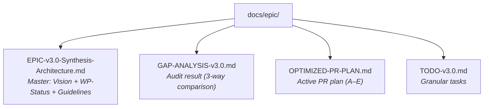

# PAI-OpenCode v3.0 — TODO

> [!NOTE]
> **Basis:** Gap-Analysis 2026-03-06 | Reference: `GAP-ANALYSIS-v3.0.md` | Plan: `OPTIMIZED-PR-PLAN.md`
> **Updated:** 2026-03-12 — WP-N1 through WP-N5 complete (PR #50–#54). WP-N6 in progress.

---

## Overall Progress

```text
WP1  ████████████ 100% ✅  ← PR #32-35
WP2  ████████████ 100% ✅  ← PR #34
WP3  ████████████ 100% ✅  ← PR #37
WP4  ████████████ 100% ✅  ← PR #38-40
──────────────────────────────────────
WP-A  ████████████ 100% ✅  ← PR #42 merged
WP-B  ████████████ 100% ✅  ← PR #43 merged
WP-C  ████████████ 100% ✅  ← PR #45 merged
WP-D  ████████████ 100% ✅  ← PR #47 merged
WP-E  ████████████ 100% ✅  ← PR #48 merged
──────────────────────────────────────
WP-N1 ████████████ 100% ✅  ← Session Registry complete, PR #50
WP-N2 ████████████ 100% ✅  ← Compaction Intelligence complete, PR #51
WP-N3 ████████████ 100% ✅  ← Algorithm Awareness complete, PR #52+#53
WP-N4 ████████████ 100% ✅  ← LSP + Fork Documentation complete, PR #53
WP-N5 ████████████ 100% ✅  ← Plan Update complete, PR #54
WP-N6 ██████████░░  85% 🔄  ← System Self-Awareness, PR #55 (fix commit pending)
```

> **The port is done. The native transformation starts with WP-N1.**
> See `docs/epic/EPIC-v3.0-OpenCode-Native.md` for the full WP-N plan.

---

## ✅ PR #A — WP3-Completion: Plugin System & Hooks — MERGED (#42)

**Branch:** `feature/wp-a-plugin-hooks` — **MERGED into `dev`**

All handlers ported and integrated into `pai-unified.ts`:

- [x] `plugins/handlers/prd-sync.ts` ✅
- [x] `plugins/handlers/session-cleanup.ts` ✅
- [x] `plugins/handlers/last-response-cache.ts` ✅
- [x] `plugins/handlers/relationship-memory.ts` ✅
- [x] `plugins/handlers/question-tracking.ts` ✅
- [x] All 6 handlers integrated into `pai-unified.ts` ✅
- [x] Bus events implemented: `session.compacted`, `session.error`, `permission.asked`, `command.executed`, `installation.update.available`, `session.updated`, `session.created` ✅
- [x] `biome check --write .` ✅
- [x] `bun test` ✅

---

## ✅ PR #B — WP3.5: Security Hardening / Prompt Injection — MERGED (#43)

**Branch:** `feature/wp-b-security-hardening` — **MERGED into `dev`**

- [x] `plugins/lib/injection-patterns.ts` ✅
- [x] `plugins/handlers/prompt-injection-guard.ts` ✅
- [x] `plugins/lib/sanitizer.ts` ✅
- [x] `MEMORY/SECURITY/` directory registered ✅
- [x] Integrated into `pai-unified.ts` (`tool.execute.before` + `message.received`) ✅
- [x] Sensitivity-level setting (low/medium/high) ✅
- [x] Manual tests with known injection patterns ✅
- [x] `biome check --write .` ✅

---

## ✅ PR #C — WP5: Core PAI System + Skill Fixes — MERGED (#45)

**Branch:** `feature/wp-c-core-pai-system` — **MERGED into `dev`**
**Estimated effort:** ~3–3.5h (verified against v4.0.3 upstream — many items already done)
**Dependencies:** PR #A ✅ (done)

> [!NOTE]
> **Completed:** PR #45 merged 2026-03-10. All tasks below delivered.

---

### C.1 — Structural Fixes: Flatten Nested Skills

Two skills have the same incorrect nested structure — content exists one level too deep.

**USMetrics — flatten:**
```bash
# Move contents up, merge SKILL.md, delete inner dir
cp -r .opencode/skills/USMetrics/USMetrics/Tools      .opencode/skills/USMetrics/
cp -r .opencode/skills/USMetrics/USMetrics/Workflows  .opencode/skills/USMetrics/
# Manually merge the two SKILL.md files (outer=category-wrapper, inner=actual skill content)
rm -rf .opencode/skills/USMetrics/USMetrics/
```

- [x] Move `USMetrics/USMetrics/Tools/` → `USMetrics/Tools/`
- [x] Move `USMetrics/USMetrics/Workflows/` → `USMetrics/Workflows/`
- [x] Merge inner `USMetrics/USMetrics/SKILL.md` into outer `USMetrics/SKILL.md`
- [x] Delete `USMetrics/USMetrics/` directory

**Telos — flatten:**
```bash
mv .opencode/skills/Telos/Telos/DashboardTemplate  .opencode/skills/Telos/
mv .opencode/skills/Telos/Telos/ReportTemplate     .opencode/skills/Telos/
mv .opencode/skills/Telos/Telos/Tools              .opencode/skills/Telos/
mv .opencode/skills/Telos/Telos/Workflows          .opencode/skills/Telos/
rm -rf .opencode/skills/Telos/Telos/
```

- [x] Move `Telos/Telos/DashboardTemplate/` → `Telos/DashboardTemplate/`
- [x] Move `Telos/Telos/ReportTemplate/` → `Telos/ReportTemplate/`
- [x] Move `Telos/Telos/Tools/` → `Telos/Tools/`
- [x] Move `Telos/Telos/Workflows/` → `Telos/Workflows/`
- [x] Delete `Telos/Telos/` directory
- [x] Verify `Telos/SKILL.md` references point to `Telos/` not `Telos/Telos/`

---

### C.2 — Missing Skill Content: Port from v4.0.3

Reference source: `.../Releases/v4.0.3/.claude/skills/`

**Utilities — 2 skills missing:**
- [x] `skills/Utilities/AudioEditor/` — port from v4.0.3 (`SKILL.md`, `Tools/`, `Workflows/`)
- [x] `skills/Utilities/Delegation/` — port from v4.0.3 (`SKILL.md` only)
- [x] Update `skills/Utilities/SKILL.md` — add AudioEditor + Delegation entries
- [x] Replace any `.claude/` references with `.opencode/` in ported files

**Research — 2 items missing:**
- [x] `skills/Research/MigrationNotes.md` — port from v4.0.3
- [x] `skills/Research/Templates/` — port directory (contains `MarketResearch.md`, `ThreatLandscape.md`)

**Agents — 1 file missing:**
- [x] `skills/Agents/ClaudeResearcherContext.md` — port from v4.0.3

---

### C.3 — Missing PAI/ Docs: Port from v4.0.3

Reference source: `.../Releases/v4.0.3/.claude/PAI/`

**9 flat docs missing from `.opencode/PAI/`:**

```bash
SRC=".../Releases/v4.0.3/.claude/PAI"
DST=".opencode/PAI"

for f in CLI.md CLIFIRSTARCHITECTURE.md DOCUMENTATIONINDEX.md FLOWS.md \
          PAIAGENTSYSTEM.md README.md SYSTEM_USER_EXTENDABILITY.md \
          THEFABRICSYSTEM.md THENOTIFICATIONSYSTEM.md; do
  cp $SRC/$f $DST/$f
  sed -i '' 's/\.claude\//\.opencode\//g' $DST/$f
done
```

- [x] `CLI.md` → `.opencode/PAI/CLI.md`
- [x] `CLIFIRSTARCHITECTURE.md` → `.opencode/PAI/CLIFIRSTARCHITECTURE.md`
- [x] `DOCUMENTATIONINDEX.md` → `.opencode/PAI/DOCUMENTATIONINDEX.md`
- [x] `FLOWS.md` → `.opencode/PAI/FLOWS.md`
- [x] `PAIAGENTSYSTEM.md` → `.opencode/PAI/PAIAGENTSYSTEM.md`
- [x] `README.md` → `.opencode/PAI/README.md`
- [x] `SYSTEM_USER_EXTENDABILITY.md` → `.opencode/PAI/SYSTEM_USER_EXTENDABILITY.md`
- [x] `THEFABRICSYSTEM.md` → `.opencode/PAI/THEFABRICSYSTEM.md`
- [x] `THENOTIFICATIONSYSTEM.md` → `.opencode/PAI/THENOTIFICATIONSYSTEM.md`
- [x] All 9 files: replace `.claude/` → `.opencode/` after copy

**3 subdirectories missing from `.opencode/PAI/`:**
- [x] `ACTIONS/` — port from v4.0.3 (contains `A_EXAMPLE_FORMAT/`, `A_EXAMPLE_SUMMARIZE/`, `lib/`, `pai.ts`, `README.md`)
- [x] `FLOWS/` — port from v4.0.3 (contains `README.md`)
- [x] `PIPELINES/` — port from v4.0.3 (contains `P_EXAMPLE_SUMMARIZE_AND_FORMAT.yaml`, `README.md`)
- [x] All ported files: replace `.claude/` → `.opencode/` after copy

> [!NOTE]
> Already present in `.opencode/PAI/` (no action needed): `ACTIONS.md`, `AISTEERINGRULES.md`,
> `CONTEXT_ROUTING.md`, `MEMORYSYSTEM.md`, `MINIMAL_BOOTSTRAP.md`, `PAISYSTEMARCHITECTURE.md`,
> `PRDFORMAT.md`, `SKILL.md`, `SKILLSYSTEM.md`, `THEDELEGATIONSYSTEM.md`, `THEHOOKSYSTEM.md`, `TOOLS.md`

> [!NOTE]
> Already present in `.opencode/skills/PAI/SYSTEM/` (docs exist, also belong in PAI/ per v4.0.3 arch):
> `PAIAGENTSYSTEM.md`, `CLIFIRSTARCHITECTURE.md`, `THEFABRICSYSTEM.md`, `THENOTIFICATIONSYSTEM.md`,
> `DOCUMENTATIONINDEX.md`, `SYSTEM_USER_EXTENDABILITY.md` — copy to PAI/ as well.

---

### C.4 — PAI Tools: BuildCLAUDE.ts → BuildOpenCode.ts

> [!NOTE]
> All other PAI Tools are already present in `.opencode/PAI/Tools/` — identical to v4.0.3.
> Only `BuildCLAUDE.ts` needs adaptation for OpenCode.

- [x] Copy `.opencode/PAI/Tools/BuildCLAUDE.ts` → `.opencode/PAI/Tools/BuildOpenCode.ts`
- [x] In `BuildOpenCode.ts`: replace all `.claude/` → `.opencode/`
- [x] In `BuildOpenCode.ts`: replace all `CLAUDE.md` → `AGENTS.md`
- [x] In `BuildOpenCode.ts`: replace all `claude` CLI references → `opencode`
- [x] Update file header comment: `// BuildOpenCode.ts — OpenCode-native version of BuildCLAUDE.ts`

---

### C.5 — Bootstrap & Index Update

- [x] Update `MINIMAL_BOOTSTRAP.md` — fix USMetrics path (remove `/USMetrics/USMetrics/` nesting)
- [x] Update `MINIMAL_BOOTSTRAP.md` — add AudioEditor and Delegation entries
- [x] Regenerate skill index: `bun GenerateSkillIndex.ts`

---

### PR #C Completion

- [x] `bun run skills:validate` (ValidateSkillStructure.ts)
- [x] `bun run skills:index` (GenerateSkillIndex.ts)
- [x] `biome check --write .`
- [x] `bun test`
- [x] Create PR against `dev` → **MERGED #45**

---

## ✅ PR #D — WP6: Installer & Migration — MERGED (#47)

**Branch:** `feature/wp-d-installer-migration` — **MERGED into `dev`**
**Estimated effort:** 1–2 days
**Dependencies:** PR #C ✅ (done)

> [!NOTE]
> **Completed:** PR #47 merged 2026-03-10. All tasks below delivered.

---

### Port PAI-Install

Reference: `.../Releases/v4.0.3/.claude/PAI-Install/`

- [x] `PAI-Install/install.sh` — port + adapt for OpenCode
  - `~/.claude/` → `~/.opencode/`
  - `CLAUDE.md` → `AGENTS.md`
- [x] `PAI-Install/cli/` — port
- [x] `PAI-Install/engine/` — port
- [x] `PAI-Install/electron/` — port + adapt for OpenCode (**required for v3.0**)
  - Electron app as GUI installer: step-by-step "Install PAI-OpenCode" UI
  - Replace all Claude Code references → OpenCode
- [x] `PAI-Install/web/` — port (Electron web UI)
- [x] `PAI-Install/main.ts` — adapt for OpenCode
- [x] `PAI-Install/README.md` — write

> [!IMPORTANT]
> **Electron GUI is required for v3.0** — both CLI installer AND Electron GUI

### Migration Script

- [x] Create `tools/migration-v2-to-v3.ts`:
  ```text
  1. Backup ~/.opencode/ → ~/.opencode-backup-YYYYMMDD/
  2. Detect current version (v2.x vs v3.x)
  3. Move flat skills → hierarchical structure (if not already done)
  4. Update MINIMAL_BOOTSTRAP.md
  5. Run ValidateSkillStructure.ts
  6. Report: what was migrated, what was skipped, what needs manual review
  ```
- [x] Test migration against a clean v2.x test setup

### DB Health (WP-F — integrated into PR #D)

- [x] Extend `plugins/handlers/session-cleanup.ts` with `checkDbHealth()` — warn when DB > 500MB or sessions > 90 days old
- [x] Implement `plugins/lib/db-utils.ts` — `getDbSizeMB()` and `getSessionsOlderThan(days)`
- [x] Create `Tools/db-archive.ts` — standalone Bun script for session archiving
  - `bun db-archive.ts` — archive sessions > 90 days
  - `bun db-archive.ts 180` — archive sessions > 180 days
  - `bun db-archive.ts --dry-run` — preview what would be archived
  - `bun db-archive.ts --vacuum` — VACUUM after archiving (requires OpenCode to be stopped)
  - `bun db-archive.ts --restore archive-2025-Q4.db` — restore from archive
- [x] Create `.opencode/commands/db-archive.ts` — OpenCode custom command `/db-archive`
- [x] Add "DB Health" tab to `PAI-Install/electron/`
- [x] Create `docs/DB-MAINTENANCE.md`

### Documentation

- [x] Write `UPGRADE.md` — step-by-step from v2.x → v3.0
- [x] Write `INSTALL.md` — fresh installation for new users
- [x] Create `CHANGELOG.md` — all breaking changes, new features, migration path
- [x] Update root `README.md` — v3.0-specific info

### PR #D Completion

- [x] Test migration script on clean test directory
- [x] Install script dry-run
- [x] `bun Tools/db-archive.ts --dry-run` on a real DB
- [x] Test custom command `/db-archive` in a fresh session
- [x] Test archive restore (restore one session)
- [x] `biome check --write .`
- [x] Create PR against `dev` → **MERGED #47**

---

## 🏁 PR #E — WP-E: Final Testing & v3.0.0 Release

**Branch:** `release/v3.0.0` from `dev`
**Estimated effort:** 0.5–1 day
**Dependencies:** PRs #A–#D all merged
**Priority:** CRITICAL (final step)

### Pre-Release Tests

- [ ] `bun test` — all tests green
- [ ] `biome check .` — zero errors
- [ ] `bun run skills:validate` — all skills valid
- [ ] Manual end-to-end: Algorithm 7 phases complete run
- [ ] Plugin events check: hooks fire correctly (session-start, tool-call, session-end)
- [ ] Injection guard test: known patterns blocked
- [ ] Migration script: clean run from v2 → v3

### GitHub Release

- [ ] Create tag `v3.0.0`
- [ ] Fill GitHub Release from `CHANGELOG.md`
- [ ] Release notes: What's New, Breaking Changes, Migration

### Communication (optional)

- [ ] Inform PAI Community (Discord/GitHub Discussions)
- [ ] Review `CONTRIBUTING.md` — are guidelines still current?

---

## 📋 Quick Reference: Files to Delete / Restructure

| File | Action | Reason |
|------|--------|--------|
| `docs/epic/ARCHITECTURE-PLAN.md` | 🗑️ Deleted | Content consolidated into EPIC + GAP-ANALYSIS |
| `docs/epic/WP4-IMPLEMENTATION-PLAN.md` | 🗑️ Deleted | WP4 complete, outdated |
| `docs/epic/WORK-PACKAGE-GUIDELINES.md` | 🗑️ Deleted | Important parts integrated into EPIC |
| `.opencode/skills/USMetrics/USMetrics/` | 🔀 Flatten → PR #C | Incorrect nested structure |
| `.opencode/skills/Telos/Telos/` | 🔀 Flatten → PR #C | Incorrect nested structure |
| `.opencode/PAI/WP2_CONTEXT_COMPARISON.md` | 🗑️ Deleted | Build artifact, no lasting value |

---

## 🗂️ Target Structure `docs/epic/` (after consolidation)

```text
docs/epic/
├── EPIC-v3.0-Synthesis-Architecture.md   ← Master (Vision + WP-Status + Guidelines)
├── GAP-ANALYSIS-v3.0.md                  ← Audit result (reference for PR work)
├── OPTIMIZED-PR-PLAN.md                  ← Active PR plan (A-E)
└── TODO-v3.0.md                          ← This file (granular tasks)
```

<details>
<summary>Mermaid view of target structure</summary>



</details>

---

## 🆕 WP-N1..N5 — OpenCode-Native Transformation (ACTIVE)

> [!IMPORTANT]
> **The port is complete. The native transformation starts now.**
> Full specification: `docs/epic/EPIC-v3.0-OpenCode-Native.md`

### WP-N1: Session Registry — ✅ COMPLETE (PR #50)
**Branch:** `feature/wp-n1-session-registry`
**Spec:** ADR-012
**Status:** Merged, ready for execution

- [x] Create `plugins/handlers/session-registry.ts` — track subagent sessions via `tool.execute.after`
- [x] Add custom tools `session_registry` + `session_results` in `pai-unified.ts`
- [x] Write AGENTS.md section on post-compaction recovery
- [x] ADR-012 already exists (merged via PR #49)

---

### WP-N2: Compaction Intelligence — ✅ Complete (PR #51)
**Branch:** `feature/wp-n2-compaction-intelligence`
**Spec:** ADR-015
**Status:** Merged into `dev`

- [x] Implement `experimental.session.compacting` hook in `pai-unified.ts`
- [x] Create `plugins/handlers/compaction-intelligence.ts` with context builders
- [x] Inject registry + ISC + PRD context into compaction summary
- [x] ADR-015 already exists (merged via PR #49)

---

### WP-N3: Algorithm Awareness — ✅ Complete (PR #52+#53)
**Branch:** `feature/wp-n3-algorithm-awareness`
**Spec:** ADR-013
**Status:** Merged into `dev`

- [x] Update AGENTS.md — Session API section (already complete from WP-N1/N2)
- [x] Update Algorithm SKILL.md — Post-Compaction recovery pattern with session tools
- [x] Update CONTEXT RECOVERY section — session_registry first, never claim results lost
- [x] ADR-013 already exists (merged via PR #49)

---

### WP-N4: LSP + Fork Documentation — ✅ Complete (PR #53)
**Branch:** `feature/wp-n4-lsp-fork`
**Spec:** ADR-014 + ADR-016

- [x] Document `OPENCODE_EXPERIMENTAL_LSP_TOOL=true`
- [x] Add LSP section to AGENTS.md (LSP vs Grep table, activation)
- [x] Document Session Fork API for safe experiments
- [x] Add Fork section to AGENTS.md (use-cases, API reference, workflow)
- [x] Installer legt auskommentierten `OPENCODE_EXPERIMENTAL_LSP_TOOL=true` Eintrag in `.env` an — Anwender müssen ihn manuell aktivieren (opt-in)

---

### WP-N5: Plan Update — ✅ Complete (PR #54)
**Branch:** `feature/wp-n5-plan-update`

- [x] Update OPTIMIZED-PR-PLAN.md — WP-N1..N4 complete, WP-E merged, summary/progress updated
- [x] Update EPIC-v3.0-OpenCode-Native.md — WP-N1..N5 status lines added
- [x] Update ADR README — ADR-012..016 Planned → Merged
- [x] Update TODO-v3.0.md — this file (WP-N5 complete)

---

### WP-N6: System Self-Awareness — 🔄 In Progress (PR #55)
**Branch:** `feature/wp-n6-system-awareness`
**Spec:** ADR-017
**Dependencies:** WP-N3 (Algorithm Awareness) + WP-N4 (LSP/Fork documented)
**Goal:** Algorithm understands its operating environment

- [x] Create `.opencode/skills/OpenCodeSystem/SKILL.md` with USE WHEN triggers
- [x] Create `SystemArchitecture.md` — PAI-OpenCode 3.0 structure
- [x] Create `ToolReference.md` — all native + MCP tools
- [x] Create `Configuration.md` — settings.json, opencode.json, model routing
- [x] Create `Troubleshooting.md` — self-diagnostic checklist
- [x] Create ADR-017: System Self-Awareness
- [x] Update skill-index.json with OpenCodeSystem entry
- [x] Update ADR README + TODO + OPTIMIZED-PR-PLAN
- [x] Fix: Remove hardcoded model names → tier-only references
- [x] Fix: Add YAML frontmatter + Obsidian callouts to all docs
- [x] Fix: Add `permission.asked` hook to SystemArchitecture.md
- [x] Fix: Safe rsync in Troubleshooting.md (was unsafe mv)
- [x] Fix: Restructure SKILL.md to PAI v3.0 schema (MANDATORY/OPTIONAL)
- [x] Fix: Add `OPENCODE_EXPERIMENTAL_LSP_TOOL=true` to .env.example
- [x] Fix: MCP detection uses grep (no cat pipe), searches both keys

---

### WP-N7: Obsidian CLI + Agent Capability Matrix — 📋 Planned
**Branch:** TBD
**Dependencies:** WP-N6
**Goal:** Obsidian formatting guidelines + agent permissions/tools/MCP capability matrix

- [ ] Obsidian CLI integration guide (frontmatter, callouts, collapsible sections)
- [ ] Formatting guidelines document for all PAI-OpenCode docs
- [ ] Agent capability matrix (permissions, tools, MCP access per agent type)

---

*Created: 2026-03-06*
*Updated: 2026-03-12 — WP-N1 through WP-N5 complete (PR #50–#54); WP-N6 in progress (PR #55 open); WP-N7 planned*
*Basis: GAP-ANALYSIS-v3.0.md + EPIC-v3.0-Synthesis-Architecture.md + EPIC-v3.0-OpenCode-Native.md*
